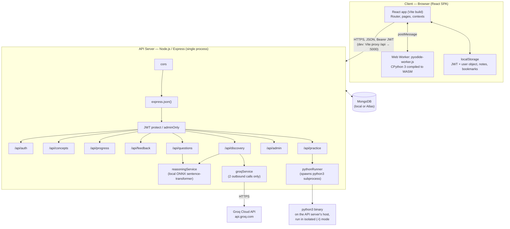

# PyBe (PyLearn) — Architecture Specification

> Companion to `product.md` (the product/feature spec). That document owns *what*
> the app does; this document owns *how it's built and wired together* — process
> topology, request lifecycles, middleware order, data flow, storage boundaries,
> execution sandboxes, and deployment. Read `product.md` first for feature
> semantics; this file assumes that context and won't re-explain feature behavior
> except where it's needed to justify an architectural decision.

---

## 1. System overview

Two independently-runnable processes, one shared MongoDB database, one external AI
API, plus a client-side WASM Python runtime that never touches the network for
execution:



**The one rule that shapes every other decision in this system:** there is exactly
one backend process and one database. Nothing about "AI" or "running Python" ever
implies a second server. The two things that sound like they'd need one — the
lesson visualizer and the AI tutor reactions — are solved without it:
- The lesson visualizer runs Python **inside the learner's own browser tab** (Web
  Worker + Pyodide/WASM), so it scales with zero server cost and needs no sandboxing
  on the backend at all.
- The AI tutor reactions are two outbound HTTPS calls from the existing Express
  process to a third-party inference API (Groq) — not a model hosted or served by
  this system.

The one place real server-side code execution *does* happen — grading Practice
Questions submissions — is deliberately isolated to its own service module
(`pythonRunner.js`) with its own subprocess boundary, timeout, and temp-file
lifecycle, and is never reused for anything else in the app.

---

## 2. Repository layout

```
pylearn/
├── package.json                 # root convenience scripts only, no code
├── backend/
│   ├── server.js                # process entrypoint — see §3
│   ├── .env / .env.example
│   ├── middleware/
│   │   └── auth.js              # protect, adminOnly
│   ├── models/                  # one file per Mongoose schema (see product.md §3)
│   ├── routes/
│   │   ├── auth.js, concepts.js, progress.js, feedback.js,
│   │   │   discovery.js, questions.js, admin.js
│   │   └── practice/
│   │       ├── index.js         # mounts topics/problems/execute/progress sub-routers
│   │       ├── topics.js, problems.js, execute.js, progress.js
│   ├── services/
│   │   ├── reasoningService.js  # local embedding model, cosine + keyword scoring
│   │   ├── groqService.js       # Groq HTTP client, 2 exported functions
│   │   └── pythonRunner.js      # subprocess harness + evaluateSubmission()
│   ├── constants/
│   │   └── practiceTopics.js    # canonical topic order + descriptions
│   └── seed/
│       ├── seedConcepts.js, seedChallenges.js, seedAdmin.js,
│       │   seedPracticeProblems.js
│       ├── practiceProblems_seed_data.json
│       └── mongoimport_ready/*.json   # pre-shaped exports for `mongoimport`
└── frontend/
    ├── vite.config.js           # dev proxy: /api → http://localhost:5000
    ├── tailwind.config.js       # brand color reads CSS vars (theme engine)
    ├── src/
    │   ├── main.jsx, App.jsx    # router + route guards (see product.md §4)
    │   ├── context/
    │   │   ├── AuthContext.jsx  # user session state, all auth API calls
    │   │   ├── ConceptContext.jsx  # "active concept" for the chatbot
    │   │   └── ThemeSync.jsx    # writes --color-brand-* CSS vars on theme change
    │   ├── utils/
    │   │   ├── api.js           # axios instance, JWT interceptor, global 401 handler
    │   │   ├── themeStyles.js   # THEME_META + palettes + applyThemePalette
    │   │   ├── conceptIcons.jsx # icon-name string → lucide component
    │   │   └── practiceTopicMap.js  # Concept.slug → practice topic name
    │   ├── pages/                # top-level routed screens
    │   │   └── admin/             # admin-only screens, own layout
    │   ├── practice/              # the LeetCode-style feature, self-contained
    │   │   ├── pages/, components/, api/
    │   ├── pytutor/                # the Pyodide-backed visualizer + practice widget
    │   │   ├── PythonPracticeWidget.jsx, data/{questions,builtins,problems}.ts
    │   ├── components/
    │   │   ├── layout/            # Navbar, Sidebar
    │   │   ├── concept/            # Section 1/2/3 components + right rail
    │   │   └── chat/                # TopicChatBot + local knowledgeBase.js
    └── public/
        └── pyodide-worker.js       # the Web Worker, loads Pyodide from CDN at runtime
```

Two co-located "feature packages" (`practice/` and `pytutor/`) are deliberately
self-contained — each owns its own pages/components/data and only reaches into
shared `utils/api.js` and `context/AuthContext.jsx`, so either could be lifted out
or replaced without touching the lesson flow in `pages/` + `components/concept/`.

---

## 3. Backend process lifecycle (`server.js`)

Startup order matters and is intentionally strict:

1. `dotenv.config()` — load env before anything reads `process.env`.
2. Build the Express app; register global middleware in this exact order:
   `cors({ origin: FRONTEND_URL, credentials: true })` → `express.json()`.
3. Mount all route groups (`/api/auth`, `/api/concepts`, `/api/progress`,
   `/api/feedback`, `/api/discovery`, `/api/questions`, `/api/admin`,
   `/api/practice`) — each router internally applies its own auth requirements
   (see §4); `server.js` itself does not gate any of them globally except CORS.
4. Register `GET /api/health` — the only unauthenticated, non-auth route besides
   register/login.
5. **Guard clause before touching the network at all**: if `process.env.MONGO_URI`
   is falsy, log a clear operator-facing error and `process.exit(1)` — the process
   never starts listening without a configured database target. (This project does
   **not** support an in-memory/no-database fallback mode; it requires a real Mongo
   connection, local or Atlas, from the first line of `server.js` onward.)
6. `mongoose.connect(MONGO_URI)` — only on success does `app.listen(PORT)` run.
   Connection failure logs the error and exits; there's no retry loop by design —
   restart the process (e.g. via nodemon / a process manager) once the underlying
   issue (bad URI, network access list, etc.) is fixed.

This means "the API is up" is a reliable signal that the database is also reachable
— there's no window where the server accepts requests against a dead DB connection.

---

## 4. Request lifecycle & the auth boundary

Every authenticated request follows the same shape:

```
Client (axios instance, utils/api.js)
  → attaches Authorization: Bearer <token> from localStorage (request interceptor)
  → Express: cors → express.json()
  → route-level `protect` middleware:
        - extract Bearer token
        - jwt.verify(token, JWT_SECRET)
        - re-fetch req.user = User.findById(decoded.id).select('-password')
          (NOT just trusting the decoded payload — a token for a deleted/changed
          user is rejected on every request, not just at issue time)
        - 401 if token missing/invalid/user gone
  → (admin routes only) `adminOnly` middleware: 403 unless req.user.role === 'admin'
  → route handler: business logic, Mongoose calls
  → JSON response
  ← client response interceptor: on any 401, clear token+user from localStorage
    and hard-redirect to /login (window.location.href) — this is a full page
    reload, not a router push, so it also clears all in-memory React state.
```

**JWT shape:** `{ id: user._id }`, signed with `JWT_SECRET`, 30-day expiry. No
refresh-token flow exists — a token is valid for its full 30 days or until the
underlying user is deleted; there is no server-side revocation list.

**Why `protect` re-queries the user on every request** instead of trusting the
JWT payload: it's the single mechanism that makes role changes, deletions, and
(implicitly) password changes take effect immediately across all of a user's open
sessions, without any separate token-invalidation system.

---

## 5. Data flow for the two most architecturally interesting features

### 5.1 Section 1 discovery flow (client state → one write, replayed forever)

```
GET /discovery/:conceptId
  → resolve learner's theme (fallback 'daily-life' for pre-theming accounts)
  → look up Concept by id, Challenge by matching conceptSlug
  → pull that theme's variant out of the Mongoose Map (`themes.get(theme)`)
  → strip decisionScenario.correctOption before responding
  → also check Progress.discoverySnapshot — if it already has an `explanation`,
    include it as `savedDiscovery` so the client can render a read-only recap
    instead of the interactive form
  ← { challenge: {scenarios, decisionScenario}, savedDiscovery, conceptIntro,
      example, reinforcement, blanks }

[client-only] learner steps through 3 scenario prompts, one at a time,
accumulating 3 free-text responses in React state — ZERO network calls here.

POST /discovery/respond  { conceptId, responses:[r1,r2,r3] }
  → build a single Groq prompt referencing all 3 scenarios+responses (+ optional
    shared background, + reasoningKeyPoints as hidden AI context)
  → ONE outbound HTTPS call to Groq, response_format: json_object
  → parse forced-JSON response (with a markdown-fence-stripping fallback in case
    the model wraps it anyway)
  → Progress.findOneAndUpdate(upsert): discoverySnapshot.responses = [...],
    discoverySnapshot.explanation = <text>
  ← { explanation }

[client] shows the explanation, then the single decision scenario (A/B).

POST /discovery/decision  { conceptId, choice }
  → correctness computed server-side against decisionScenario.correctOption
    (never trust a client-supplied "correct" flag)
  → SECOND outbound Groq call, analysis framed around this specific choice
  → merge into the same discoverySnapshot document (upsert-safe if hit out of
    order)
  ← { correct, analysis }
```

**Architectural guarantee:** revisiting a completed Section 1 later only ever
executes the first GET above — the two POSTs, and therefore both Groq calls, never
fire again for that concept+user. This bounds Groq API cost to exactly 2 calls per
learner per concept, ever (not per visit).

### 5.2 The two Python execution sandboxes (do not conflate them)

| | Lesson visualizer (`pytutor/`) | Practice Questions grading (`practice/`) |
|---|---|---|
| Where it runs | Learner's browser, inside a Web Worker | API server, as a real OS subprocess |
| Runtime | Pyodide (CPython → WebAssembly), lazy-loaded from a CDN | The host's actual `python3` binary |
| Trigger | "Visualize" button — every concept lesson | "Run" / "Submit" — practice problems only |
| Network cost per use | One-time ~10–20MB Pyodide download per browser session (cached after); zero thereafter | One HTTP round-trip per run; server spawns a fresh process each time |
| Isolation mechanism | Browser sandbox + Worker boundary (no filesystem/network access to speak of) | `python3 -I` (isolated mode, ignores `PYTHONPATH`/user site packages) + `execFile` timeout (`EXEC_TIMEOUT_MS`, default 5000ms) + `maxBuffer` cap + a fresh temp dir per run, removed in a `finally` |
| Output capture | In-worker trace object (call/line/return/exception events, frames, heap) | stdout parsed between two sentinel markers (`###LEETPY_RESULT_START/END###`) so the learner's own `print()` output can't corrupt the JSON result block |
| Persists anything? | No — visualize is unlimited, stateless, never graded | Yes — `mode:'submit'` upserts `PracticeProgress` (`solved`/`attempted` + last code); `mode:'run'` persists nothing |
| Failure modes handled | N/A (client-side, no server risk) | Syntax/compile error (no sentinel markers found → return `compileError`), per-test exception (caught per test, doesn't abort the run), timeout (`TIMEOUT` → "Time Limit Exceeded"), non-JSON-serializable return value (harness falls back to `repr()`) |

Keeping these as two separate services (`pytutor/` client bundle vs.
`backend/services/pythonRunner.js`) is a deliberate boundary: the lesson visualizer
must never need a server round-trip (it has to work for unlimited, ungraded,
exploratory use), while the practice grader must produce a trustworthy pass/fail
result the backend can persist and later show in admin analytics — two different
trust and cost models that shouldn't share a code path.

---

## 6. The theming engine (cross-cutting, not a "feature module")

This is architecturally significant because it touches every page without any
per-component theme-awareness code:

1. `utils/themeStyles.js` defines `PALETTES` (an 11-shade `50..900` RGB-triple ramp
   per theme) and `THEME_META` (icon, label, gradient/border/bg helper classes per
   theme).
2. `tailwind.config.js` maps the Tailwind `brand` color family to
   `rgb(var(--color-brand-NNN) / <alpha-value>)` — i.e., Tailwind's `bg-brand-500`,
   `border-brand-300`, etc. are all just reading CSS custom properties, not fixed
   hex values.
3. `index.css` sets a default palette on `:root` (shown for logged-out/pre-theme
   users) as `--color-brand-*: R G B` triples.
4. `context/ThemeSync.jsx` watches `user.theme` and calls `applyThemePalette`,
   which overwrites those same CSS variables on `document.documentElement` at
   runtime.
5. Because essentially every shared UI primitive (`.btn-primary`, `.card` accents,
   `.input` focus rings, badges, nav highlights) is built from the `brand` Tailwind
   color, step 4 alone re-skins the *entire already-rendered app* the instant
   `user.theme` changes — no component subscribes to theme individually, no
   re-render cascade beyond whatever Tailwind classes are already applied.

Switching theme is a single `PATCH /auth/theme` call (see product.md §5.2); the
architecture guarantees this can never cascade into any data mutation beyond the
`User.theme` field, since neither `Progress` nor `discoverySnapshot` carries a
theme reference.

---

## 7. Local ML inference (`reasoningService.js`) — why it's in-process, not a call-out

`@xenova/transformers` runs `Xenova/all-MiniLM-L6-v2` (an ONNX-runtime port of a
sentence-transformer) **inside the Node process itself** — no Python, no separate
model server, no network call. Mechanics:

- The pipeline is created lazily on first use and memoized in a module-level
  promise (`extractorPromise`) so the (relatively expensive) model load happens
  once per process lifetime, not once per request.
- Scoring combines two independent signals and takes the more generous:
  cosine similarity between mean-pooled, normalized sentence embeddings, and a
  cheap keyword-overlap heuristic (stopword-filtered token intersection) — this
  guards against genuinely-relevant answers that phrase things very differently
  from the reference `keyPoints` and would otherwise land just under a pure
  embedding-similarity threshold.
- The pass threshold (`REASONING_PASS_THRESHOLD`, default `0.32`) is tuned
  deliberately low relative to what a "same meaning" score might suggest (0.6+),
  because empirically related-but-differently-worded sentences from this model
  commonly land in the 0.3–0.5 cosine range — treating it as a strict
  same-meaning bar produces false negatives against reasonable learner answers.
- This service backs two independent features that both need "is this free-text
  answer in the right direction" scoring without an LLM round-trip: the legacy
  `/discovery/reinforce` endpoint and `/questions/scenario/:id/check` (admin-
  authored scenario questions). Both are unlimited-attempt, ungraded-elsewhere
  checks — this is intentionally the *cheap, local, no-external-dependency* half
  of the app's "understand free text" story, with Groq reserved for the *narrative,
  generative* half (Section 1).

---

## 8. Deployment topology

### Local development
```
Terminal 1: cd backend  && npm run dev     # nodemon, :5000
Terminal 2: cd frontend && npm run dev     # vite,    :5173, proxies /api → :5000
```
Vite's dev server proxy (`vite.config.js`) means the browser only ever talks to
`:5173`; CORS in `server.js` (`FRONTEND_URL`, default `http://localhost:5173`) is
what makes the *actual* cross-origin request from the browser to `:5000` work when
the proxy passes it through with `changeOrigin: true`.

### Database
- **Local MongoDB** (`mongodb://localhost:27017/pylearn`) for solo/offline dev.
- **MongoDB Atlas** (`mongodb+srv://...`) for shared/team/production use — the app
  makes no code-level distinction between the two; it's purely a `MONGO_URI` value.
  There is deliberately no local-Mongo fallback anywhere in the codebase (see §3) —
  a missing or wrong `MONGO_URI` is a hard failure, not a silent degrade, so a team
  can't accidentally end up writing to divergent local databases without noticing.
- Seed data is available two ways: idempotent npm scripts (`seed:concepts`,
  `seed:challenges`, `seed:practice`, `seed:admin`) that talk to Mongoose models
  directly, or pre-shaped JSON files under `backend/seed/mongoimport_ready/` for
  direct `mongoimport --jsonArray --drop` loading (used as a fallback if the seed
  scripts ever have trouble) — everything except the admin user, since that seed
  script needs to hash a password at seed time.

### Production shape (implied by the above, to be detailed further in a future
ops-specific doc)
- `frontend`: `vite build` → static asset bundle, served by any static host or
  behind a reverse proxy (Nginx, etc.) that forwards `/api/*` to the Express
  process — the same logical shape as the dev proxy, just outside Vite.
- `backend`: a single long-running Node process (`node server.js`), needs
  `MONGO_URI`, `JWT_SECRET`, `FRONTEND_URL` (set to the real deployed frontend
  origin, for CORS), and `GROQ_API_KEY` if Section 1's AI calls are to work.
  `PYTHON_BIN` must point at a real, working Python 3 interpreter on the same host
  for the Practice Questions execution path — this is a genuine host dependency
  the API process needs, unlike everything else in the stack.
- No horizontal-scaling concerns are addressed by the current codebase (no shared
  session store beyond the stateless JWT, no queue in front of `pythonRunner.js`,
  no rate limiting visible on the Groq or subprocess-exec paths) — a single API
  instance is the assumed baseline; scaling this out is explicitly out of scope for
  this document and should be addressed in the ops-focused follow-up.

---

## 9. Security boundaries worth naming explicitly

- **Every Mongo-touching route requires `protect`** except `register`, `login`,
  and `/health`. There is no "read-only public API" surface beyond those three.
- **Admin surface is a second, independent gate** (`adminOnly`) layered on top of
  `protect`, not a separate authentication scheme — same JWTs, just an additional
  role check. There is no public registration path to `role: 'admin'` at all; it
  only exists via a server-side seed script.
- **Answer keys never leave the server**: `Question.keyPoints` (scenario answer
  key) and `Challenge.themes.*.decisionScenario.correctOption` are both explicitly
  stripped from every response that a learner-facing route sends, at the
  serialization step in the route handler — not relied upon to be hidden by the
  frontend.
- **Code execution is isolated, not sandboxed by permissions alone**: the practice
  grader runs with `-I` (isolated mode) and a hard timeout, in a per-request temp
  directory that's always cleaned up (`fs.rm(..., { recursive:true, force:true
  }).catch(() => {})` in a `finally`), but this is process-level isolation
  (subprocess + timeout), not a hardened sandbox (no seccomp/container-per-run in
  the current design) — worth flagging for any production hardening pass.
- **Client-side storage is explicitly out of the trust boundary**: notes and
  bookmarks live only in `localStorage` and are never transmitted to or validated
  by the server — they're personalization, not application state the backend
  needs to reason about.
