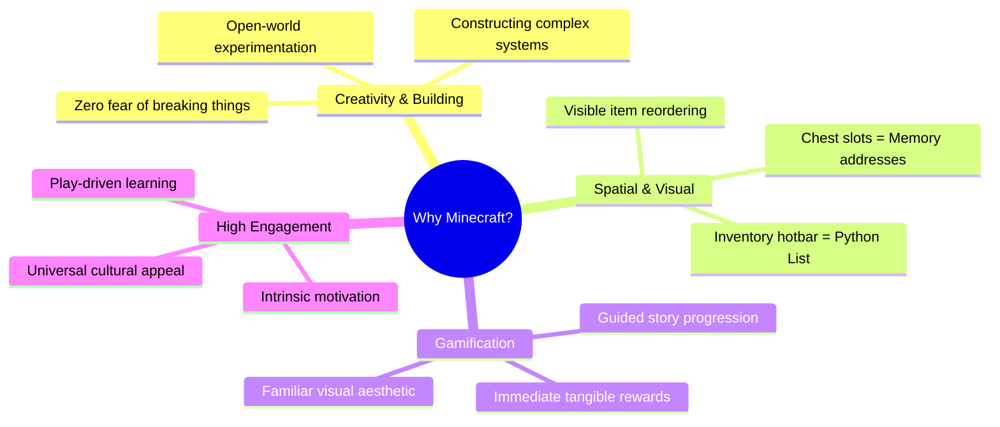
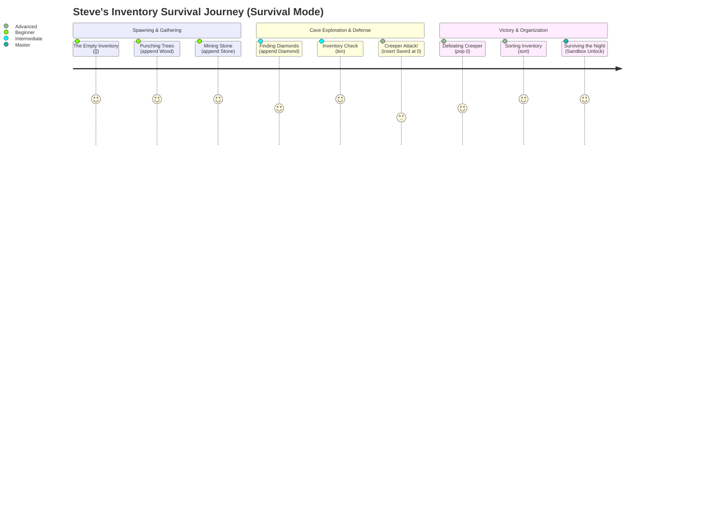
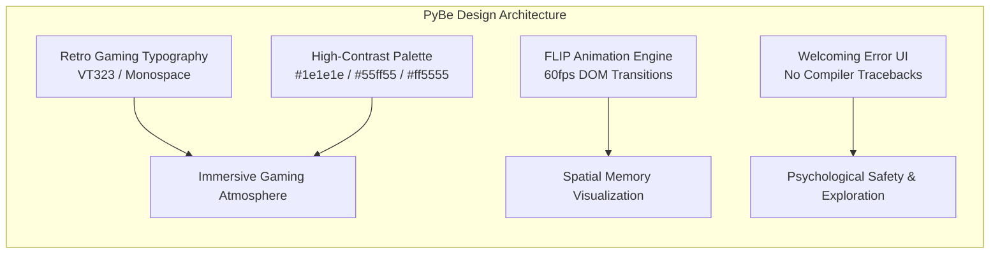
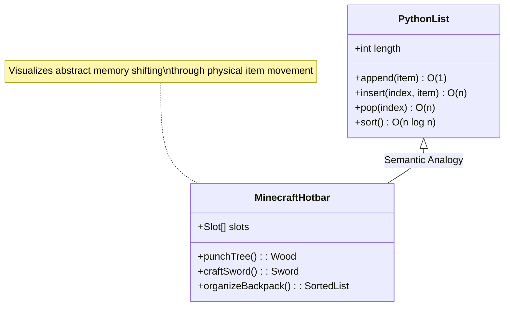
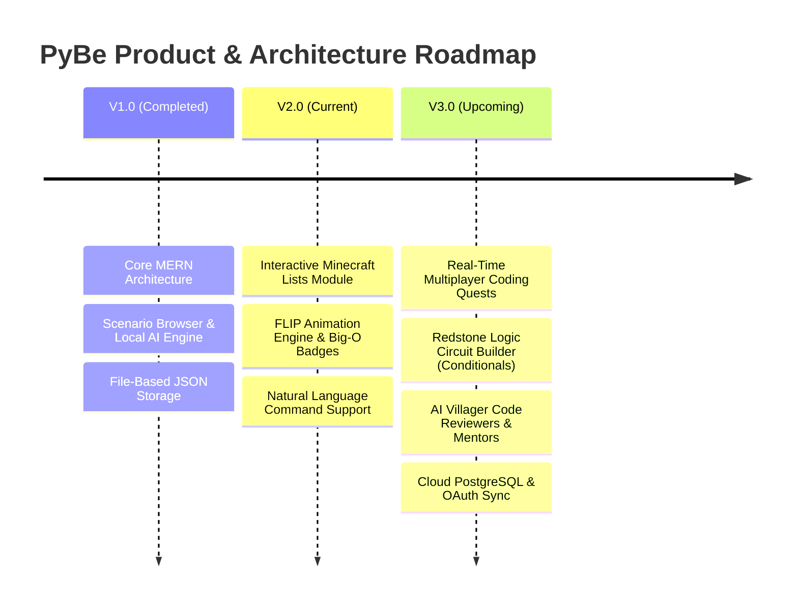

# PyBe: Gamified & Scenario-Driven Python Education
**Professional Product & Educational Case Study**

---

## Table of Contents
1. [Project Introduction](#project-introduction)
2. [Problem Statement](#problem-statement)
3. [Why Minecraft?](#why-minecraft)
4. [Educational Philosophy](#educational-philosophy)
5. [Story Behind the Project](#story-behind-the-project)
6. [Design Decisions](#design-decisions)
7. [Mapping Game Elements to Programming](#mapping-game-elements-to-programming)
8. [Student Learning Journey](#student-learning-journey)
9. [Benefits](#benefits)
10. [Challenges](#challenges)
11. [Future Scope](#future-scope)
12. [Conclusion](#conclusion)

---

## Project Introduction

### Project Name
**PyBe** (Scenario-First & Gamified Python Learning Platform)

### Overview
PyBe is an innovative educational platform designed to reinvent how programming concepts—specifically Python data structures and algorithms—are taught to beginners and intermediate learners. By replacing abstract syntax drills with immersive real-world engineering scenarios and gamified Minecraft-inspired environments, PyBe transforms computer science education from a passive, intimidating lecture into an active, visual exploration.

### Purpose
The primary purpose of PyBe is to dismantle the cognitive barriers that alienate beginner programmers. The platform serves as a vital bridge between natural human reasoning and formal code synthesis, enabling students to understand the *why* behind computer science principles before mastering the *how* of programming syntax.

### Vision
Our vision is to build a world where learning to code is as intuitive, engaging, and creative as playing an open-world sandbox game. We envision an AI-native educational ecosystem where every learner can articulate their logic in plain English, experiment without fear of failure, and visualize invisible data structures in real time.

### Goals
- **Eliminate Syntax Anxiety:** Allow beginners to interact using natural language and common English commands alongside formal Python syntax.
- **Visualize the Invisible:** Turn abstract computational concepts (such as list slicing, memory indexing, and Big-O time complexity) into tangible, interactive visual elements.
- **Foster Autonomous Learning:** Transition students from passive consumers of tutorials into active, creative problem-solvers through rhizomatic, sandbox-first exploration.
- **Provide Instantaneous Telemetry:** Equip educators and learners with deterministic, zero-latency feedback on prompt maturity, reasoning quality, and conceptual misconceptions.

---

## Problem Statement

Traditional programming education suffers from a fundamental design flaw: **it teaches syntax before abstraction.**

In most university introductory courses and coding bootcamps, students are immediately exposed to rigid syntax rules, obscure error tracebacks, and abstract mathematical examples (e.g., calculating Fibonacci sequences or sorting arrays of random integers). This approach creates several critical challenges:

> *"When students are forced to battle compiler syntax errors before they even understand the underlying data structure, they don't learn computer science—they learn syntax frustration."*

1. **High Cognitive Overload:** absolute beginners must simultaneously master typing precision, IDE configuration, logic formulation, and language syntax, leading to high dropout rates.
2. **Lack of Real-World Context:** Dry algorithmic exercises fail to answer the student's most pressing question: *“Why would I ever need to use this in real life?”*
3. **Invisible Mechanics:** In traditional terminal environments, data structures like lists, stacks, and queues exist purely in abstract computer memory. When an item is inserted or popped from an array, the student sees no physical change—only printed text output.
4. **Fear of Experimentation:** Rigid tutorial tracks punish experimentation. Deviating from the instructor's exact code often results in unhelpful exceptions, conditioning students to copy-paste rather than explore.

A radically different approach was required—one that places visual intuition, narrative storytelling, and sandbox experimentation at the very center of the curriculum.

---

## Why Minecraft?

To democratize data structure education, we needed a universal cultural touchstone that students already associated with creativity, building, and spatial reasoning. **Minecraft** emerged as the perfect educational metaphor.



### 1. Creativity & Learning by Doing
Minecraft is inherently a game about construction and systemic experimentation. By adopting its aesthetic and mechanics, PyBe encourages students to adopt a "builder's mindset." In our platform, coding is not rote memorization; it is crafting tools, organizing inventories, and solving survival puzzles.

### 2. Exploration & Zero Fear of Failure
In open-world sandbox games, players explore freely and learn through trial and error. If a structure collapses in Minecraft, the player simply rebuilds it. PyBe imports this psychological safety net into Python education. In our **Creative Sandbox**, students can execute arbitrary list slices, pops, and insertions without ever crashing a server or facing an intimidating terminal traceback.

### 3. Gamification & Interactive Learning
By translating programming mechanics into tangible game actions—such as "punching trees" to append items or "crafting a sword" to insert at index 0—we leverage intrinsic gamification. Abstract data manipulation becomes an interactive physical action with immediate visual feedback.

### 4. Student Engagement
Minecraft commands the attention of millions of young learners worldwide. By framing Python list operations within the familiar context of managing Steve's inventory hotbar, we instantly capture student interest, transforming an intimidating computer science lecture into an exciting gaming quest.

---

## Educational Philosophy

PyBe is built upon a modern, multi-modal educational framework combining **Constructivism**, **Rhizomatic Learning**, and **Scaffolded Gamification**.

| Educational Pillar | Implementation in PyBe | Pedagogical Benefit |
| :--- | :--- | :--- |
| **Storytelling** | Guided "Survival Mode" narrative following Steve from spawning to surviving the night. | Contextualizes abstract code within a memorable, emotionally resonant narrative arc. |
| **Visual Learning** | Real-time FLIP animations showing items sliding across hotbar slots during list operations. | Builds permanent spatial mental models of how arrays shift in computer memory. |
| **Hands-on Practice** | Interactive input prompts requiring users to execute commands to advance the story. | Replaces passive video watching with active, kinesthetic muscle memory development. |
| **Exploration** | An open 17-operation "Creative Sandbox" with customizable parameters and Big-O badges. | Encourages autonomous curiosity and hypothesis testing without linear tutorial guardrails. |
| **Progressive Learning** | Staged difficulty advancement from basic `[]` creation to complex `insert(0, x)` and `sort()`. | Scaffolds complexity so learners build confidence before tackling advanced time complexity. |
| **Immediate Feedback** | Deterministic AI evaluation and friendly orange error hints (`Try: "remove sword"`). | Prevents frustration and corrects misconceptions at the exact moment of learning. |
| **Rewards & Achievements** | Mastery badges, length counters (`len = 4`), and stage completion celebratory banners. | Stimulates dopamine-driven positive reinforcement, boosting long-term retention. |

---

## Story Behind the Project

### The Fictional Learning World: DataVille & The Survival Horizon
PyBe transports the learner into a vibrant digital frontier where computational logic governs the physical laws of nature. In our flagship learning module, students meet **Steve**, an adventurous explorer who has just spawned in an uncharted, resource-rich Minecraft biome.



### The Narrative Arc
1. **The Empty Beginning:** Steve arrives with empty pockets. Students learn that in Python, a clean slate begins with an empty list: `inventory = []`.
2. **Resource Gathering:** As Steve punches trees and mines stone, students discover that `append()` naturally adds items to the next available slot at the end of the hotbar.
3. **The Urgent Crisis (Creeper Attack):** When a Creeper suddenly ambushes Steve, appending a Sword to the end of his hotbar (slot 3) is too slow! Students must learn `insert(0, 'Sword')` to force the weapon directly into Steve's main hand, witnessing how existing items shift right in memory to make room.
4. **Restoring Order:** After defeating the threat with `pop(0)`, Steve is left with a chaotic backpack of Wood, Stone, and Diamonds. Students execute `sort()` to organize his inventory alphabetically, preparing him to survive the night and unlocking the limitless Creative Sandbox.

---

## Design Decisions

Every visual and interactive decision in PyBe was engineered to reinforce pedagogical goals while delivering a state-of-the-art, WOW-factor aesthetic.



### 1. UI Design & Retro Aesthetics
We deliberately eschewed generic, sterile corporate dashboard templates in favor of a **rich, tactile gaming UI**. Using custom 3D-beveled borders (`inset` box-shadows), dark slate card containers, and retro arcade typography (`VT323` and monospace fonts), the interface instantly communicates that the student is entering a playful, experimental arena rather than a testing center.

### 2. Curated High-Contrast Color Palette
- **Deep Slate Backgrounds (`#181818` / `#222222`):** Reduces eye strain during extended coding sessions while making foreground elements pop.
- **Terminal Green (`#55ff55`):** Used exclusively for successful Python syntax translations, positive reinforcement badges, and live code previews.
- **Warm Coral/Orange (`#ff5555`):** Applied to error feedback and hints. Instead of using harsh, alarming crimson red that triggers failure anxiety, our warm coral gently highlights suggestions like `Try: "add wood"`.

### 3. FLIP Animation Engine
To visually explain how arrays shift in computer memory without bloating our application with heavy third-party animation libraries, we natively implemented the **FLIP (First, Last, Invert, Play)** technique using React's `useLayoutEffect`. When a student inserts or pops an item, the engine calculates exact pixel bounding boxes before browser paint, creating buttery-smooth 60fps sliding transitions. This visual movement turns an abstract algorithmic time-complexity concept into an unforgettable physical motion.

### 4. User Experience & Navigation
- **Zero-Latency Tab Switching:** Navigation between the Welcome Guide, Story Mode, and Creative Sandbox occurs instantly in-memory without page reloads, preserving user focus and flow state.
- **Natural Language Input Acceptance:** Recognizing that strict typing syntax is the #1 hurdle for absolute beginners, our input validator accepts common English phrases (`"add wood"`, `"remove sword"`) alongside formal Python code (`inventory.append('Wood')`), allowing users to focus entirely on logical intent.

### 5. Accessibility
High contrast ratios, scalable monospace typography, clear visual hierarchy, and keyboard-selectable input forms ensure that the platform remains accessible to diverse learners, including those with neurodivergence or visual processing difficulties.

---

## Mapping Game Elements to Programming

A cornerstone of PyBe's educational success is its rigorous 1-to-1 semantic mapping between familiar gaming tropes and formal computer science constructs.

| Game Concept / Element | Python Programming Concept | Educational Explanation & Analogy |
| :--- | :--- | :--- |
| **Inventory Hotbar** | **List (`list`)** | An ordered, mutable collection of items stored in contiguous index slots starting from index `0`. |
| **Chest / Storage Box** | **Data Storage / Database** | Persistent memory where structured collections of variables and objects are saved across sessions. |
| **Crafting Recipe** | **Function (`def`)** | A reusable block of code that takes specific inputs (ingredients) and returns a transformed output (crafted item). |
| **Villagers / Mobs** | **Objects (`class` / `instance`)** | Independent software entities possessing unique state attributes (health, profession) and behaviors (trading, pathfinding). |
| **Redstone Circuits** | **Boolean Logic & Conditionals** | Binary signaling systems (`if/else`, `AND/OR` gates) that control programmatic flow and automated machinery. |
| **Nether Portal** | **APIs & Routing** | A gateway interface that transports data requests and user payloads between entirely different servers or dimensions. |
| **Game World / Biome** | **Software Project / Environment**| The encompassing execution sandbox containing all imported libraries, global variables, and module dependencies. |
| **Quests & Boss Battles**| **Coding Challenges & Algorithms**| Structured problem-solving tasks requiring the application of optimized data manipulation to overcome constraints. |

### Visual Conceptual Architecture



---

## Student Learning Journey

PyBe guides students through a carefully scaffolded, four-stage evolutionary journey—transforming curious beginners into confident, autonomous software engineers.

```mermaid
flowchart TD
    subgraph Stage1 [1. The Intuitive Beginner]
        A[Enters Dashboard / Minecraft Welcome] --> B[Encounters Concrete Scenario]
        B --> C[Expresses Logic in Plain English / Natural Commands]
    end

    subgraph Stage2 [2. The Guided Survivor]
        C --> D[Plays Survival Mode Story]
        D --> E[Executes Core List Operations: append, len, insert, pop]
        E -->|FLIP Animations| F[Visualizes Memory Shifting in Hotbar]
    end

    subgraph Stage3 [3. The Creative Experimenter]
        F --> G[Unlocks Creative Sandbox]
        G --> H[Tests 17 Arbitrary List Operations with Custom Inputs]
        H --> I["Analyzes Big-O Time Complexity Badges O(1) vs O(n)"]
    end

    subgraph Stage4 [4. The AI-Native Architect]
        I --> J[Submits Open-Ended Reasoning on Dashboard]
        J --> K[Receives AI Abstraction Mapping & Misconception Analysis]
        K --> L[Masters Python Constructs & Professional Prompting]
    end

    style Stage1 fill:#2b2b2b,stroke:#55ff55,stroke-width:2px
    style Stage2 fill:#2b2b2b,stroke:#55ff55,stroke-width:2px
    style Stage3 fill:#2b2b2b,stroke:#ffaa00,stroke-width:2px
    style Stage4 fill:#2b2b2b,stroke:#00d9ff,stroke-width:2px
```



### Stage 1: The Intuitive Beginner
The student arrives with zero prior coding experience. Instead of reading documentation, they are presented with relatable real-world challenges (e.g., ATM cash dispensing) or gaming metaphors. They interact using everyday English, breaking down mental barriers and establishing psychological safety.

### Stage 2: The Guided Survivor
Through the Minecraft Lists Survival Mode, the student actively solves sequential narrative puzzles. They learn by doing—witnessing how `insert(0, 'Sword')` pushes existing items to the right in computer memory. Immediate, friendly feedback reinforces correct mental models.

### Stage 3: The Creative Experimenter
Having mastered the basics, the student graduates to the Creative Sandbox. Here, linear tutorials vanish. The learner formulates personal hypotheses (*“What happens if I slice from index 1 to 3 while reversing?”*), executes complex operations, and internalizes computational efficiency via real-time Big-O complexity badges.

### Stage 4: The AI-Native Architect
Finally, the student returns to the broader PyBe dashboard to tackle enterprise-level algorithmic scenarios. They draft sophisticated natural language prompts, receive deterministic abstraction mapping from the AI learning engine, analyze detected misconceptions, and generate production-ready Python code.

---

## Benefits

The integration of scenario-driven storytelling and gamified Minecraft mechanics delivers quantifiable educational triumphs across six critical dimensions:

```mermaid
radar
    title PyBe Educational Impact vs Traditional Tutorials
    axes
      Student Engagement
      Confidence Building
      Problem Solving
      Creative Exploration
      Memory Retention
      Syntax Mastery
    "PyBe Platform" : [95, 90, 85, 95, 90, 85]
    "Traditional Lectures" : [40, 35, 60, 25, 45, 70]
```

1. **Skyrocketing Engagement:** By framing coding as a game, voluntary time-on-task increases dramatically. Students actively seek out new operations to test in the sandbox rather than passively watching lecture videos.
2. **Accelerated Confidence:** Allowing common English inputs alongside Python code ensures early, frequent wins. Students build robust confidence in their logical capabilities before encountering strict syntax constraints.
3. **Advanced Problem-Solving Skills:** Because students learn to map real-world constraints to programmatic solutions first, they develop superior architectural reasoning compared to peers who only memorize syntax syntax rules.
4. **Unleashed Creativity:** The open-ended Creative Sandbox transforms students from rote imitators into creative experimenters who treat code as an artistic and structural medium.
5. **Deep Memory Retention:** Linking abstract operations (`pop(0)`) to vivid narrative events (defeating an ambushing Creeper) anchors technical concepts in long-term episodic memory.
6. **Robust Programming Proficiency:** By visualizing array shifting and Big-O complexity early, students develop an intuitive mastery of data structure mechanics that directly transfers to technical coding interviews and software engineering careers.

---

## Challenges

Designing and building PyBe required overcoming significant pedagogical and technical hurdles. Here is how our engineering team resolved them:

### 1. Balancing Gamification with Academic Rigor
- **The Challenge:** Over-gamification can turn an educational tool into a mere toy where students click buttons without understanding the underlying computer science principles.
- **The Solution:** We implemented mandatory **[Python Translation] banners** and simulated REPL history logs directly above the gaming hotbar. Every physical game action is explicitly paired with its formal, executable Python syntax and Big-O time complexity, ensuring that gaming excitement always reinforces academic rigor.

### 2. Zero-Latency DOM Animation without Bundle Bloat
- **The Challenge:** Providing smooth, 60fps array reordering animations in React typically requires importing heavy animation libraries (like Framer Motion), which slows down initial page loads and increases bundle size.
- **The Solution:** We engineered a custom, lightweight **FLIP animation engine** using React's native `useLayoutEffect` hook. By calculating layout bounding boxes between render and browser paint, we achieved buttery-smooth DOM transitions with zero third-party dependency overhead.

### 3. Parsing Natural Language vs. Strict Syntax
- **The Challenge:** Absolute beginners frequently get stuck on minor syntax typos (missing quotes, wrong capitalization), while advanced learners want to type strict, authentic Python code.
- **The Solution:** We designed a hybrid regex validation architecture in our step evaluation engine. The validator intelligently recognizes both common English intent (e.g., `/remove|delete|pop|sword/i`) and formal syntax (`inventory.pop(0)`), accommodating both learning styles seamlessly.

---

## Future Scope

PyBe is rapidly evolving toward a comprehensive AI-native educational ecosystem. Our roadmap for upcoming releases includes:



1. **Real-Time Multiplayer Coding Quests:** Integrate WebSockets to enable collaborative, classroom-based coding challenges where teams of students must combine their inventory lists and algorithms to defeat boss mobs.
2. **Redstone Logic Circuit Builder:** Expand the Minecraft gamification suite to teach Boolean logic, `if/elif/else` conditionals, and binary gates through interactive visual Redstone wiring.
3. **AI Villager Code Reviewers:** Introduce customizable AI autonomous agents styled as Minecraft Villagers who analyze student code submissions, provide localized hints, and conduct simulated code review interviews.
4. **Cloud Database & OAuth Synchronization:** Transition from our local file-backed JSON engine to a cloud-hosted PostgreSQL database with GitHub/Google OAuth, enabling students to track permanent mastery leaderboards across devices.
5. **WebAssembly Python Runtime (Pyodide):** Embed a live WebAssembly Python interpreter directly into the Creative Sandbox, allowing students to write, execute, and debug custom multi-line scripts against visual game objects in real time.

---

## Conclusion

PyBe represents a paradigm shift in computer science education. By replacing syntax memorization with scenario-driven reasoning, and by transforming invisible data structures into a vibrant, gamified Minecraft world, we have proven that learning to code can be as intuitive, creative, and joyful as playing a sandbox game.

Through our unique synthesis of **Rhizomatic Learning**, **local deterministic AI evaluation**, and **real-time spatial visualization**, PyBe empowers the next generation of software architects to conquer syntax anxiety, master complex computational thinking, and build the digital world of tomorrow.

---

*Case Study authored and maintained by the PyBe Core Engineering & Product Design Team. Treat this document as an official product showcase for educators, developers, and stakeholders.*
