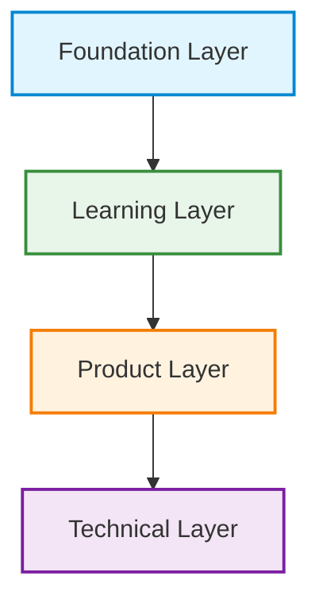

# PyBe Master Architecture

## Introduction
This document serves as the master blueprint of the entire PyBe platform. Its purpose is to integrate all isolated aspects of the project—our ideological foundation, our pedagogical strategy, our product design, and our technical architecture—into one coherent, holistic system. 

It exists to answer one central question: **How does PyBe work as a complete learning platform?** 

By mapping the overarching structure of the platform, this document ensures that every technical decision supports a product feature, every product feature serves a pedagogical goal, and every pedagogical goal aligns with our fundamental vision.

## The Layered Architecture Model
PyBe is organized as a layered architecture. Rather than treating education, product, and software engineering as distinct phases of development, we treat them as strictly dependent structural layers. 

Each layer acts as the load-bearing foundation for the layer directly above it. Decisions flow upward: the foundational constraints dictate the learning model; the learning model shapes the product design; and the product design dictates the technical requirements.

## Architectural Layers

### 1. Foundation Layer
The Foundation Layer is the ideological bedrock of the platform. It establishes the boundaries and trajectory of the project.
- **Vision:** The long-term aspirational future we are building toward.
- **Context:** The systemic problems in programming education that necessitate our approach.
- **Goals:** The primary educational and product objectives of the platform.
- **Philosophy:** Our core beliefs, such as prioritizing meaning over memorization.
- **Constraints:** The explicit non-goals that prevent scope creep and protect the project's identity.

### 2. Learning Layer
The Learning Layer translates our foundational philosophy into a structured pedagogical strategy. It defines *how* the user will learn.
- **Learning Flow:** The structured progression from encountering a problem to mastering a concept.
- **Computational Thinking:** The prioritization of problem decomposition and algorithmic logic over syntax.
- **Concept Emergence:** The strategy of introducing tools only when the learner encounters a problem that requires them.
- **Assessment:** The methodologies used to measure genuine comprehension and logic transfer.
- **Reflection:** Mechanisms that prompt the learner to internalize the logic they have just applied.
- **Feedback:** The supportive responses provided to guide learners through productive struggle without simply giving away answers.

### 3. Product Layer
The Product Layer translates the pedagogical strategy into a tangible user experience. It defines *where* and *what* the user interacts with.
- **Worlds:** The overarching, real-world ecosystems that contextualize learning.
- **Storylines:** The narrative arcs that provide intrinsic motivation and continuity.
- **Scenarios:** The self-contained, interactive challenges that require a computational solution.
- **User Experience:** The interface and interactions that facilitate accessible, frictionless learning.
- **Navigation:** How learners move between scenarios, worlds, and overarching concepts.
- **Progression:** The overarching structure that tracks a learner's journey and unlocking of subsequent challenges based on demonstrated mastery.

### 4. Technical Layer
The Technical Layer translates the product requirements into functional engineering. It provides the digital infrastructure necessary to execute the layers above it.
- **System Architecture:** The high-level structural design of the platform's independent components.
- **Engines:** The core processors responsible for driving narratives, rendering scenarios, and evaluating user logic.
- **Data Models:** The abstract structures used to represent learners, progress, worlds, and concepts.
- **APIs:** The communication boundaries that allow the platform's internal systems to interact.
- **Storage:** The abstract mechanisms for persisting user progress, state, and world content.
- **Python Execution:** The safe, integrated environments required to evaluate and run learner-submitted code.

## Layer Relationship Diagram

## A Living Blueprint
This document is a living blueprint. It provides the macroscopic view of the PyBe platform. Detailed specifications, constraints, and implementations for each specific layer will be continuously developed, refined, and documented in their respective directories (`docs/foundation/`, `docs/pedagogy/`, `docs/product/`, and `docs/technical/`).
