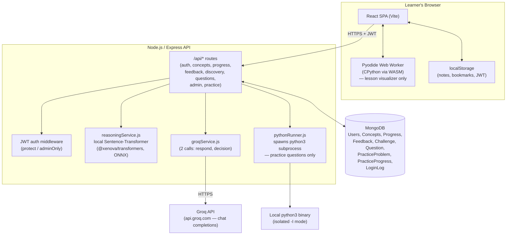

# PyBe (PyLearn) — Product Specification

> **Purpose of this document.** This is a complete, implementation-level product spec
> for a MERN web app that teaches Python through a themed, AI-assisted "discovery
> learning" workflow, plus a separate LeetCode-style practice area and an admin
> analytics dashboard. It is written so that a coding LLM given only this file can
> regenerate a functionally equivalent application — same data model, same routes,
> same page flows, same UX rules, same edge-case behaviors. A companion
> `architecture.md` will go deeper on system architecture; this document only
> includes one high-level diagram (see [Architecture Diagram](#architecture-diagram)).

---

## 1. One-line pitch

**PyBe** is a Python learning platform where every learner picks one real-world
theme (Sports, Daily Life, Philosophy, Food, or Environmental) at onboarding, and
every lesson — from then on — teaches each Python concept through that theme's own
story world, using an AI tutor (Groq) to react to the learner's own reasoning
before any code or syntax is shown.

---

## 2. Tech stack

**Monorepo**, two apps, one shared root `package.json` with convenience scripts.

- `backend/` — Node.js 18+, Express 4, Mongoose 8 (MongoDB), JWT auth (jsonwebtoken +
  bcryptjs), `@xenova/transformers` (local ONNX sentence-transformer), `cors`, `dotenv`.
- `frontend/` — React 18 + Vite 5, React Router 6, Axios, Tailwind CSS 3, Recharts
  (admin charts), `@monaco-editor/react` (code editor), `lucide-react` (icons — **no
  emoji anywhere in the product**), Pyodide (CPython-in-WASM, loaded from a CDN inside
  a Web Worker — not an npm package).
- **Two execution paths for "run Python code," by design, never mixed:**
  1. **Client-side, Pyodide-in-a-Web-Worker** — powers the per-concept "Visualize"
     widget in Section 2 of the lesson page. No network round-trip, no server
     involvement, unlimited use.
  2. **Server-side, real CPython subprocess** — powers the standalone "Practice
     Questions" (LeetCode-style) area. `backend/services/pythonRunner.js` shells out
     to `python3 -I <tempfile>` per submission, with a harness that serializes
     results as JSON between sentinel markers, a configurable execution timeout, and
     temp-file cleanup in a `finally` block.
- One AI provider integration: **Groq** (`api.groq.com`, OpenAI-compatible chat
  completions, JSON mode), used for exactly two calls in the whole app — both inside
  the Section-1 discovery flow. Model: `llama-3.3-70b-versatile` by default,
  configurable via env. (Note: Groq, the fast-inference company at
  `console.groq.com` — not "Grok"/xAI.)

### Root scripts (`package.json`)
```
install:all   -> install backend + frontend deps
dev:backend    -> cd backend && npm run dev   (nodemon)
dev:frontend   -> cd frontend && npm run dev  (vite, http://localhost:5173)
seed           -> alias for seed:concepts
seed:concepts  -> node backend/seed/seedConcepts.js
seed:challenges-> node backend/seed/seedChallenges.js
seed:admin     -> node backend/seed/seedAdmin.js
seed:practice  -> node backend/seed/seedPracticeProblems.js
seed:all       -> seed:concepts && seed:challenges
```

### Backend env (`.env`)
```
PORT=5000
MONGO_URI=mongodb://localhost:27017/pylearn        # or Atlas URI — required, app exits if missing
JWT_SECRET=change_this_in_production
FRONTEND_URL=http://localhost:5173                  # CORS origin

GROQ_API_KEY=...            # required only for the two AI calls in Section 1
GROQ_API_URL=https://api.groq.com/openai/v1/chat/completions
GROQ_MODEL=llama-3.3-70b-versatile

PYTHON_BIN=python3           # used by the practice-question runner
EXEC_TIMEOUT_MS=5000
REASONING_PASS_THRESHOLD=0.32   # local sentence-transformer pass bar
```

Backend server listens only after a successful `mongoose.connect`; a missing
`MONGO_URI` or failed connection logs an error and `process.exit(1)` — the app
never silently boots without a database.

---

## 3. Data model (MongoDB / Mongoose)

### `User`
| field | type | notes |
|---|---|---|
| name | String, required | |
| email | String, required, unique, lowercase | |
| password | String, required | bcrypt hash |
| role | enum `user` \| `admin`, default `user` | public registration always forces `user` |
| theme | enum `sports`\|`daily-life`\|`philosophy`\|`food`\|`environmental`, default null | drives every scenario/example the learner sees |
| learningGoal | String, default `''` | free text, "why learn Python" |
| pythonLevel | enum `beginner`\|`intermediate`, default null | |
| learningMode | enum `guided`\|`explore`, default null | guided = sequential unlock; explore = all unlocked |
| onboardingComplete | Boolean, default false | |
| createdAt | Date, default now | |

### `Concept` (one Python topic / lesson)
`title, slug (unique), order (Number), difficulty (easy|medium), icon (lucide-react component name, e.g. "Package" — looked up via `conceptIcons.jsx`, never an emoji), description`.

### `Progress` (one per user+concept, compound-unique index on `userId+conceptId`)
- `discoveryCompleted`, `codingCompleted`, `blanksCompleted` — three independent booleans, one per lesson section.
- `discoverySnapshot` — read-only record of what happened in Section 1: `responses[3]`, `explanation`, `decisionChoice`, `decisionCorrect`, `decisionAnalysis`. Written only by the discovery endpoints; the frontend never edits it, only replays it on revisit.
- `completed`, `completedAt`, `createdAt`, `updatedAt`.
- **Pre-save hook:** auto-sets `completed = true` (and `completedAt` once, if unset) exactly when all three of `discoveryCompleted && codingCompleted && blanksCompleted` are true. This is the single source of truth for "lesson done."

### `Feedback` (upserted, one per user+concept)
`userId, conceptId, helpful (Boolean, required), comment (String, optional), createdAt`.

### `Challenge` (one per Concept, matched by `conceptSlug`) — the content backing Section 1 + Section 2
This is the richest schema in the app. Authoring content lives entirely here, not in code.

- `themes`: a Mongoose `Map` keyed by exactly the 5 theme strings, each value a **themeVariant**:
  - `storyTitle` (optional, not currently rendered — authoring reference)
  - `background` (optional; if present, shown persistently across all 3 scenario steps instead of a per-step artwork placeholder)
  - `scenarios`: **exactly 3** objects, each `{ scenario, prompt, image (optional path), reasoningKeyPoints[] (never shown to learner; passed to the AI as extra context) }`
  - `decisionScenario`: `{ scenario, question, optionA, optionB, correctOption: 'A'|'B', image }` — `correctOption` is **never sent to the client**.
  - `example`: `{ code, explanation, syntaxBreakdown: [{ code, points[] }] }` — a themed worked example, hand-authored per theme+concept (so 5 themes × N concepts = 5N distinct examples), plus an authored line-by-line breakdown (not generated at request time).
- `conceptHint` (optional, AI-only context, never shown to learner)
- `conceptIntro` (required) — the plain-English concept explanation shown in Section 2
- `reinforcement`: `{ prompt, hint, keyPoints[] }` — an optional, separate exercise, unrelated to Section 1/2/3, checked by local semantic scoring
- `blanks`: `{ conceptual: FillBlank, code: FillBlank }` — **theme-agnostic**, same for every learner regardless of theme. `FillBlank = { text (contains a literal "____" token), options[] (word bank incl. distractors), answer (must be one of options), hint }`.

### `Question` (admin-authored, additive per Concept)
`conceptId, type ('practice'|'scenario'), level (easy|medium|hard), title, scenario (optional flavor / required for scenario type), description (the task/prompt), starter (practice only), hint, expectedOutput (required for practice), acceptableOutputs[], keyPoints[] (scenario only, never sent to client — answer key for semantic scoring), order, isActive, createdBy`. Timestamps on.

### `PracticeProblem` (LeetCode-style, seeded content — separate from `Question`)
`slug (unique), topic, title, order, difficulty (Easy|Medium|Hard), description, hint, functionName, paramNames[], starterCode, tests[]`. Each test: `{ mode: 'args'|'custom', args (for args mode), call (raw python expr, for custom mode), displayInput, expected }`.

### `PracticeProgress`
`userId (String — the app's Mongo user id, passed through, not an ObjectId ref), problemSlug, status ('attempted'|'solved'), lastCode`. Compound-unique on `userId+problemSlug`.

### `LoginLog`
One doc per successful login: `userId, name, email, role` (denormalized so old logs still read right after a name change), `ipAddress, userAgent, loginAt`.

---

## 4. Frontend route map & auth guards

Base layout: `AuthProvider` → `ThemeSync` (repaints CSS vars on theme change) →
`ConceptProvider` (tracks "active concept" for the chatbot) → `BrowserRouter`.

| Path | Guard | Page |
|---|---|---|
| `/` | none | HomePage |
| `/about` | none | AboutPage |
| `/login` | `PublicRoute` | LoginPage |
| `/register` | `PublicRoute` | RegisterPage |
| `/onboarding` | `OnboardingRoute` | OnboardingPage |
| `/mode-selection` | none | ModeSelectionPage |
| `/dashboard` | `PrivateRoute` | DashboardPage |
| `/modules` | `PrivateRoute` | ModulesPage |
| `/notes` | `PrivateRoute` | NotesPage |
| `/concept/:id` | `PrivateRoute` | ConceptPage |
| `/practice` | `PrivateRoute` | Practice Topics |
| `/practice/topic/:topic` | `PrivateRoute` | Topic's problem list |
| `/practice/problem/:slug` | `PrivateRoute` | Problem workspace |
| `/admin` (+ `questions`,`analytics`,`logs`,`feedback`) | `AdminRoute` | Admin dashboard |
| `*` | none | NotFoundPage |

Guard semantics:
- **PrivateRoute**: no user → `/login`. `role==='admin'` → `/admin` (admins never see learner UI). `!onboardingComplete` → `/onboarding`.
- **OnboardingRoute**: no user → `/login`. admin → `/admin`. already onboarded → `/dashboard`.
- **PublicRoute** (login/register): admin → `/admin`. onboarded user → `/dashboard`. non-onboarded user → `/onboarding`.
- **AdminRoute**: no user → `/login`. non-admin → `/admin` (i.e., effectively blocked — a non-admin can never reach it).

A floating `TopicChatBot` renders app-wide but is only actually shown when: a user is logged in, is **not** an admin, and the current path starts with `/concept/`. It reads the "active concept" from context (set by `ConceptPage`) rather than from the route alone, but the route check ensures it disappears immediately on navigating away.

---

## 5. Feature specification

### 5.1 Auth & accounts
- `POST /auth/register` — public; **always** creates `role: 'user'`. No public path to create an admin.
- `POST /auth/login` — same form/endpoint for learners and admins; response includes `role`, and the frontend branches on it. Writes a best-effort `LoginLog` row on every success (a logging failure must never block sign-in).
- Admin accounts are provisioned only via `npm run seed:admin` (`ADMIN_EMAIL`/`ADMIN_PASSWORD` env vars, defaults `admin@pybe.dev` / `ChangeMe123!`); re-running rotates the password for that email.
- JWT: 30-day expiry, `{ id: user._id }` payload, `Authorization: Bearer <token>` header, verified by `protect` middleware which loads `req.user` (password field excluded) fresh from the DB on every request (not just decoded-from-token) so a deleted/changed user is caught immediately. `adminOnly` middleware runs after `protect` and 403s anyone whose `req.user.role !== 'admin'`.
- Frontend stores `token` and the full `user` object in `localStorage`; a global Axios response interceptor clears both and hard-redirects to `/login` on any 401.

### 5.2 Onboarding (4-step wizard, one question per screen, progress dots up top)
1. **"What are you into?"** — pick exactly one theme: Sports / Daily Life / Philosophy / Food / Environmental. Each option shows its lucide icon + a one-line flavor description (e.g. Sports: "Scoreboards, leagues, training stats, match-day decisions"). This choice is what all future lesson content is filtered through.
2. **"Why do you want to learn Python?"** — free text, no wrong answer, just stored (`learningGoal`).
3. **"How much Python do you know?"** — Beginner / Intermediate.
4. **"How do you prefer to learn?"** — Guided Journey (sequential unlock) / Explore Freely (everything unlocked). Copy explicitly says "you can always switch this later."

Submits `PUT /auth/onboarding` with all four answers at once, sets `onboardingComplete: true`, then routes to `/dashboard`.

**Switching theme later** is a *separate*, narrower endpoint (`PATCH /auth/theme`) available any time from the Dashboard — it updates only `theme` and deliberately never touches `learningGoal`/`pythonLevel`/`learningMode`/`onboardingComplete`. `Progress` has no theme field at all, so switching themes can never affect what a learner has already completed — only which story-world future lessons are told through.

### 5.3 Theme system (full-app re-skin, not just lesson cards)
5 themes, each with its own icon (Trophy / Sun / Brain / UtensilsCrossed / Leaf) and an 11-shade color palette (50–900). `applyThemePalette` overwrites the app's `--color-brand-*` CSS custom properties at runtime; because every primary button, card accent, focus ring, and badge is built from the Tailwind `brand` color (which itself just reads those CSS vars), one function call re-skins the entire UI instantly, with zero per-component changes. No emoji anywhere — every visual theme cue is a real icon component.

### 5.4 Dashboard
Shows the learner's name/email, three pill badges (learning mode, Python level, current theme), a **theme switcher strip** (click any of the 5 theme icons to switch instantly — disabled while a switch is in flight, shows a small spinner on the one being switched to, and a checkmark badge on the currently-active one), and three large nav cards: **Modules**, **Practice Questions** ("LeetCode-style Python problems, organized by topic"), **Notes** ("Everything you've saved while studying, organized by topic").

### 5.5 Modules page
Grid of every `Concept`, each card showing its icon (themed gradient), title, description, a completed checkmark, or a locked padlock. Locking rule (guided mode only): a concept with `order > 1` is locked unless the concept at `order - 1` has `completed: true` in the learner's progress map. Explore mode: nothing is ever locked. Clicking an unlocked card navigates to `/concept/:id`. Robust error states distinguish "backend unreachable," "session invalid (401/403)," and "other server error," each with a specific actionable message (e.g. reminding the user to run `npm run seed:concepts` and check MongoDB is running).

### 5.6 Concept page — the core lesson experience
Layout: Navbar, left `Sidebar` (all concepts with locked/unlocked/completed states, current one highlighted), main content, and a right-hand `LessonRightRail` (see 5.6.4). A progress tracker bar shows three linked steps — **Discovery Learning → Visualize & Code → Fill in the Blanks** — each lighting up green with a checkmark as its section completes. Sections 2 and 3 are not even mounted until the previous one is done (no "coming soon" placeholder — they simply don't render).

If the concept is locked (guided mode, previous concept incomplete), the page shows a lock icon and a "back to dashboard" prompt instead of the lesson.

On completing **all three** sections, `Progress.completed` flips true and:
- A confetti-style "Lesson Completed!" banner appears with a link into Practice Questions (auto-targeted at the practice topic matching this concept, via `practiceTopicMap.js`, or the general practice hub as fallback).
- `FeedbackWidget` appears (thumbs up/down + optional comment textarea after picking).
- A "Continue to next lesson" button appears (only after full completion — never before).
- On completing a section, the page auto-scrolls the just-unlocked next section into view (`scrollIntoView({behavior:'smooth'})`, with a short setTimeout so React renders it first) — the UX goal stated in-code is that finishing a section should feel like advancing to the next module, not like a quiz quietly appearing below the fold.

Only the **previous** lesson is ever link-able from the nav row at the bottom — the *next* lesson link deliberately never appears there, only in the completion banner, so it's impossible to peek ahead before finishing.

#### 5.6.1 Section 1 — AI-Powered Discovery Learning
No pass/fail gate anywhere in this section. Every learner response is treated as showing real understanding.

1. **Three scenario steps, one at a time**, Back/Next wizard (`GET /discovery/:conceptId`, theme-filtered server-side — `resolveTheme` falls back to `daily-life` for any pre-theming account). Each step shows: optional shared `background` text (persistent across all three steps, in place of per-step artwork) or a per-step image placeholder, the scenario text, an open-ended prompt, and a free-text textarea. Nothing is sent to the server until all three are answered — purely client-side state until the final Next.
2. **One combined submission** — `POST /discovery/respond` with all 3 responses. Backend calls Groq once (`generateResponse`): the model is told to (a) silently consider how the learner's understanding moved across the three answers, (b) write ONE 5–7 sentence consolidated explanation that explicitly references the *specific* details of scenarios 1–3 (not "the first scenario" but what it actually was), tying the pattern together and bridging to the real Python concept, (c) never say anything is "wrong," (d) include no code yet. Response is forced JSON (`response_format: json_object`), a markdown-fence stripper handles models that ignore that instruction anyway. The explanation + the three raw responses are persisted into `Progress.discoverySnapshot` (upsert) so returning to a completed lesson later replays this exact content with **zero** additional AI calls and **no** ability to edit past answers — it's a read-only recap.
3. **A single follow-up decision scenario** — a real-life analogy (deliberately *not* about Python syntax) with two options, A/B. `correctOption` is stripped server-side before the initial GET; the learner picks blind. `POST /discovery/decision` computes correctness server-side, then makes a **second**, separate Groq call (`generateDecisionAnalysis`) that gives a short (2–4 sentence), specific analysis of that exact pick, framed entirely in the analogy's own terms — correct or not. This too is merged into the same `discoverySnapshot`.
4. Only after the decision result is shown does a "Continue to the Python concept" control appear, which fires `discoveryCompleted: true` via `POST /progress/update`.

#### 5.6.2 Section 2 — Concept intro + themed worked example + visualizer
Only rendered once Section 1 is complete. Shows: the plain-English `conceptIntro`, then the themed worked `example` (code + explanation), with a collapsible per-line **syntax breakdown** (each meaningful token — keywords, punctuation, quotes, operators — gets its own plain-English point; collapsed by default, each line toggles independently). The example is shown in an **editable code box with a single "Visualize" button — no Run button, no pass/fail test**. Visualizing runs the code through the Pyodide-in-a-Worker tracer and opens an inline step-through debugger (see 5.7 for the shared visualizer mechanics). The learner can visualize as many times as they want; **the moment they've visualized at least once**, a "Proceed to next module" button appears, firing `codingCompleted: true`. There's no gate beyond "you looked at it running once."

#### 5.6.3 Section 3 — Fill in the blanks
Only rendered once Section 2 is complete. Exactly two exercises, both theme-agnostic (identical for every learner regardless of theme): one **conceptual** blank (a sentence about the idea) and one **code** blank (a line of code). Each is a drag-and-drop word bank above a sentence/line with one inline blank slot — real HTML5 drag-and-drop on desktop, with a tap-to-place fallback for touch devices (tap a chip to place it in the empty slot; tap a filled slot to clear it back to the bank, since dragging is unreliable on mobile). Submitting both at once hits `POST /discovery/blanks/check` (pure local string comparison against the answer key, no AI). **The learner can always continue regardless of correctness** — a short 1–2 line hint is shown for any wrong blank so they still learn the right answer before moving on. Completing this fires `blanksCompleted: true`, which (combined with the other two) flips `Progress.completed`.

#### 5.6.4 Lesson right rail
A persistent sidebar/floating panel alongside the lesson with:
- **Read-aloud narrator** (Web Speech API `speechSynthesis`) that reads the AI's Section-1 explanation. Play / Pause / Replay / 4-speed cycle (0.8×, 1×, 1.25×, 1.5×). Text passed through `cleanForSpeech`, which strips code fences, inline backticks, f-string braces, Python operator symbols, quotes, brackets, and anything after "Let's read this code" (the syntax-breakdown section) so TTS doesn't try to pronounce punctuation. Prefers an English "Female" voice if the browser exposes one. The narrator is disabled once Section 1 is already completed on this visit (`disableNarrator`).
- **Bookmark** toggle — stored in `localStorage` as an array under a per-user key; toggling shows a small toast ("Bookmarked!" / "Bookmark removed").
- **Notes** — a floating, chat-style popup with a textarea, bullet/numbered-list insert buttons (`insertLinePrefix`, inserts at the current line under the cursor), and Save. Persisted to `localStorage` under key `pybe_note_<userId>_<conceptSlug or id>` — **notes are entirely client-side, never sent to the backend.**
- A toast component for lightweight success/info/warning confirmations (bottom-right, auto-dismiss, colored left border by type).
- A chatbot toggle (see 5.9).

### 5.7 The Pyodide visualizer (shared mechanics, used by both Section 2's example and the standalone Practice Questions area)
Python runs **only** in the browser here, via Pyodide (CPython → WebAssembly) inside a Web Worker (`public/pyodide-worker.js`), lazily downloaded from a CDN the first time a learner opens any visualizer widget in a session and kept warm afterward (~10–20MB one-time download, browser-cached after). "Visualize" produces a step trace (`call`/`line`/`return`/`exception` events, stack frames, heap objects for lists/dicts/tuples/sets/class instances) rendered as a step-through debugger with:
- Forward/back stepping controls (SkipBack/ChevronLeft/ChevronRight/SkipForward) and a scrubber.
- Per-step plain-English annotation (`quickAnnotation`) — e.g. "Calling: main()", "Condition TRUE — entering loop body", "Assigning: total", using a small `builtins.ts` lookup table to describe common built-in method calls (e.g. `.append()`).
- Support for programs that call `input()` via a small modal prompting for stdin before continuing.
- No server round-trip of any kind for execution — code, output, and every trace step are produced entirely client-side.

### 5.8 Practice Questions (standalone, LeetCode-style — separate from any single concept)
Route: `/practice` (topics grid) → `/practice/topic/:topic` (problem list, `X/Y solved`) → `/practice/problem/:slug` (workspace: description, hint, Monaco code editor pre-filled with `starterCode`, Run vs Submit).
- Topics are a **fixed, ordered curriculum list** (`practiceTopics.js`): Comments, Variables, Data Types, Numbers, Casting, Booleans, Operators, Strings, String Formatting, Lists, Tuples, Sets, Dictionaries, If...Else, While Loops, For Loops, Functions, Lambda, Classes/Objects, Inheritance, List Comprehension — each with a one-line description. Only topics that actually have seeded problems appear.
- Execution is **real, server-side Python** (`pythonRunner.js`): the user's code + an auto-generated test harness are written to a temp file and run via `python3 -I` (isolated mode) with a timeout (`EXEC_TIMEOUT_MS`, default 5s) and a max output buffer; the harness calls the target function for every test (either by positional `args` or a raw `call` expression) and prints results as a JSON block between two sentinel markers so real user `print()` output never corrupts parsing. Handles: syntax errors, timeouts, per-test exceptions (each test fails independently rather than aborting the whole run), and non-JSON-serializable return values (falls back to `repr()`).
- **Run** mode only evaluates and shows pass/fail per visible test case, no persistence. **Submit** mode does the same evaluation *and*, if a `userId` is supplied, upserts `PracticeProgress` (`solved` if all tests passed, else `attempted`) plus the last submitted code, so a learner can leave and come back mid-problem without losing work. A lightweight autosave endpoint (`PUT /practice/progress/draft`) persists in-progress code on its own, independent of a full submit.
- Each problem also stores neighbor slugs (prev/next within its topic) so the workspace can offer sequential navigation.

### 5.9 Topic-locked chatbot
A floating, bottom-right chat widget, visible only on a concept page. It is **RAG-based over a local knowledge base — not an LLM call.** It answers only questions relevant to the concept currently open (scoped by slug); if no concept is active it prompts the user to navigate to a topic first. Renders a typing indicator, bot/user avatar bubbles, and a text input.

### 5.10 Notes page
A standalone `/notes` view that reads **every** `localStorage` note the current user has ever saved (scanning all keys with the user's note-key prefix), matches each back to its `Concept` by slug/id, sorts by lesson order, and lets the user inline-edit or delete any note. This is the same client-only storage the Lesson Right Rail writes to — the Notes page is purely a read/aggregate/edit surface over it, with no backend involvement.

### 5.11 Admin dashboard
A completely separate, visually distinct (dark sidebar shell) view gated by `role: 'admin'`, sharing the same login form as learners. Four sections, all under `/admin/*`, all backend routes gated by `protect + adminOnly`:

1. **Questions** (`/admin/questions`) — pick a module (Concept), add unlimited coding or scenario-style `Question` docs. These are **additive**: they appear *alongside*, not instead of, PyBe's own built-in practice content, served via the public `GET /questions/concept/:conceptId` (which strips `keyPoints`, the scenario answer key, before sending). Scenario-type answers are checked with the same local semantic-similarity scorer used elsewhere (`POST /questions/scenario/:id/check`), unlimited attempts.
2. **Analytics** (`/admin/analytics`) — summary cards (total learners, modules, active users last 7/30 days via distinct `LoginLog.userId`), a per-module completion-rate + avg-time-to-complete table/chart (`avgTimeToCompleteMinutes` computed from `completedAt - createdAt` on `Progress`, only over rows where both are set), a daily activity line chart (unique logins + completions per day, last N days, default 30, clamped 1–180), and a per-learner table (completion %, avg speed, login count, last active), sorted by concepts completed descending. Built with Recharts.
3. **Login Logs** (`/admin/logs`) — every successful sign-in, newest first, searchable by name/email, capped/limited (`?limit=`, default 200, max 1000).
4. **Feedback Analysis** (`/admin/feedback`) — per-module helpful/not-helpful percentage breakdown, plus the raw feed of every feedback row (who, which module, thumbs, optional free-text comment).

Non-admin routes and the learner-facing lesson flow are completely unaware of any of this — it's a separate view, not a hidden UI mode.

---

## 6. Complete API reference

All routes except `/auth/register`, `/auth/login`, and `/health` require `Authorization: Bearer <jwt>` (`protect` middleware). Admin routes additionally require `adminOnly`.

### Auth
| Method | Path | Body | Notes |
|---|---|---|---|
| POST | `/api/auth/register` | `{name,email,password}` | always `role:'user'` |
| POST | `/api/auth/login` | `{email,password}` | writes LoginLog (best-effort) |
| GET | `/api/auth/profile` | — | returns `req.user` |
| PUT | `/api/auth/onboarding` | `{theme,learningGoal,pythonLevel,learningMode}` | sets `onboardingComplete:true` |
| PATCH | `/api/auth/theme` | `{theme}` | isolated from other onboarding fields |

### Concepts / Progress / Feedback
| Method | Path | Notes |
|---|---|---|
| GET | `/api/concepts` | sorted by `order` |
| GET | `/api/concepts/:id` | 404 if missing |
| POST | `/api/progress/update` | body: any of `{conceptId, discoveryCompleted, codingCompleted, blanksCompleted}`; upserts; returns `{progress, nextConcept}` (nextConcept only computed if just-completed **and** guided mode) |
| GET | `/api/progress/user/:userId` | 403 unless `userId` matches caller; populates concept `title order difficulty icon slug` |
| POST | `/api/feedback` | `{conceptId, helpful, comment}`; upsert, one per user+concept |

### Discovery (Section 1/2/3 content + checks)
| Method | Path | Notes |
|---|---|---|
| GET | `/api/discovery/:conceptId` | full lesson payload for the learner's theme: background, 3 scenarios, decision scenario (`correctOption` stripped), `savedDiscovery` recap if previously completed, `conceptIntro`, themed `example`, reinforcement prompt+hint, blanks (text+options only) |
| GET | `/api/discovery/blanks/:conceptId` | Section 3 content standalone, theme-agnostic |
| POST | `/api/discovery/respond` | `{conceptId, responses:[r1,r2,r3]}` → one Groq call → `{explanation}`; persists to `discoverySnapshot` |
| POST | `/api/discovery/decision` | `{conceptId, choice:'A'|'B'}` → server checks correctness, second Groq call → `{correct, analysis}`; persists |
| POST | `/api/discovery/blanks/check` | `{conceptId, conceptualAnswer, codeAnswer}` → `{conceptualCorrect, codeCorrect, allCorrect, correctAnswers, hints}` |
| POST | `/api/discovery/reinforce` | `{conceptId, answer}` → local semantic score → `{passed, score, feedback}` (legacy/optional, not wired into the current 3-section flow) |

### Questions (admin-authored, learner-facing read + scenario check)
| Method | Path | Notes |
|---|---|---|
| GET | `/api/questions/concept/:conceptId` | public-to-any-learner; strips `keyPoints` |
| POST | `/api/questions/scenario/:id/check` | `{answer}` → local semantic score |

### Practice (LeetCode-style)
| Method | Path | Notes |
|---|---|---|
| GET | `/api/practice/topics?userId=` | topic list with total/solved counts |
| GET | `/api/practice/problems/topic/:topic?userId=` | problems in a topic with per-user status |
| GET | `/api/practice/problems/:slug?userId=` | full problem detail incl. prev/next, saved code |
| POST | `/api/practice/execute` | `{slug, code, mode:'run'|'submit', userId}` → real Python execution → `{compileError, allPassed, results}`; `submit` also upserts `PracticeProgress` |
| PUT | `/api/practice/progress/draft` | `{userId, slug, code}` → autosave, marks `attempted` on insert |
| GET | `/api/practice/progress/summary?userId=` | `{solved, attempted}` counts |

### Admin (all require `protect + adminOnly`)
| Method | Path |
|---|---|
| GET/POST | `/api/admin/questions` |
| PUT/DELETE | `/api/admin/questions/:id` |
| GET | `/api/admin/analytics/summary` |
| GET | `/api/admin/analytics/concepts` |
| GET | `/api/admin/analytics/users` |
| GET | `/api/admin/analytics/activity?days=` |
| GET | `/api/admin/logs?limit=` |
| GET | `/api/admin/feedback` |
| GET | `/api/admin/feedback/summary` |

### Misc
`GET /api/health` → `{status:'ok'}`, no auth.

---

## 7. Content authoring model (what makes 5 themes possible)

The seeded curriculum (as authored in `seedConcepts.js`) is **18 concepts**, in this
exact order, each with a lucide icon and difficulty:

1. Hello World (easy, Terminal)
2. Variables (easy, Package)
3. Input & Output (easy, MessageSquare)
4. Operators (easy, Calculator)
5. Conditions (easy, GitBranch)
6. Loops (easy, Repeat)
7. Functions (medium, Settings2)
8. Lists (medium, List)
9. Tuples (medium, Lock)
10. Dictionaries (medium, BookOpen)
11. Sets (medium, Blend)
12. String Handling (medium, Type)
13. File Handling (medium, Folder)
14. Classes (medium, Blocks)
15. Objects (medium, Box)
16. Access Modifiers (medium, ShieldCheck)
17. Inheritance (medium, GitFork)
18. Abstraction (medium, Layers)

For every one of these, `seedChallenges.js` must populate a matching `Challenge`
document with **all 5 theme variants fully authored** (3 scenarios + 1 decision
scenario + 1 worked example + syntax breakdown, per theme) plus the theme-agnostic
`conceptIntro`, `reinforcement`, and `blanks`. This is intentionally hand-authored
content, not generated at request time — the AI is only ever used to *react to the
learner's own words*, never to invent the lesson content itself.

---

## 8. Conventions & non-functional requirements

- **No emoji anywhere in the product** — every icon is a real `lucide-react`
  component, looked up by name string stored in the DB (`Concept.icon`) via a small
  mapping utility, so new icons can be added without touching component code.
- **Dark mode** throughout (`dark:` Tailwind variants on every surface), toggled from
  the navbar.
- **Mobile/touch parity**: anything built on native HTML5 drag-and-drop (the
  fill-in-the-blank exercises) must also support a tap-to-place fallback, since
  dragging is unreliable on touch devices.
- **Error messages are specific, not generic**: distinguish "the backend isn't
  reachable at all" vs. "your session/token is invalid" vs. "the request reached
  the server but failed," each with an actionable next step (check MongoDB is
  running, re-login, re-seed, etc.).
- **No AI call ever re-fires on revisit.** Anything an AI generated (the Section-1
  explanation, the decision analysis) is persisted the moment it's produced and
  replayed read-only forever after — never regenerated, never editable after the
  fact.
- **No pass/fail gating where the product intentionally rejects it**: Section 1's
  three free-text responses and Section 2's visualizer are never scored or graded —
  understanding is assumed and reflected back, not tested. Section 3's blanks *are*
  checked, but wrongness never blocks progress, only surfaces a hint.
- **Two genuinely separate code-execution paths**, never conflated: Pyodide-in-
  browser for lesson visualization (zero server load, unlimited use), real
  server-side CPython subprocess for the graded Practice Questions area (needs
  correctness guarantees a WASM sandbox alone doesn't easily give you for
  submission tracking). Do not merge these into one pipeline.
- **Theme changes are non-destructive**: switching a learner's theme must never be
  able to alter, hide, or reset any previously recorded `Progress` or
  `discoverySnapshot`, since neither model stores a theme field.

---

## 9. Architecture Diagram



**Key architectural rule this diagram encodes:** there is exactly **one** backend
process. Python code the learner writes never reaches the server when they're
inside a lesson (Pyodide handles it entirely client-side); it only reaches the
server, as a real subprocess, inside the separate Practice Questions area. The AI
provider (Groq) is only ever invoked from two specific backend functions, both
inside the Section-1 discovery flow — nowhere else in the app makes an LLM call.
