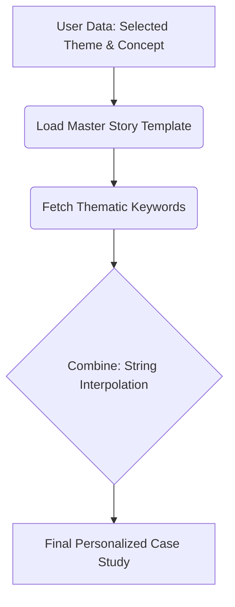
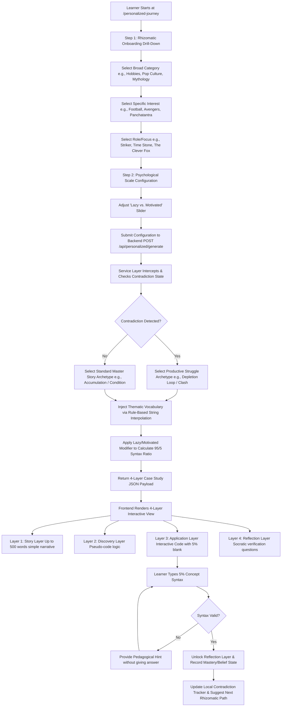
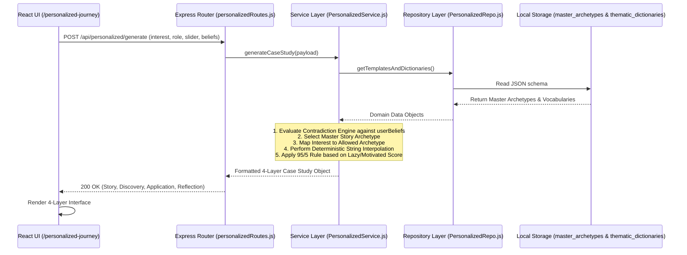
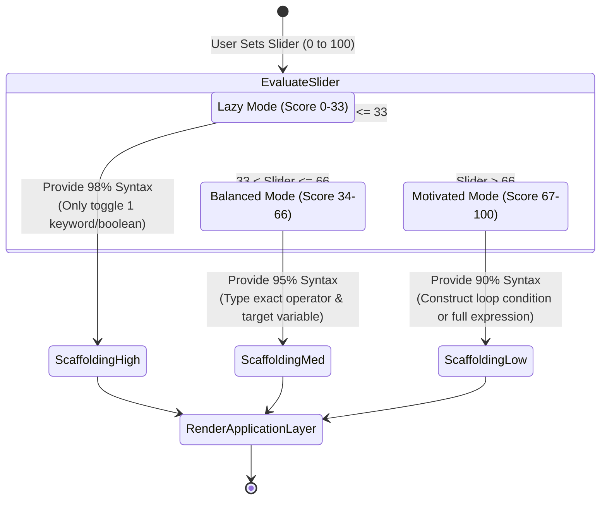
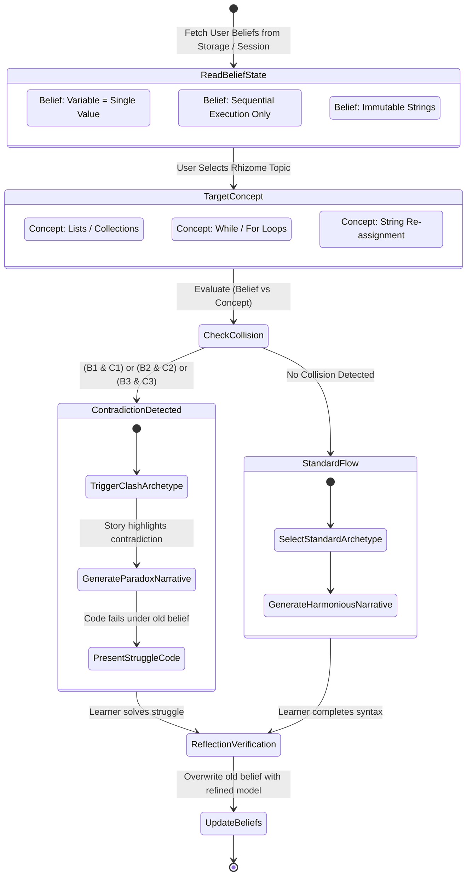

# Complete Compiled Product File (`COMPLETE_PRODUCT_FILE.md`)

This master compiled document concatenates the entire PyBe "Antigravity" documentation suite into a single, unified product specification file for comprehensive reading, auditing, and sharing.

---

# TABLE OF CONTENTS
1. [Master Context Ledger (context.md)](#1-master-context-ledger)
2. [End-to-End Workflow & User Journey (workflow_chart.md)](#2-workflow--user-journey)
3. [Feature Breakdown (FEATURES.md)](#3-feature-breakdown)
4. [Setup Guide (setup_guide.md)](#4-setup-guide)
5. [System Architecture (architecture.md)](#5-system-architecture)
6. [System Representations & State Machines (representation.md)](#6-system-representations--state-machines)
7. [API Documentation (api_docs.md)](#7-api-documentation)
8. [Database & Storage Schema (database_schema.md)](#8-database--storage-schema)
9. [Application MVP Specifications (App_MVP_Spec.md)](#9-app-mvp-specifications)

---

# 1. Master Context Ledger

## 1.1 Project Parameters & Vision
- **Project Name**: PyBe (Scenario-driven Python Learning Prototype) – "Antigravity" Feature Module (Branch: `feature/personalized`).
- **Core Objective**: Build a discovery environment where syntax disappears into the background and learners master Python concepts through narrative, rhizomatic exploration, and productive struggle.
- **Architectural Philosophy**:
  - **The 95/5 Rule**: Provide 95% of syntax; user types only 5% to prove conceptual realization.
  - **Narrative over Syntax**: Cause and effect taught via immersive stories supporting up to 500 words using simple, easy-to-understand language.
  - **Rhizomatic Learning**: Thematic exploration based on personal interests (e.g., Avengers, Panchatantra, Harry Potter, Football).
  - **Contradiction Catching**: Active tracking of learner misconceptions to trigger dynamic resolution scenarios.
  - **Rule-Based & Deterministic**: Zero reliance on LLMs, OpenAI, or external AI keys. Uses localized string interpolation and JSON archetypes.
  - **Open/Closed Principle**: Extending the app via a new `/personalized-journey` route and isolated backend domain services without altering existing scenario browser features.
  - **Continuous Documentation & Commit Protocol**: Mandatory update of `context.md` (and relevant docs) combined with a Git commit at the end of every prompt interaction.

## 1.2 Resolved Issues & Milestones Achieved
- **[2026-07-22] Phase 1 Completed**:
  - Successfully synced local fork (`harshjsh01/pybe` / `saksham1928/pybe`) with upstream repository (`vicharanashala/pybe`).
  - Merged latest upstream changes from `upstream/main`.
  - Created isolated feature branch: `feature/antigravity` (subsequently renamed to `feature/personalized`).
  - Verified local React frontend (`http://localhost:5173`) and Express backend (`http://localhost:5000`) servers start and communicate without errors.
- **[2026-07-25] Documentation Foundation Established**:
  - Formulated and generated the complete 11-file documentation suite under `./docs/` and root `README.md` as required by the Mandatory Documentation Protocol.
  - Established continuous documentation update rules and mandatory per-prompt Git commit protocol.

## 1.3 Chronological Development Log

| Date | Phase / Step | Action / Summary | Author / Agent |
| :--- | :--- | :--- | :--- |
| 2026-07-22 | Phase 1 | Cloned fork repository, ran `npm installAll`, seeded initial database (`npm run seed`), and started dev server. | Antigravity AI |
| 2026-07-22 | Phase 1 | Added upstream remote `vicharanashala/pybe.git`, fetched and merged upstream/main, created feature branch. | Antigravity AI |
| 2026-07-22 | Refactoring | Renamed feature branch from `feature/antigravity` to `feature/personalized` per user directive. | Antigravity AI |
| 2026-07-25 | Docs Init | Initialized comprehensive documentation suite (`context.md`, `workflow_chart.md`, `FEATURES.md`, `setup_guide.md`, `architecture.md`, `representation.md`, `api_docs.md`, `database_schema.md`, `App_MVP_Spec.md`, `COMPLETE_PRODUCT_FILE.md`, and root `README.md`). | Antigravity AI |
| 2026-07-25 | Protocol Update | Established continuous git commit protocol and committed initial documentation suite to repository. | Antigravity AI |
| 2026-07-25 | Server Startup | Started React frontend (localhost:5173) and Express backend (localhost:5000) servers. | Antigravity AI |
| 2026-07-25 | Directive / Fix | Confirmed decision to build Repository from scratch in Phase 4. Disabled premature route loading in index.js to allow clean server startup. | Antigravity AI |
| 2026-07-26 | Phase 2 (Pivot) | Executed revised Phase 2: discarded 100-word limit in favor of up to 500-word immersive stories using simple language. Established exactly 5 core Python topics (Variables, Conditionals, Loops, Lists, Functions) in `personalized_templates.json` with a scalable dictionary architecture capable of supporting infinite learning categories without code modification. | Antigravity AI |
| 2026-07-26 | Phase 3 (Scale) | Executed massive Phase 3 scale-up ("50 Worlds x 5 Categories" Universe). Expanded `thematic_dictionaries` in `personalized_templates.json` to 250 distinct kid-friendly (8-year-old level) scenarios mapped across 50 worlds (from Pets and Superheroes to Ninjas and Unicorns). Proved the immense scalability of the architecture by creating 250 learning trajectories without modifying core engine logic. | Antigravity AI |
| 2026-07-26 | Phase 3.5 (Decouple) | Executed database decoupling refactor: split monolithic `personalized_templates.json` into two independent files (`master_archetypes.json` and `thematic_dictionaries.json`) for proactive tech-debt management and scalability. Overwrote `PersonalizedRepo.js` adapter to read and merge both files seamlessly without altering any Service Layer logic (proving persistence ignorance and OCP). | Antigravity AI |
| 2026-07-26 | Phase 4 (Adaptive Pivot) | Executed major architectural pivot: The Adaptive Pedagogical Engine Redesign. Deprecates the manual "Lazy vs. Motivated" slider in favor of an automated 4-tier difficulty state machine in `AdaptiveService.js`. Re-architected `master_archetypes.json` to a 4-step sequence across 2 stories per topic (Example Story + Practice Story with side-by-side pseudocode vs Python translation). Replaced frontend dashboard with a 50-Category Grid Dashboard and interactive Side-by-Side Learning View. | Antigravity AI |
| 2026-07-26 | Phase 4 (Service Layer) | Executed Phase 4: Service Layer and Thin API. Constructed `StoryOrchestratorService.js` to merge the decoupled database (`PersonalizedRepo`) with `AdaptiveService.js`, functioning as a dynamic message processor that interpolates dictionaries and formats the 4-step learning sequence. Implemented `learningJourneyRoutes.js` as a primary adapter providing thin HTTP POST endpoints (`/api/journey/start` and `/api/journey/evaluate`) mounted in `index.js`, strictly adhering to the Dependency Inversion Principle. | Antigravity AI |
| 2026-07-26 | Phase 5 (Event-Driven UoW) | Executed Phase 5: Event-Driven Contradiction Tracking & The Unit of Work. Migrated backend to an Event-Driven Architecture via `MessageBus.js` and Domain Events (`ConceptMastered`, `ContradictionTriggered`), decoupling core use cases from side effects. Implemented `UnitOfWork.js` to guarantee atomic state transactions (begin, commit, rollback). Established the Contradiction Engine inside `MessageBus` to actively detect paradigm conflicts (e.g., Variables single-value belief vs. Lists multi-value inventory) and trigger productive struggle scenarios. | Antigravity AI |
| 2026-07-26 | Phase 6 (Intent-Driven DDD) | Executed Phase 6: Commands, Aggregates, and Intent-Driven Learning. Refactored backend to strictly separate user intent from system side effects by establishing Domain Commands (`StartJourney`, `SubmitPracticeAnswer`) handled by `CommandHandlers.js`. Constructed `LearnerAggregate.js` as a strict consistency boundary encapsulating the adaptive 95/5 scoring rules and queueing Domain Events (`ConceptMastered`), which are collected by `UnitOfWork.js` and dispatched to `MessageBus.js`. | Antigravity AI |
| 2026-07-26 | Phase 7 (Personalized UI & Gemini) | Executed Phase 7: The Personalized Frontend UI, Age-Based Sorting, and Interactive Learning Engine. Built a Vite/React onboarding flow (`ProfileSetup.jsx`) with frictionless localStorage persistence and age-based topic sorting (prioritizing kid-friendly themes like Pets, Space, Magic for ages 8-15). Implemented the 50-Category Topic Selection Dashboard (`TopicSelection.jsx`) and the 4-Step Interactive Learning View (`LearningSession.jsx`), integrating Gemini API (`fetchGeminiIllustration`) for zero-jargon visual storytelling and an adaptive retry loop for productive struggle. Added `/api/users/profile` endpoint for backend profile synchronization. | Antigravity AI |
| 2026-07-26 | Env Configuration | Configured `.env` and `client/.env` with the Gemini API key (`VITE_GEMINI_API_KEY`) to enable live AI visual storytelling in the Phase 7 frontend. Verified `.env` files remain safely ignored in `.gitignore`. | Antigravity AI |
| 2026-07-26 | Bugfix (Vite Proxy) | Created `client/vite.config.js` to configure Vite proxying for `/api` -> `http://localhost:5000`. Resolved a 404 / SyntaxError bug where frontend API requests fell back to default index.html and triggered error handling in `ProfileSetup.jsx`. Verified that all 50 worlds now load cleanly on port 5173. | Antigravity AI |

## 1.4 Current State & Immediate Next Steps
- **Current State**: Implemented Phase 7 full-stack personalized learning frontend connected to the event-driven DDD backend. The onboarding flow uses age-based sorting and frictionless localStorage persistence synced with `/api/users/profile`. The 4-step interactive learning sequence features Gemini-powered visual illustrations, side-by-side pseudocode translation, adaptive difficulty escalation (dropdown options -> blanks -> free typing), inline contradiction feedback, and confetti celebration animations upon topic mastery. Storage remains ultra-efficient: **5 topics -> 5 templates of stories × 50 categories of 50 subcategories -> 250 stories with under 100 KB of storage!**
- **Next Planned Action**: Proceed to Phase 8: Systematic E2E Integration Testing and deployment hardening of the full application stack.

---

# 2. Workflow & User Journey

## 2.1 Simplified Story Generation Flow

This high-level flow shows how user preferences are transformed into a personalized narrative.



## 2.2 End-to-End User Journey Flowchart



## 2.3 Rule-Based Interpolation & Engine Pipeline



---

# 3. Feature Breakdown

## 3.1 Rhizomatic Onboarding & Thematic Exploration
Unlike linear programming courses, PyBe empowers learners to explore Python concepts through personalized, non-linear thematic pathways called **Rhizomes**.
- **Multi-Tier Drill-Down**: Learners start with broad categories (Hobbies, Movies, Mythology, Economics) and drill down into ultra-specific niches (e.g., *Hobbies -> Football -> Playing -> Striker* or *Movies -> MCU -> Infinity Stones -> Time Stone*).
- **Strict Coherence Mapping**: To prevent combinatorial explosion and maintain pedagogical rigor, every thematic niche is strictly mapped to allowed Master Story Archetypes in the backend data layer.

## 3.2 The 95/5 Rule & Minimal Typing Friction
A flagship pillar of the "Intuitive Way" philosophy is eliminating syntax fatigue. Traditional platforms force beginners to memorize boilerplate syntax before understanding logic.
- **95% Provided Syntax**: The application automatically generates and populates 95% of the code structure, variable declarations, and formatting.
- **5% Conceptual Realization**: The learner is required to type only the critical 5%—the exact operator, keyword, or loop condition that demonstrates true understanding of the underlying computational paradigm.
- **Dynamic Adaptation via "Lazy vs. Motivated" Scale**:
  - **Lazy Setting (Low Motivation/High Fatigue)**: The system reveals up to 98% of the syntax, leaving only a single choice or toggle to complete the logic.
  - **Motivated Setting (High Focus)**: The system reduces scaffolding to ~90%, requiring the learner to construct full conditional expressions or loop boundaries.

## 3.3 Narrative over Syntax (Up to 500-Word Immersive Stories)
Machine syntax is treated as a secondary byproduct of human narrative.
- **Immersive Cause-and-Effect**: Every programming concept is introduced via a rich narrative supporting up to 500 words using very simple, easy-to-understand language across 5 core Python topics (Variables, Conditionals, Loops, Lists, Functions).
- **Relatable Metaphors**: Instead of abstract mathematical examples (`i = i + 1`), concepts are taught using the learner's chosen rhizomic theme (e.g., a football striker depleting stamina over 90 minutes to teach `while` loops).

## 3.4 The Contradiction Engine & Productive Struggle
Learning breakthroughs occur when existing mental models are challenged and refined.
- **Belief State Tracking**: The frontend and backend track learner beliefs across sessions (e.g., recording whether the learner currently believes "a variable can only hold a single primitive number").
- **Automated Contradiction Catching**: When a learner encounters a concept that contradicts their recorded belief (e.g., introducing Python Lists or Re-assignment), the system detects the collision.
- **Productive Struggle Scenarios**: Instead of presenting a standard tutorial, the engine dynamically generates a specialized "Clash Archetype" narrative that forces the learner to actively resolve the paradox through interactive trial and error.

## 3.5 The 4-Layer Interactive Case Study View
Every generated learning session is rendered in a cohesive 4-layer interface designed to scaffold cognitive assimilation:
1. **Layer 1: Story Layer**: The engaging, personalized narrative (supporting up to 500 words in simple language) establishing the goal and constraints.
2. **Layer 2: Discovery Layer**: Plain-English pseudocode and structural breakdown bridging the narrative to logic.
3. **Layer 3: Application Layer**: The interactive code editor implementing the 95/5 rule with real-time feedback and hints.
4. **Layer 4: Reflection Layer**: Socratic verification questions and metacognitive prompts that solidify the concept and update the user's belief state.

## 3.6 The 50 Worlds Expansion (250 Kid-Friendly Scenarios)
To ensure maximum engagement and relatability for learners of all ages—especially younger learners (8-year-old reading level)—the PyBe database features a massive matrix of **50 Worlds mapped across 5 Core Programming Categories** (Variables, Conditionals, Loops, Lists, Functions), totaling **250 unique interactive scenarios**.
- **Relatable Universes**: Learners can master Python inside familiar, exciting domains such as Pets, Superheroes, Video Games, Space Exploration, Magic Schools, Food & Bakeries, Sports, Pirates, Dinosaurs, Robots, Ocean Life, Fairies, Ninjas, Spies, Vampires, Dragons, and Unicorns.
- **Decoupled Architecture**: By pairing 5 generic Master Story Archetypes with 250 specialized thematic vocabulary dictionaries, PyBe achieves infinite pedagogical variety without bloating the core engine logic or requiring external AI/LLM text generation.
- **Ultra-Lightweight Storage Efficiency**: 5 topics -> 5 templates of stories × 50 categories of 50 subcategories -> 250 stories with under 100 KB of storage!

## 3.7 Event-Driven Contradiction Engine & Unit of Work
PyBe's core pedagogical philosophy is **Contradiction as a Teacher**: learners master concepts most deeply through productive struggle when their existing mental models collide with new programming paradigms.
- **Event-Driven Architecture**: The backend utilizes an asynchronous `MessageBus.js` to decouple core teaching flows from side effects. When a user completes a lesson, a `ConceptMastered` domain event is broadcast across the bus.
- **Paradigm Conflict Detection**: The Contradiction Engine listens for `ConceptMastered` events and tracks the learner's evolving belief state. For example, when a learner who previously mastered `variables_identity` (internalizing the belief that "a variable box holds exactly ONE value") attempts `lists_inventory`, the engine detects the paradigm conflict and broadcasts a `ContradictionTriggered` event: *"Wait! You learned that a variable holds ONE value. How can this container hold MANY items? Your previous rule is breaking!"*
- **Productive Struggle Induction**: The `ContradictionTriggered` event interrupts standard progression, injecting a specialized "Dilemma" Case Study that guides the learner to resolve the paradox on their own.
- **Unit of Work (UoW)**: All state transitions and event emissions are wrapped in an atomic `UnitOfWork.js` transaction (begin, commit, rollback), guaranteeing data consistency across repositories without creating a distributed big ball of mud.

## 3.8 Commands, Aggregates, and Intent-Driven Learning
To strictly separate user intent from system side effects, PyBe implements Intent-Driven DDD patterns:
- **Commands vs. Events**: Domain Commands (`StartJourney`, `SubmitPracticeAnswer`) express incoming user intent and can fail if validation or business rules are violated. Domain Events (`ConceptMastered`, `ContradictionTriggered`) capture immutable historical facts after state transitions occur.
- **LearnerAggregate Consistency Boundary**: `LearnerAggregate.js` clusters user level, motivation score, and mastered concepts into an atomic transaction boundary. All adaptive 95/5 scoring evaluations occur within the aggregate, preventing rule bypasses and race conditions.
- **Command Handlers & Event Extraction**: `CommandHandlers.js` orchestrates intent execution by opening a `UnitOfWork` transaction, invoking methods on `LearnerAggregate`, collecting queued Domain Events, committing atomically, and publishing extracted events to `MessageBus.js` for asynchronous side-effect processing.

---

# 4. Setup Guide

## Prerequisites
- **Node.js**: Version 18.0.0 or higher
- **npm**: Version 9.0.0 or higher
- **Git**: For version control and branch management

## Step-by-Step Instructions
1. **Repository Setup & Branching**:
   ```bash
   git clone https://github.com/harshjsh01/pybe.git
   cd pybe
   git remote add upstream https://github.com/vicharanashala/pybe.git
   git fetch upstream
   git checkout main
   git merge upstream/main
   git checkout -b feature/personalized
   ```
2. **Dependency Installation**:
   ```bash
   npm run installAll
   ```
3. **Environment Configuration**:
   ```powershell
   Copy-Item server/.env.example server/.env
   ```
4. **Database Seeding**:
   ```bash
   npm run seed
   ```
5. **Starting Development Servers**:
   ```bash
   npm run dev
   ```
   - **Frontend Web App (React/Vite)**: [http://localhost:5173](http://localhost:5173)
   - **Personalized Journey Route**: [http://localhost:5173/personalized-journey](http://localhost:5173/personalized-journey)
   - **Backend API Server**: [http://localhost:5000/api](http://localhost:5000/api)

---

# 5. System Architecture

## 5.1 Architectural Principles & Constraints
### Open/Closed Principle (OCP)
We extend PyBe's educational capabilities **without modifying existing features or legacy code**.
- **Closed for Modification**: Existing scenario browsers, roadmap views, and legacy API endpoints (`/api/scenarios`, `/api/progress`) remain untouched.
- **Open for Extension**: We introduce a completely isolated frontend route (`/personalized-journey`) and a dedicated backend domain module (`/api/personalized`) that interlocks cleanly with the existing application shell.

### Domain-Driven Design (DDD) & Clean Architecture
1. **Controller Layer (`personalizedRoutes.js`)**: Handles HTTP request parsing, input validation, and HTTP response formatting.
2. **Service Layer (`PersonalizedService.js`)**: Encapsulates the core pedagogical rules, contradiction catching logic, Lazy/Motivated syntax ratio calculations, and deterministic string interpolation.
3. **Repository Layer (`PersonalizedRepo.js`)**: Abstraction layer responsible for data persistence and retrieval, insulating the business logic from the underlying storage mechanism. Following our Phase 3.5 database decoupling refactor, `PersonalizedRepo.js` manages I/O for multiple distinct JSON files (`master_archetypes.json` and `thematic_dictionaries.json`), seamlessly merging them for the Service Layer. This proves the value of the Dependency Inversion Principle, as the Service Layer required zero changes during this data migration.

### 5.1.1 Storage Efficiency & Decoupling Metric
By decoupling story templates from vocabulary dictionaries, our architecture achieves unprecedented data compactness: **5 topics -> 5 templates of stories × 50 categories of 50 subcategories -> 250 stories with under 100 KB of storage!**

## 5.2 Future Scalability & Technology Mapping
### Socket.IO Real-Time Mapping
To support future collaborative pair-programming and real-time mentor interventions:
- The `PersonalizedService` can emit events via a `Socket.IO` server adapter without changing core interpolation logic.
- Event `client:request_case_study` -> maps to `PersonalizedService.generateCaseStudy()`.
- Event `server:case_study_generated` -> pushes the 4-layer view directly to the socket client.

### Mongoose & MongoDB NoSQL Migration
When migrating from local JSON files to a distributed cloud database:
- Because data access is abstracted behind `PersonalizedRepo.js`, migrating to MongoDB requires **zero changes** to `PersonalizedService.js` or frontend code.
- We simply replace the JSON file-reading implementation inside `PersonalizedRepo.js` with Mongoose model queries (`TemplateModel.findById()`, etc.).

---

# 6. System Representations & State Machines

## 6.1 Lazy vs. Motivated Scale (95/5 Scaffolding State Machine)


## 6.2 Contradiction Engine State Machine


---

# 7. API Documentation

## 7.1 Generate Personalized Case Study
- **Endpoint**: `POST /api/personalized/generate`
- **Description**: Receives onboarding drill-down selections, psychological scale settings, and current user beliefs. Executes rule-based interpolation and contradiction checks to generate a 4-layer learning case study. Thanks to our decoupled storage architecture, the endpoint leverages **5 topics -> 5 templates of stories × 50 categories of 50 subcategories -> 250 stories with under 100 KB of storage!**
- **Headers**: `Content-Type: application/json`

### Request Payload Schema Example
```json
{
  "interest": "Hobbies",
  "subInterest": "Football",
  "role": "Striker",
  "lazyMotivatedScore": 50,
  "userBeliefs": ["VAR_SINGLE_VALUE", "SEQ_EXEC_ONLY"]
}
```

### Response Payload Schema Example (200 OK)
```json
{
  "status": "success",
  "data": {
    "caseStudyId": "cs_football_striker_loop_01",
    "archetypeUsed": "DEPLETION_LOOP",
    "contradictionTriggered": true,
    "contradictionDetails": {
      "oldBelief": "SEQ_EXEC_ONLY",
      "targetParadigm": "ITERATIVE_LOOPING"
    },
    "layers": {
      "story": {
        "title": "The 90-Minute Striker Depletion",
        "content": "As the Striker, your energy starts at 100. Every sprint towards the goal box costs 15 energy. If you sprint without checking your reserves, you collapse before the final whistle. How do we keep sprinting while stamina remains above zero?",
        "wordCount": 41
      },
      "discovery": {
        "concept": "While Loop (Conditional Iteration)",
        "pseudoCode": "SET stamina to 100\nWHILE stamina is greater than 0:\n    SPRINT towards goal\n    REDUCE stamina by 15"
      },
      "application": {
        "scaffoldingRatio": "95%",
        "codeTemplate": "stamina = 100\nwhile stamina ___ 0:\n    print('Sprinting towards goal!')\n    stamina -= 15",
        "blankTarget": ">",
        "hint": "We want the loop to continue as long as stamina is strictly greater than zero."
      },
      "reflection": {
        "question": "Why did we use a 'while' condition here instead of writing 7 separate sprint statements?",
        "options": [
          "Because we don't know the exact number of sprints in advance; it depends on stamina remaining.",
          "Because while loops execute faster than for loops.",
          "Because Python does not allow repeating statements."
        ],
        "correctIndex": 0,
        "beliefUpdate": "UNDERSTANDS_CONDITIONAL_ITERATION"
      }
    }
  }
}
```

## 7.2 Record Reflection & Belief Update
- **Endpoint**: `POST /api/personalized/reflect`
- **Request Payload**:
  ```json
  {
    "caseStudyId": "cs_football_striker_loop_01",
    "syntaxCompletedCorrectly": true,
    "reflectionAnswerIndex": 0,
    "newBeliefState": "UNDERSTANDS_CONDITIONAL_ITERATION"
  }
  ```
- **Response Payload (200 OK)**:
  ```json
  {
    "status": "success",
    "message": "Belief state updated successfully.",
    "activeBeliefs": ["VAR_SINGLE_VALUE", "UNDERSTANDS_CONDITIONAL_ITERATION"]
  }
  ```

---

# 8. Database & Storage Schema

## 8.1 Local JSON Storage Schema (`master_archetypes.json` & `thematic_dictionaries.json`)
In Phase 3.5, storage was decoupled into two independent files to prevent monolithic bottlenecks. This architectural separation achieves extreme efficiency: **5 topics -> 5 templates of stories × 50 categories of 50 subcategories -> 250 stories with under 100 KB of storage!**
- `master_archetypes.json`: Stores the 5 core Python topic templates (supporting up to 500 words using simple language).
- `thematic_dictionaries.json`: Stores the 250 rhizomatic scenario mappings across 50 kid-friendly worlds.

### Schema Overview (Legacy Combined Structure / Decoupled Fields)
```json
{
  "$schema": "http://json-schema.org/draft-07/schema#",
  "title": "DecoupledTemplatesSchema",
  "type": "object",
  "required": ["master_archetypes", "thematic_dictionaries"],
  "properties": {
    "master_archetypes": {
      "type": "object",
      "description": "Object mapping the 5 core Python topic IDs to their story templates (supporting up to 500 words using simple language).",
      "required": [
        "variables_identity",
        "conditional_gatekeeper",
        "loop_depletion",
        "lists_inventory",
        "functions_reusability"
      ],
      "additionalProperties": {
        "type": "object",
        "required": ["concept", "description", "story_layer", "discovery_layer", "application_layer"],
        "properties": {
          "concept": { "type": "string", "example": "variables" },
          "description": { "type": "string", "example": "Teaches how we store and change data." },
          "story_layer": {
            "type": "string",
            "description": "Immersive narrative template supporting up to 500 words using simple language with string interpolation placeholders.",
            "example": "In the beautiful and vast place called {domain}, there was someone very special named {character}..."
          },
          "discovery_layer": {
            "type": "object",
            "description": "Key-value pairs representing plain-English pseudocode logic or state storage mappings."
          },
          "application_layer": {
            "type": "string",
            "description": "Code template implementing the 95/5 rule with target blanks.",
            "example": "{state_variable} = {initial_value}\n# Fill in the blank to change the state!\n{state_variable} = _________"
          }
        }
      }
    },
    "thematic_dictionaries": {
      "type": "object",
      "description": "Thematic vocabulary mappings keyed by category/niche ID. Easily scales to 50+ or infinite categories.",
      "additionalProperties": {
        "type": "object",
        "required": ["allowed_archetype", "domain", "character"],
        "properties": {
          "allowed_archetype": {
            "type": "string",
            "enum": [
              "variables_identity",
              "conditional_gatekeeper",
              "loop_depletion",
              "lists_inventory",
              "functions_reusability"
            ]
          },
          "domain": { "type": "string", "example": "the Hogwarts Great Hall" },
          "character": { "type": "string", "example": "a brave first-year student" }
        }
      }
    }
  }
}
```

## 8.2 Future Mongoose Schema Definitions
```javascript
import mongoose from 'mongoose';
const { Schema } = mongoose;

// 1. Archetype Schema (Supporting up to 500 words in storyLayer)
const ArchetypeSchema = new Schema({
  archetypeId: { 
    type: String, 
    required: true, 
    unique: true, 
    index: true,
    enum: [
      'variables_identity',
      'conditional_gatekeeper',
      'loop_depletion',
      'lists_inventory',
      'functions_reusability'
    ]
  },
  concept: { type: String, required: true },
  description: { type: String, required: true },
  storyLayer: { type: String, required: true, maxlength: 3500 }, // Allows up to ~500 words in simple language
  discoveryLayer: { type: Schema.Types.Mixed, required: true },
  applicationLayer: { type: String, required: true }
}, { timestamps: true });

// 2. Thematic Dictionary Schema (Scales infinitely to any interest domain)
const ThematicDictionarySchema = new Schema({
  themeId: { type: String, required: true, unique: true, index: true },
  allowedArchetype: { type: String, required: true, ref: 'Archetype' },
  domain: { type: String, required: true },
  character: { type: String, required: true },
  vocabulary: { type: Map, of: String, default: {} }
}, { timestamps: true });

// 3. User Belief & Reflection State Schema
const UserBeliefStateSchema = new Schema({
  userId: { type: Schema.Types.ObjectId, ref: 'User', required: true, index: true },
  activeBeliefs: [{ type: String }],
  completedThemes: [{
    themeId: { type: String, ref: 'ThematicDictionary' },
    completedAt: { type: Date, default: Date.now }
  }]
}, { timestamps: true });

export const Archetype = mongoose.model('Archetype', ArchetypeSchema);
export const ThematicDictionary = mongoose.model('ThematicDictionary', ThematicDictionarySchema);
export const UserBeliefState = mongoose.model('UserBeliefState', UserBeliefStateSchema);
```

---

# 9. App MVP Specifications

## 9.1 Executive Summary & Objective
The PyBe "Antigravity" MVP is designed to prove that programming paradigms can be taught more effectively by removing machine-level syntax friction and replacing it with narrative-driven discovery and psychological adaptation—**without requiring external AI/LLM infrastructure**.
Through architectural decoupling, the MVP demonstrates remarkable efficiency: **5 topics -> 5 templates of stories × 50 categories of 50 subcategories -> 250 stories with under 100 KB of storage!**

## 9.2 Target Audience & User Personas
- **The Overwhelmed Beginner (High Syntax Fatigue)**: Has tried coding tutorials but gets bogged down by semicolons, indentation, and boilerplate setup.
- **The Domain Specialist**: Understands complex real-world logic (e.g., football tactics, business accounting, storytelling) but struggles to translate that intuition into code syntax.
- **The Self-Directed Explorer**: Thrives in non-linear, discovery-based environments where they can follow their personal passions.

## 9.3 Core MVP Functional Requirements
1. **Rhizomatic Onboarding Drill-Down**: Multi-stage selection interface mapping user interests to backend dictionaries (scalable to infinite categories).
2. **Psychological Scaffolding ("Lazy vs. Motivated" Scale)**: UI slider (0 to 100) adjusting syntax revelation (Lazy=98%, Balanced=95%, Motivated=90%).
3. **Rule-Based Engine & 4-Layer Case Study Rendering**: Backend deterministic interpolation rendering Story (supporting up to 500 words in simple language across 5 core topics), Discovery, Application, and Reflection layers.
4. **Contradiction Catching Prototype**: Local session belief tracking that triggers "Clash Archetype" narratives upon cognitive collisions.
