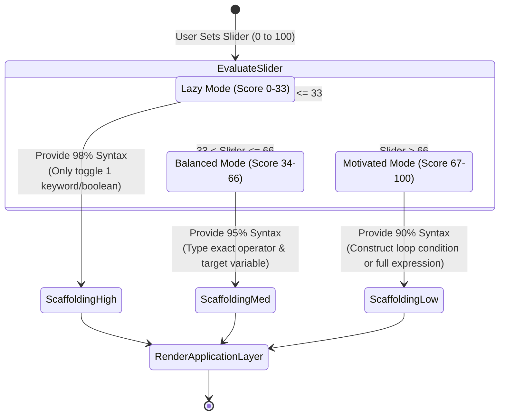
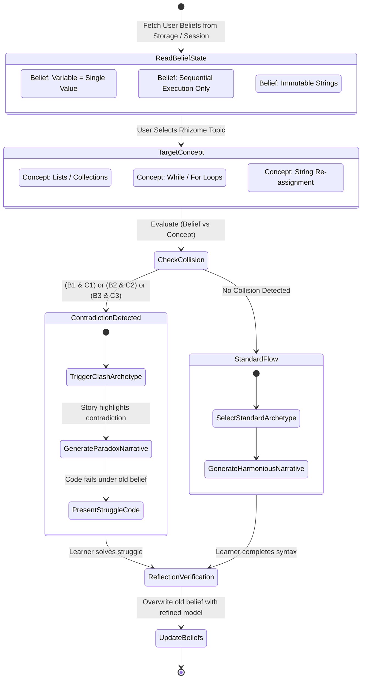

# System Representations & State Machines (`representation.md`)

This document provides visual state machine representations and logic diagrams for the two core intelligent components of the Antigravity module: the **Lazy vs. Motivated Scale** and the **Contradiction Engine**.

---

## 1. Lazy vs. Motivated Scale (95/5 Scaffolding State Machine)

The psychological scale adjusts the ratio of provided syntax versus required learner input in real time.

---

## 2. Contradiction Engine State Machine

The Contradiction Engine tracks learner beliefs and intercepts standard curriculum progression to inject productive struggle when cognitive collisions occur.

