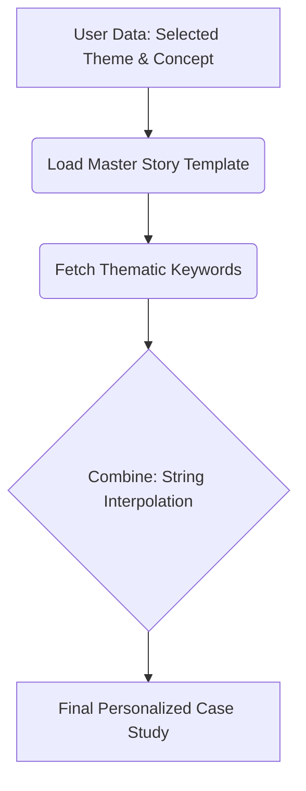
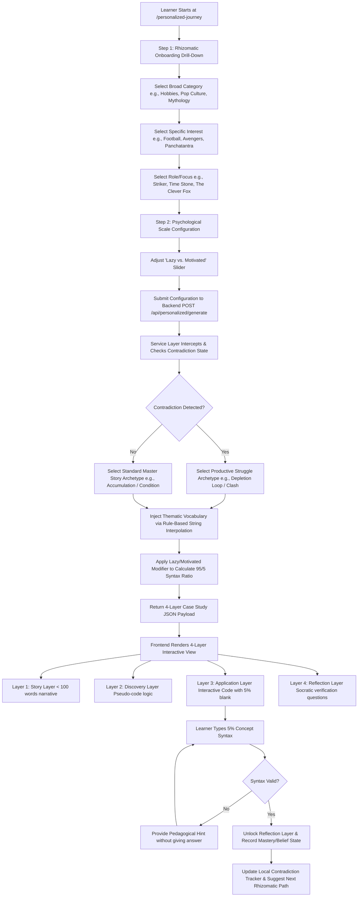
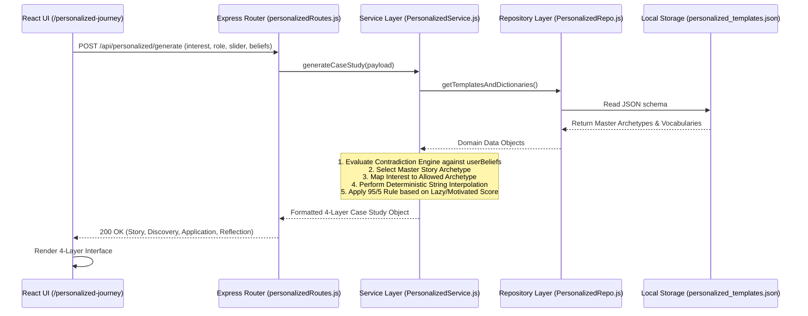

# End-to-End Workflow & User Journey (`workflow_chart.md`)

This document illustrates the complete user journey and system workflow for the PyBe "Antigravity" module using Mermaid.js flowcharts.

---

## 1. Simplified Story Generation Flow

This high-level flow shows how user preferences are transformed into a personalized narrative.

---

## 2. End-to-End User Journey Flowchart

---

## 2. Rule-Based Interpolation & Engine Pipeline

