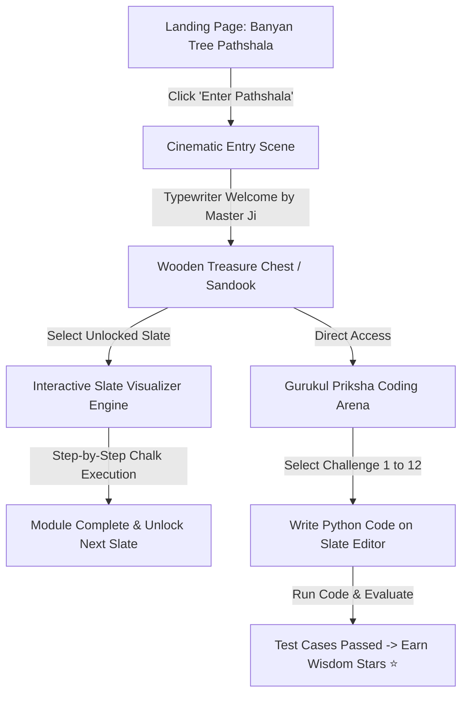

# 📦 PRODUCT.md — PyBe Gurukul Product Specification Document

> **Product Name**: PyBe Gurukul (PyBe Pathshala)  
> **Tagline**: *A Nostalgic 1950s Village Pathshala Adventure for Learning Python Loops*  
> **Version**: 1.0.0  
> **Status**: Active / Production Ready

---

## 🎯 1. Product Vision & Mission

### Vision
To revolutionize beginner computer science education by blending nostalgic storytelling, cultural immersion, and real-time visual execution — proving that coding fundamentals can be learned intuitively without abstract jargon or sterile UI environments.

### Mission
PyBe Gurukul transports learners to a simple 1950s Indian village *Pathshala* beneath a sacred Banyan Tree. Guided by **Master Ji**, students replace dry code syntax with wooden slates (*Fatti*), reed pens (*Kalam*), ink pots (*Siyahi*), and village story problems, transforming abstract loop mechanics into relatable real-world metaphors.

---

## 👥 2. Target Audience & User Personas

| Persona | Description | Key Needs | How PyBe Gurukul Solves It |
| :--- | :--- | :--- | :--- |
| **Aarav (The Absolute Beginner)** | Middle school student (age 10–16) encountering programming for the first time. | Visual feedback, fun gamification, non-intimidating interface. | Interactive chalk slates, step-by-step execution, and story-based progress. |
| **Priya (The Visual Learner)** | College student struggling with loop conditions and state changes. | Clear visualization of variable states during loop iterations. | Live variable inspector updating on the wooden slate in real-time. |
| **Masterji Teacher (Educator)** | CS instructor looking for creative teaching aids. | Engaging narrative hooks, story-driven challenges. | 12 real-life village problem statements with built-in test case evaluation. |

---

## 💡 3. Core Value Proposition

1. **Cultural & Nostalgic Resonance**: Replaces generic modern IDE dark themes with parchment paper textures, warm sunbeams, vintage typography, and authentic village elements.
2. **Tactile Mental Models**:
   - `for loop` $\rightarrow$ Multiplication tables recited under the Banyan tree.
   - `while loop` $\rightarrow$ Drawing water buckets from the village well until full.
   - `do-while loop` $\rightarrow$ Answering the Whispering Banyan Tree's riddle at least once.
3. **Instant Audio-Visual Feedback**: Zero setup required; instant procedural sound effects (Web Audio API brass bell, chalk scraping) accompany every interaction.

---

## 🗺️ 4. User Journey & Navigation Flow



---

## 🛠️ 5. Functional Feature Modules

### 5.1 Landing Page & Narrative Hook
- **Parchment Story Card**: Explains the ethos of the vintage 1950s pathshala — no desks, no laptops, no smartboards, only curiosity and shared wisdom.
- **Interactive Brass Bell**: Clicking the bell triggers a triple-chime brass bell sound effect (`Tan... Tan... Tan...`).
- **Feature Showcase**: Introduces the core tools (*Fatti*, *Kalam*, *Siyahi*, *Ghanta*, *Gurukul Priksha*).

### 5.2 Antique Wooden Treasure Chest (*Pathshala Pitara*)
- **Slate Progression System**:
  - 📜 **Slate 1: For Loop** (Unlocked by default) — *The Art of Known Repetition*
  - 🔒 **Slate 2: While Loop** (Locked; unlocks upon completing Slate 1) — *Condition-Driven Repetition*
  - 🔒 **Slate 3: Do-While Loop** (Locked; unlocks upon completing Slate 2) — *Post-Check Validation*
- **Visual Ribbons**: Clear visual status indicators (`✨ Unlocked` / `🔒 Locked`).

### 5.3 Interactive Slate Visualizer Engine
- **Dark Slate Canvas**: Formatted to resemble a dark grey/green slate with wooden border trim.
- **Chalk Code Display**: Code rendered line-by-line in chalk handwriting style.
- **Active Line Highlight**: Gold glow outlining the current executing line.
- **Live Memory Inspector**: Real-time value display of active variables (e.g., `i = 3`, `bucket_full = False`).
- **Control Toolbar**:
  - ⏯️ `Auto Play` / `Pause`
  - ⏭️ `Step Forward`
  - ⏮️ `Step Back`
  - 🔄 `Reset Slate`
  - 🎚️ Execution Speed Slider ($0.5\times$ to $2.0\times$)

### 5.4 Gurukul Priksha (Interactive Coding Arena)
- **12 Real-Life Story Challenges**:

```
 🟢 Easy Level (Fundamental Iteration)
 ├── Challenge 01: Attendance Register (Print 1 to N)
 ├── Challenge 02: Morning Prayer Bell (Ring N times)
 ├── Challenge 03: Sweet Distribution (Sum of sweets)
 └── Challenge 04: Even Neem Leaves (Even number filter)

 🟡 Medium Level (State & Condition Control)
 ├── Challenge 05: Drawing Water from Well (While loop bucket)
 ├── Challenge 06: Harvested Wheat Bags (Accumulator loop)
 ├── Challenge 07: Evening Lamp Lighting (Countdown timer)
 └── Challenge 08: Banyan Tree Ring Count (Multiples calculation)

 🔴 Advanced Level (Algorithmic Thinking)
 ├── Challenge 09: Village Feast Cooking (Nested logic simulation)
 ├── Challenge 10: Whispering Tree Riddle (Post-check simulation)
 ├── Challenge 11: Granary Stock Manager (Threshold tracking)
 └── Challenge 12: Gurukul Graduation Challenge (Final Master Priksha)
```

- **Code Slate Editor**: Integrated text area with line numbers, code snippets, auto-reset, and run capabilities.
- **Evaluation Engine**: Evaluates Python-like code logic against hidden test inputs and produces instant output logs.
- **Progress Persistence**: Saves solved challenge states and total **Wisdom Stars (⭐)** in local browser state.

---

## 🎨 6. Design System & UX Principles

### 6.1 Color Palette

```
  Warm Parchment (Primary BG) : #F7F2E6 / #EBD8B8
  Dark Slate (Code Canvas)    : #1C2D24
  Deep Terracotta (Accents)   : #C85A32
  Mustard Yellow (Badges)     : #E0A938 / #D4AF37
  Dark Mahogany (Borders)     : #3B2314
  Forest Green (Success)      : #2D5A27
```

### 6.2 Typography Hierarchy
- **Primary Headings & Titles**: `Tillana`, `Kalam` (Warm handwritten Indian style)
- **Narrative Story Body**: `Lora` (Classic serif for literary feel)
- **Chalkboard & Code**: `VT323` (Monospaced chalkboard font)

---

## 🔊 7. Audio Architecture

The application implements a procedural **Web Audio API** engine without requesting external audio media files:

```javascript
// Sound Effect Map
playHeavyGhantaSound()  -> Multi-harmonic brass bell resonance (3.2s decay)
playChalkSound()        -> Filtered noise burst simulating chalk on slate
playWoodenClickSound()  -> Low-frequency transient impulse
playVictoryChime()      -> Arpeggiated pentatonic chord (D Major / Mohanam Raga)
```

---

## 📈 8. Success Metrics & Roadmap

### Success Metrics (KPIs)
- **Completion Rate**: $>85\%$ of users complete Slate 1 and proceed to Gurukul Priksha.
- **Engagement Time**: Average session duration $>12$ minutes.
- **Challenge Mastery**: Average user solves at least 6 out of 12 Gurukul Priksha challenges.

### Future Expansion Roadmap

| Phase | Milestone | Features |
| :--- | :--- | :--- |
| **Phase 1 (Current)** | **Loop Fundamentals** | For, While, Do-While, 12 Priksha Challenges, Web Audio Engine. |
| **Phase 2** | **Data Structures** | *Village Jhola (Lists/Arrays)*, *Granary Drawers (Dictionaries)*. |
| **Phase 3** | **Functions & Modular Code** | *Master Ji's Mantras (Functions)* and reusability challenges. |
| **Phase 4** | **Localization & Community** | Multi-language support (Hindi, Punjabi, Marathi, Tamil) & Code Share. |

---

## 📄 9. Document Control

- **Author**: Antigravity AI & Gurukul Dev Team
- **Approved By**: Master Ji 👴🏽
- **Last Updated**: August 2026
