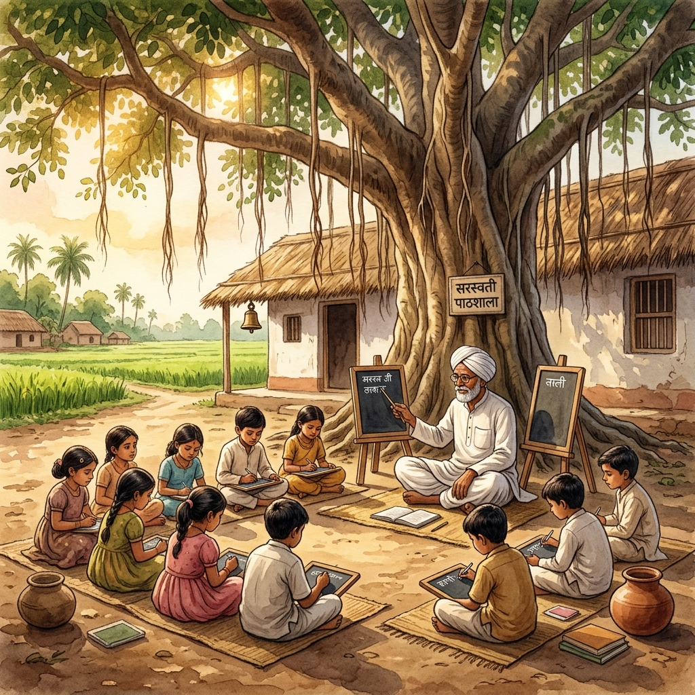

# 🌳 PyBe Gurukul — Vintage 1950s Pathshala Python Adventure

> *"Sa Vidya Ya Vimuktaye"* (Knowledge Liberates)  
> An interactive, story-driven Python learning experience set in a nostalgic 1950s–1980s Indian village Pathshala under a great Banyan Tree.

---

## 📜 Table of Contents

- [Overview](#-overview)
- [Key Features](#-key-features)
- [Learning Modules (Wooden Slates)](#-learning-modules-wooden-slates)
- [Gurukul Priksha (Coding Arena)](#-gurukul-priksha-coding-arena)
- [Technical Architecture](#-technical-architecture)
- [Getting Started](#-getting-started)
- [Project Structure](#-project-structure)
- [Design & Aesthetics](#-design--aesthetics)
- [Audio Synthesizer](#-audio-synthesizer)
- [License](#-license)

---

## 🌾 Overview

**PyBe Gurukul (PyBe Pathshala)** transforms fundamental Python programming concepts into a rich visual, interactive, and nostalgic story. Instead of dry code snippets, learners step into a vintage village school beneath an ancient Banyan Tree to learn with **Master Ji** using wooden slates (*Fatti*), reed pens (*Kalam*), ink pots (*Siyahi*), and the chime of the village school bell (*Ghanta*).



---

## ✨ Key Features

### 📖 Story-Driven Cinematic Journey
- **Nostalgic Narrative**: Begins with morning light breaking over the village Pathshala, children arriving with cloth bags (*Jhola*), and Master Ji greeting everyone under the Banyan tree.
- **Master Ji's Wisdom**: Guided learning with interactive dialogues and pedagogical encouragement.

### 🪵 Interactive Wooden Slate (*Fatti*) Execution
- **Line-by-Line Chalk Visualizer**: Watch Python loops execute line-by-line directly on a dark wooden slate.
- **Dynamic Variable Tracking**: Real-time visualization of loop variables (`i`, `sum`, `count`, `water_level`, etc.) as code executes.
- **Step & Auto Play Controls**: Control execution speed, step forward, pause, or step back to inspect iteration mechanics.

### 🏆 Gurukul Priksha (Interactive Coding Arena)
- **12 Real-Life Village Challenges**: Story-based Python challenges covering roll calls, well watering, harvest counting, festival sweets distribution, and more.
- **In-Browser Python Slate Editor**: Custom code editor with line numbers, code resetting, and instant execution feedback.
- **Hidden Test Cases & Wisdom Stars**: Earn stars and track progress as all test cases pass.

### 🔊 Procedural Web Audio Engine
- Synthesizes realistic 1950s brass school bell chimes, chalk writing sound effects, wooden slate clicks, and celebration sounds using the **Web Audio API** (no external audio assets required).

---

## 📜 Learning Modules (Wooden Slates)

| Slate | Concept | Village Story Context | Key Mechanics Learned |
| :--- | :--- | :--- | :--- |
| **Slate 1** | **For Loop** | Master Ji teaching mathematical tables under the Banyan tree | Known count iteration, range sequences, accumulators |
| **Slate 2** | **While Loop** | Drawing water buckets from the village well until full | Condition-driven loops, flag checks, state updates |
| **Slate 3** | **Do-While Loop** | The Whispering Banyan Tree riddle challenge | Guaranteeing at least one execution, post-condition validation |

---

## 🏆 Gurukul Priksha (Coding Arena)

The **Gurukul Priksha** consists of 12 progressive challenges categorized into three difficulty tiers:

### 🟢 Easy Tier
1. **Attendance Register**: Print roll numbers from $1$ to $N$.
2. **Morning Prayer Bell**: Ring the bell $N$ times with a simulated chime output.
3. **Sweet Distribution**: Calculate total sweets distributed across $N$ children.
4. **Even Neem Leaves**: Filter and display even-numbered neem leaves.

### 🟡 Medium Tier
5. **Drawing Water from Well**: Simulate bucket filling using a `while` loop condition.
6. **Harvested Wheat Bags**: Calculate cumulative total weight of wheat bags collected.
7. **Evening Lamp Lighting**: Light village lamps until sunset condition is met.
8. **Banyan Tree Ring Count**: Calculate tree age from inner ring counts.

### 🔴 Advanced Tier
9. **Village Feast Cooking**: Multi-stage loop calculation for recipe ingredients.
10. **Whispering Tree Riddle**: Implement post-test iteration validation logic.
11. **Granary Stock Manager**: Manage grain intake/outflow until threshold is reached.
12. **Gurukul Graduation Challenge**: Master-level multi-loop algorithmic challenge.

---

## 🏗️ Technical Architecture

```
                                  ┌────────────────────────┐
                                  │      index.html        │
                                  │  (Multi-View Layout)   │
                                  └───────────┬────────────┘
                                              │
                    ┌─────────────────────────┼─────────────────────────┐
                    ▼                         ▼                         ▼
         ┌────────────────────┐    ┌────────────────────┐    ┌────────────────────┐
         │     styles.css     │    │     script.js      │    │ Web Audio Engine   │
         │ (Parchment, Wood,  │    │  (State, Execution │    │ (Procedural Sound  │
         │  CSS Design System)│    │   Engine, Challenges)    Synthesizer API) │
         └────────────────────┘    └────────────────────┘    └────────────────────┘
```

- **Frontend Tech**: Pure HTML5, Vanilla CSS3 (Custom design system with CSS Variables & Glassmorphism), pure Vanilla JavaScript (ES6+).
- **Zero External Dependencies**: Runs entirely client-side without any node server, bundler, or third-party framework dependencies.

---

## 🚀 Getting Started

### Quick Start
1. Clone or download the repository.
2. Open [index.html](file:///c:/Users/riyah/Downloads/gurukul/index.html) directly in any modern web browser (Google Chrome, Mozilla Firefox, Microsoft Edge, Safari).
3. Click **"Enter the Pathshala"** to start the interactive adventure!

### Local Development / Dev Server
Optionally, serve using any lightweight HTTP server:
```bash
# Using Python 3 built-in HTTP server
python -m http.server 8000
```
Then navigate to `http://localhost:8000` in your web browser.

---

## 📁 Project Structure

```
gurukul/
│
├── index.html        # Main application HTML containing view containers & modal layouts
├── script.js         # Core application logic, slate visualizer, coding editor, challenge engine & web audio
├── styles.css        # Vintage design system, parchment paper styling, dark wood slates, ambient lighting
├── assets/
│   └── images/       # High-resolution vintage thematic visual assets
│       ├── landing_hero.png
│       ├── story_hero.png
│       └── ...
└── README.md         # Project documentation
```

---

## 🎨 Design & Aesthetics

The UI is built with a custom design system capturing authentic 1950s–1980s rural Indian aesthetics:

- **Typography**: 
  - `Tillana` & `Kalam` for warm handwritten Indian calligraphy scripts.
  - `Lora` for vintage narrative storytelling text.
  - `VT323` for classic chalk-on-slate code representation.
- **Color Palette**:
  - Warm Parchment (`#F7F2E6`, `#EBD8B8`)
  - Terracotta & Ochre (`#C85A32`, `#E0A938`)
  - Deep Vintage Slate & Dark Wood (`#1C2D24`, `#3B2314`)
  - Forest Green & Indian Brass (`#2D5A27`, `#D4AF37`)
- **Micro-Animations**: Sunbeam overlays, floating pollen dust particles, bell chimes, and smooth view transitions.

---

## 🔊 Audio Synthesizer

The audio engine utilizes the **Web Audio API** to generate procedural sound effects without loading external `.mp3` or `.wav` files:

```javascript
// Example: Procedural Brass Bell Chime (Web Audio API)
const ctx = new AudioContext();
const freqs = [110, 220, 330, 440, 550, 880, 1320]; // Harmonically rich bell partials
```

Features include:
- **Village Ghanta Chime**: Multi-frequency harmonic decay simulating a heavy cast-brass bell.
- **Chalk Writing Effect**: Modulated white-noise audio burst simulating chalk scraping on a wooden board.
- **Wooden Chest Latch**: Low-frequency resonant impact sound.

---

## 📜 License

This project is open-source under the MIT License. Feel free to use, modify, and share to promote joyful and creative programming education!
