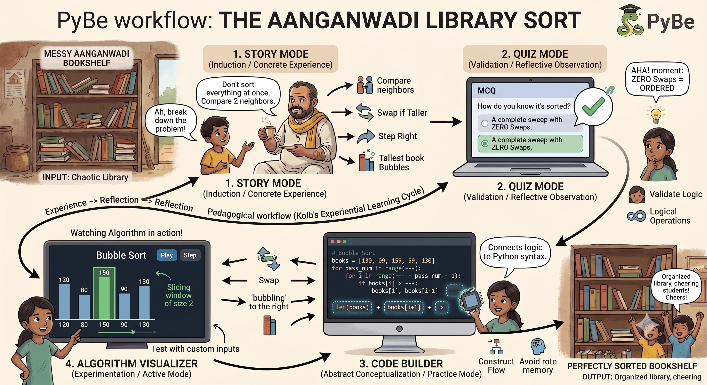

"""# PyBe Module: The Aanganwadi Library Sort (Bubble Sort)

Welcome to **The Aanganwadi Library Sort**, an interactive learning module built for the PyBe open-source project. This module abstracts the complexities of Python syntax to teach the fundamental operations of the Bubble Sort algorithm through an intuitive, story-driven case study.

## 🗺️ Learning Workflow

## 📖 About the Project
Programming languages require strict syntax that can alienate beginners. This module bridges that gap by allowing learners to discover programming paradigms organically. Instead of jumping straight into nested `for` loops, learners follow Raju and Prahlad Kaka as they organize a messy stack of books in a village Aanganwadi library. Through this relatable scenario, they discover concepts like "comparison," "swapping," and "bubbling" naturally.

## ✨ Key Features
1. **Story Mode (Induction Phase):** A multi-slide interactive narrative that introduces the base algorithm visually and conceptually.
2. **Quiz Mode (Conceptual Validation):** A character-driven multiple-choice assessment to validate the learner's understanding of the logical operations.
3. **Code Builder (Practice Phase):** A drag-and-drop syntax builder where users construct a working Python Bubble Sort loop using visual chips, eliminating rote memorization of syntax.
4. **Algorithm Visualizer (Active Experimentation):** A dynamic bar chart that visually steps through the sorting process for any user-inputted custom array of numbers.

## 🧠 Pedagogical Foundations
Built upon the discussions from the PyBe cohort sessions, this module utilizes:
* **Kolb’s Experiential Learning Cycle:** Concrete Experience ➔ Reflective Observation ➔ Abstract Conceptualization ➔ Active Experimentation.
* **Solo Taxonomy:** Progressing from a simple unistructural concept (comparing two books) to a relational understanding (optimizing the sweep).
* **Constructivism:** Creating an organic *need* to discover a structured solution rather than forcing a pre-written algorithm on the learner.

## 🚀 Getting Started
Since this is a standalone front-end component, no complex server environment setup is required.
1. Clone the repository to your local machine.
2. Open `index.html` in any modern web browser.
3. Navigate through the story and interactive modes using the bottom navigation bar.

## 📂 Documentation & Standards
For detailed formal requirements, system design, non-functional requirements (NFRs), and architectural guidelines, please refer to the formal specification document:
* [Product Specification (product.md)]

## 🎯 Learning Outcomes

After completing this module, learners should be able to:

- Explain the basic idea behind Bubble Sort.
- Understand comparison and swapping operations.
- Describe why larger elements gradually "bubble" toward the end of the array.
- Construct the basic Bubble Sort logic using Python syntax.
- Trace Bubble Sort step-by-step on a custom array.

## 👩‍💻 Author

**Kajal Kumari**

Developed as part of the PyBe Summer Internship 2026.