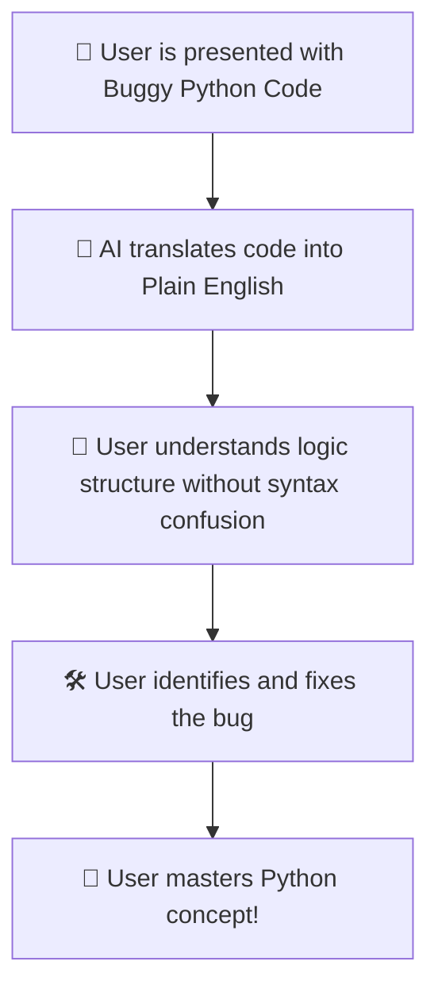

# 💡 Idea Summary - Interactive Debugging Challenges

**Name:** 🧑‍💻 PyBe Developer  
**Email:** 📧 contact@pybe.com  

**What is PyBe?** 
PyBe is a scenario-driven Python learning prototype built from the supplied PRD and breakdown document. It has no login flow for now.

## 🚀 Our Feature Idea
This project focuses on the **Interactive Debugging Challenges Engine**, a feature module within PyBe. 

While traditional platforms ask beginners to write code from scratch, this feature immerses them in maintaining and fixing code. Users are presented with a broken Python script and a specific goal. By identifying and correcting the logic errors, users develop strong debugging skills and a deeper understanding of core Python concepts.

To bridge the gap between human language and code, this feature implements a powerful AI Translation Engine that translates buggy code into deterministic plain English pseudocode. This helps learners understand the code's structural logic step-by-step without getting bogged down by raw syntax.

### 🔄 The Learning Flow

