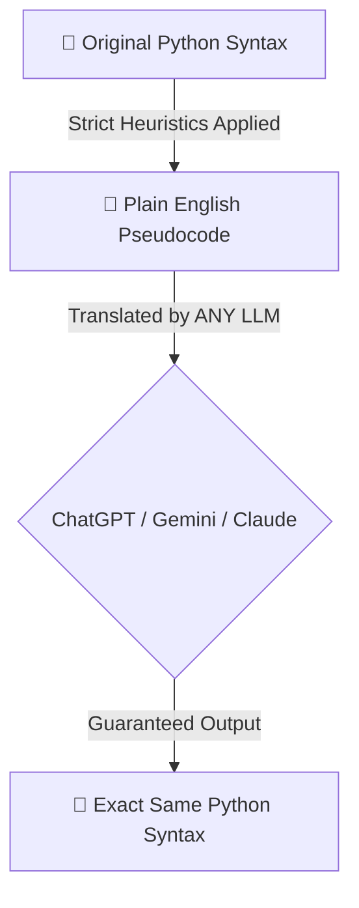

# 📜 Principles - Interactive Debugging Challenges

**What is PyBe?**
PyBe is a scenario-driven Python learning prototype built from the supplied PRD and breakdown document. It has no login flow for now.

The following principles govern the **Interactive Debugging Challenges Engine** feature:

## ✅ Principles Followed
1. **Focus on Debugging:** Emphasize reading and fixing existing code over writing from scratch. Real-world software development is heavily focused on maintaining and debugging existing codebases; beginners should practice this from day one.
2. **Deterministic AI Behavior:** AI-generated pseudocode must be structurally precise to guarantee that any external LLM will reconstruct the exact same Python syntax. Ambiguity is the enemy of learning.
3. **Immersive User Experience:** The platform must provide a seamless, syntax-highlighted editing experience directly in the browser.
4. **Reliable Content:** Every debugging challenge must be mathematically and logically verifiable against strict test cases before being presented to the user. No false positives.

### 🎯 The Deterministic AI Principle

## ❌ Principles Not Followed
1. **"Write Everything for the User":** The feature intentionally refuses to auto-fix bugs or provide the final code without user effort. The AI Translation Engine explains the structure, but the user must synthesize the final fix themselves.
2. **Oversimplified Pseudocode:** We reject the use of ambiguous, overly-humanized pseudocode that loses structural integrity (e.g., translating `range(1, 11)` as "1 to 10"). Our translations remain highly readable while enforcing strict programming syntax boundaries.
3. **Bloated Tooling:** We avoid heavy frameworks when simple solutions suffice. The engine relies on lightweight tools (Vite, React, Express) to ensure speed and simplicity.
