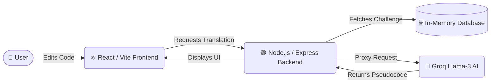

# 📦 Product Document - Interactive Debugging Challenges

**What is PyBe?**
PyBe is a scenario-driven Python learning prototype built from the supplied PRD and breakdown document. It has no login flow for now.

## 🌟 Feature Overview
This repository contains the **Interactive Debugging Challenges Engine** built for PyBe. It is a web-based interactive debugging environment that runs on a lightweight MERN stack architecture (React, Node.js, Express) tailored for fast, seamless code execution and AI inference.

## 🛠️ Core Capabilities
- **📚 Curated Debugging Challenges:** 55 rigorously verified Python challenges across 11 core topics (Lists, Loops, Strings, Variables, Slicing, Arithmetic, Comparisons, Conditionals, Control flow, Dictionaries, Functions).
- **💻 Interactive Code Editor:** A custom-built, syntax-highlighted code editor utilizing `react-simple-code-editor` and PrismJS for real-time visual feedback and seamless code editing.
- **🤖 AI Translation Engine:** A specialized LLM integration (Groq Llama-3) that converts Python code into deterministic plain English pseudocode. This feature acts as a bridge for beginners, preventing LLM hallucination and off-by-one errors during translation round-trips.
- **✅ Strict Verification System:** A robust validation system built into the backend that ensures every challenge has a verifiable bug, a valid solution, and consistent, self-contained test cases.

### 🏗️ Architecture Flow

