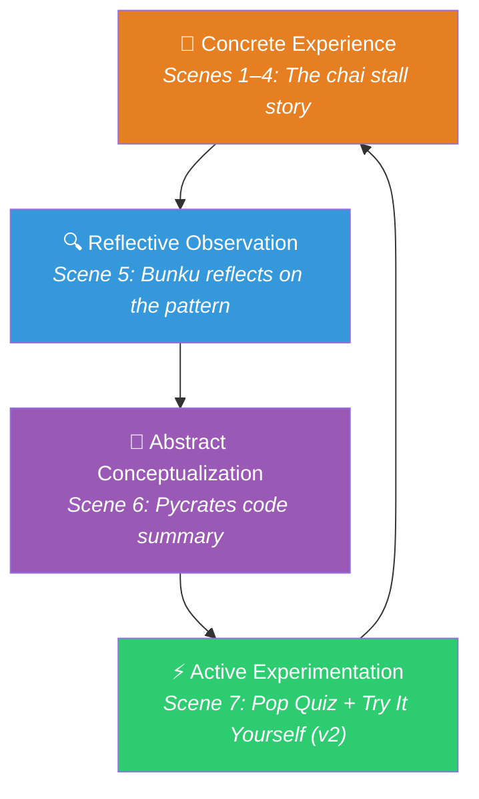
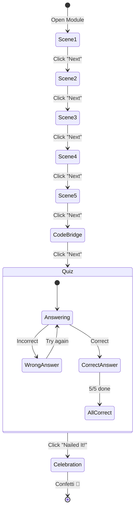

# Pycrates: The Perfect Recipe — Product Document

> **Module**: Functions (Dada and Bunku's Tea Stall)  
> **Platform**: PyBe 
> **Version**: 1.0  
> **Last Updated**: August 2026  

---

## 1. Product Vision

### 1.1 Mission Statement

Pycrates is a **story-driven, interactive learning platform** that teaches Python programming concepts to beginners through culturally rooted Indian narratives. Each module wraps a core programming concept inside a relatable, emotionally engaging comic-strip story — transforming abstract code into something the learner has *already understood* before they ever see a line of syntax.

### 1.2 Philosophy

> *"Learning is driven by open-ended, real-world problems rather than direct instruction."*  
> — Problem-Based Learning Framework (Barrows & Jonassen)

Pycrates is built on the belief that abstract syntax should only be introduced to solve a concrete problem the user already understands. Our core philosophy is driven by:

- **The Theory:** Learning is driven by open-ended, real-world problems rather than direct instruction.
- **In the Story:** The module does not start by defining what a Python function is. Instead, it introduces a dilemma: Dada is exhausted because making tea from scratch for every customer is slow and tedious. The user focuses on solving this relatable problem first, making the eventual introduction of the programming syntax feel earned and logical.
- **Concrete before abstract:** Physical-world analogies come first; formal code comes after the learner already *gets it*.
- **Every learner can learn:** Some take more time. The platform is patient — it never punishes, only guides.

### 1.3 Target Audience

| Segment | Description |
|---------|-------------|
| **Primary** | Indian students aged 12–18 with zero to beginner Python exposure |
| **Secondary** | College freshmen (non-CS) encountering programming for the first time |
| **Tertiary** | Self-learners and educators looking for culturally relevant CS teaching tools |

### 1.4 Key Differentiators

| Feature | Pycrates | Traditional Platforms (Codecademy, etc.) |
|---------|----------|----------------------------------------|
| Teaching method | Story-first, then code | Code-first, maybe an example |
| Cultural context | Rooted in Indian village life | Generic Western context |
| Progression model | Mastery-gated (100% required) | Completion-gated (submit and move on) |
| Assessment style | In-story quiz with character reactions | Isolated exercises |
| Emotional design | Confetti, Bunku reactions, comic art | Badge/point gamification |

---

## 2. Pedagogical Framework

### 2.1 Learning Theory Foundations

The module design draws from the following educational frameworks, as discussed and recommended during PyBe mentoring sessions:

#### Kolb's Experiential Learning Cycle



| Kolb Phase | Module Implementation |
|------------|----------------------|
| **Concrete Experience** | Learner immerses in the chai stall story (Scenes 1–4) |
| **Reflective Observation** | Bunku observes and articulates the pattern (Scene 5) |
| **Abstract Conceptualization** | Story maps to `def` / function call syntax (Scene 6) |
| **Active Experimentation** | Quiz forces application of understanding (Scene 7) |

#### Induction–Deduction Cycle (John Dewey)

The module follows an **inductive path**: learners collect concrete observations (chai-making steps are repetitive) and generalize upward to an abstract principle (functions = reusable packaged instructions). The quiz then asks learners to **deductively apply** the principle back to specific scenarios.

```
Concrete Observations → General Principle → Specific Application
(Chai steps are slow)    (Package & reuse)    (Define 1, Call 3)
```

#### Bloom's Taxonomy — Question Mapping

| Quiz Question | Bloom's Level | Verb |
|--------------|---------------|------|
| Q1: What does pre-making the mix represent? | **Remember** | Identify |
| Q2: What is dropping a scoop? | **Understand** | Explain |
| Q3: Define 1 time, call 3 times? | **Apply** | Calculate / Predict |
| Q4: What principle does this represent? | **Remember** | Recall |
| Q5: Can Dada reuse it the next day? | **Analyze / Transfer** | Generalize |

#### Mastery Learning (Sal Khan / Benjamin Bloom)

- The quiz requires **100% correctness** before the learner can proceed
- Wrong answers don't lock the learner out — they can retry indefinitely
- This ensures no learner advances with a fragile foundation
- The system is patient: there is no penalty for taking more attempts

### 2.2 Story Design Framework

The narrative follows a **Problem–Struggle–Insight–Solution–Reflection** arc, aligned with Jonassen's problem categorization:

| Story Element | Jonassen Mapping | Implementation |
|--------------|-----------------|----------------|
| **Problem type** | Well-structured (clear goal, constrained) | Dada needs to serve tea faster |
| **Conflict type** | Person vs. Task (efficiency bottleneck) | Repetitive manual steps vs. demand |
| **Resolution mechanism** | Abstraction / Encapsulation | "Master Mix" = packaging steps |
| **Emotional arc** | Frustration → Ingenuity → Triumph | Sweat → Jar → Confetti |

### 2.3 Learning Outcome

**Course Learning Outcome (CLO):**

> By completing this module, the learner will be able to:
> 1. **Define** a Python function using the `def` keyword to encapsulate a reusable set of instructions
> 2. **Call** a defined function by name to execute its packaged instructions
> 3. **Explain** the DRY (Don't Repeat Yourself) principle and why functions embody it
> 4. **Distinguish** between defining a function (one-time) and calling it (many times)
> 5. **Predict** the behavior of code that defines and calls a function multiple times

**Dublin Descriptor Alignment (Level 4–5):**
- Knowledge: Factual and conceptual understanding of functions
- Applying: Using functions in a guided context
- Autonomy: Recognizing when and why to create a function

---

## 3. Product Architecture

### 3.1 Module Structure

Each Pycrates module follows a consistent **3-act structure**:

```
┌──────────────────────────────────────────────────────────────────┐
│                        PYCRATES MODULE                          │
├──────────────────────────────────────────────────────────────────┤
│                                                                  │
│  ACT 1: THE STORY (Scenes 1–5)                                  │
│  ┌────────┐ ┌────────┐ ┌────────┐ ┌────────┐ ┌────────┐        │
│  │Scene 1 │→│Scene 2 │→│Scene 3 │→│Scene 4 │→│Scene 5 │        │
│  │Problem │ │Pain    │ │Insight │ │Solution│ │Reflect │        │
│  └────────┘ └────────┘ └────────┘ └────────┘ └────────┘        │
│                                                                  │
│  ACT 2: THE CODE BRIDGE (Scene 6)                               │
│  ┌─────────────────────────────────────────────────┐            │
│  │  Pycrates Summary: Analogy → Python Syntax       │            │
│  │  "The Master Mix = def make_chai():"              │            │
│  └─────────────────────────────────────────────────┘            │
│                                                                  │
│  ACT 3: THE ASSESSMENT (Scene 7)                                │
│  ┌─────────────────────────────────────────────────┐            │
│  │  Pop Quiz: 5 MCQs, mastery-gated, with Bunku     │            │
│  │  reactions, explanations, confetti on completion  │            │
│  └─────────────────────────────────────────────────┘            │
│                                                                  │
└──────────────────────────────────────────────────────────────────┘
```

### 3.2 Content Architecture — Current Module

**Module Title**: Dada and Bunku's Tea Stall  
**Concept Taught**: Python Functions (define & call)  
**Analogy**: Master Spice Mix = Function definition; Scoop into pot = Function call

| Slide | Type | Content Summary |
|-------|------|----------------|
| 0 | Story | **The Morning Rush** — Dada is overwhelmed making chai from scratch for a crowd under the banyan tree in Gidderbaha |
| 1 | Story | **The Tedious Task** — 4-step repetitive process: peel ginger, grind cardamom, measure leaves, add sugar |
| 2 | Story | **Preparing the Solution** — Dada pre-grinds everything into a "Master Spice Mix" jar |
| 3 | Story | **The Power of Reusability** — One scoop = one pot of perfect chai, instantly |
| 4 | Story | **The Pattern Revealed** — Bunku observes: package once, use many times |
| 5 | Code Bridge | **Pycrates: Functions** — `def make_chai()` with 3 function calls |
| 6 | Quiz | **Pop Quiz** — 5 mastery-gated MCQs with Bunku reactions |

### 3.3 Asset Inventory

| Asset | Filename | Purpose |
|-------|----------|---------|
| Scene 1 illustration | `scene_01_morning_rush.png` | Morning rush at the stall |
| Scene 2 illustration | `scene_02_tedious_task.png` | Dada doing tedious steps |
| Scene 3 illustration | `scene_03_master_mix.png` | Making the Master Mix jar |
| Scene 4 illustration | `scene_04_reusability.png` | Using the mix to serve fast |
| Scene 5 illustration | `scene_05_pattern_revealed.png` | Bunku watching the crowd clear |
| Happy Bunku | `happy_bunku.png` | Correct answer reaction |
| Sad Bunku | `sad_bunku.png` | Wrong answer reaction |

---

## 4. Characters

### 4.1 Character Profiles

#### Dada (The Chai Maker)

| Attribute | Detail |
|-----------|--------|
| **Role** | Protagonist / Problem-Solver |
| **Species** | Human |
| **Personality** | Hardworking, innovative, practical |
| **Narrative function** | Represents the *programmer* — the one who identifies repetition and creates abstractions |
| **Key moment** | Scene 3 — decides "there has to be a better way" and creates the Master Mix |

#### Bunku (The Fox)

| Attribute | Detail |
|-----------|--------|
| **Role** | Observer / Narrator / Quiz Companion |
| **Species** | Fox |
| **Personality** | Curious, reflective, expressive |
| **Narrative function** | Represents the *learner* — watches, reflects, then understands the principle |
| **Key moment** | Scene 5 — realizes the brilliance of "package once, use many" |
| **Quiz role** | Reacts emotionally to answers (happy face / sad face), creating an empathetic feedback loop |

### 4.2 Setting

| Element | Detail |
|---------|--------|
| **Location** | Gidderbaha, Punjab, India |
| **Specific place** | A chai stall under a banyan tree |
| **Time** | Early morning (pre-dawn preparation → morning rush) |
| **Cultural markers** | Clay stove, loose-leaf chai, ginger/cardamom spices, village farmers heading to fields |
| **Why this setting** | Universally relatable for Indian learners; chai-making is a deeply familiar domestic process |

---

## 5. User Experience Design

### 5.1 Interaction Flow



### 5.2 Navigation System

| Element | Behavior |
|---------|----------|
| **Back button** | Disabled on first slide; navigates to previous slide |
| **Next button** | Advances to next slide; changes to "Nailed It!" on quiz slide |
| **Quiz lock** | "Nailed It!" is disabled (grayed) until all 5 answers are correct |
| **Completion** | "Nailed It!" triggers confetti animation, then button changes to "Awesome!" |

### 5.3 Quiz Feedback System

| Event | Visual Feedback | Bunku Reaction |
|-------|----------------|----------------|
| **Correct answer** | Button turns green (`#2ecc71`), all options lock | 😊 `happy_bunku.png` |
| **Wrong answer** | Button turns red (`#e74c3c`) with 70% opacity, only that button locks | 😢 `sad_bunku.png` |
| **Explanation** | Pops in with CSS animation (scale 0.9→1.0, opacity 0→1) | Appears beside explanation text |
| **All correct** | "Nailed It!" button unlocks, turns green | — |
| **Completion** | 80 confetti particles burst from top of screen | — |

### 5.4 Emotional Design Principles

| Principle | Implementation |
|-----------|---------------|
| **No punishment** | Wrong answers show feedback but don't penalize; learner can always retry |
| **Character empathy** | Bunku's expressions create emotional stakes without stress |
| **Celebration** | Confetti explosion rewards mastery — a dopamine hit for effort |
| **Warmth** | Yellowed caption boxes (`#fff9d6`), comic-book styling, familiar village setting |
| **Progression feel** | Slide transitions with scale + opacity create a sense of forward movement |

---

## 6. Technical Specification

### 6.1 Technology Stack

| Layer | Technology |
|-------|-----------|
| **Structure** | Semantic HTML5 |
| **Styling** | Vanilla CSS3 with CSS Custom Properties |
| **Logic** | Vanilla JavaScript (ES6) |
| **Fonts** | Google Fonts — `Inter` (body), `Bangers` (headings) |
| **Images** | PNG (AI-generated illustrations + character reactions) |
| **Deployment** | Static HTML — zero dependencies, no build step |

### 6.2 Design System

#### Color Tokens

| Token | Hex | Usage |
|-------|-----|-------|
| `--bg-dark` | `#1a1a1a` | Page background |
| `--panel-border` | `#000000` | Comic panel borders |
| `--caption-bg` | `#fff9d6` | Caption boxes (warm parchment) |
| `--primary-blue` | `#4A90E2` | Quiz title |
| `--primary-orange` | `#E67E22` | Next button, accents |
| `--text-dark` | `#2c3e50` | Body text |
| `--correct-green` | `#2ecc71` | Correct answer highlight |
| `--wrong-red` | `#e74c3c` | Wrong answer highlight |
| `--disabled-gray` | `#bdc3c7` | Locked button state |

#### Typography

| Element | Font | Size | Weight |
|---------|------|------|--------|
| Body text | Inter | 18px | 600 |
| Quiz questions | Inter | 18px | 700 |
| Option buttons | Inter | 15px | 600 |
| Pycrates title | Bangers | 48px | Normal |
| Quiz title | Bangers | 42px | Normal |
| Navigation buttons | Bangers | 22px | Normal |
| Code block | Courier New | 16px | Normal |

#### Code Syntax Highlighting

| Class | Color | Purpose |
|-------|-------|---------|
| `.kw` | `#c678dd` (purple) | Keywords (`def`) |
| `.fn` | `#61afef` (blue) | Function names |
| `.str` | `#98c379` (green) | Strings |
| `.com` | `#7f848e` (gray, italic) | Comments |

### 6.3 Layout System

```
┌────────────────────────────────────────────────────┐
│                  .comic-container                   │
│  max-width: 1000px │ height: 90vh │ border-radius   │
│                                                      │
│  ┌──────────────────────────────────────────────┐   │
│  │              .slide-viewport                  │   │
│  │  flex: 1 │ position: relative                 │   │
│  │                                                │   │
│  │  ┌──────────────────────────────────────────┐ │   │
│  │  │           .image-wrapper                  │ │   │
│  │  │  flex: 1 │ centered │ padding: 20px       │ │   │
│  │  └──────────────────────────────────────────┘ │   │
│  │  ┌──────────────────────────────────────────┐ │   │
│  │  │            .caption-box                   │ │   │
│  │  │  bg: #fff9d6 │ border-top: 3px            │ │   │
│  │  └──────────────────────────────────────────┘ │   │
│  └──────────────────────────────────────────────┘   │
│  ┌──────────────────────────────────────────────┐   │
│  │               .nav-bar                        │   │
│  │  [← BACK]                          [NEXT →]   │   │
│  └──────────────────────────────────────────────┘   │
└────────────────────────────────────────────────────┘
```

### 6.4 Animation System

| Animation | Type | Duration | Easing |
|-----------|------|----------|--------|
| Slide transition | CSS transform + opacity | 400ms | `cubic-bezier(0.25, 0.8, 0.25, 1)` |
| Explanation pop-in | CSS keyframe (scale + opacity) | 300ms | `ease-out` |
| Button hover | CSS transform (translateY) | 200ms | Default |
| Button press | CSS transform (translate) + box-shadow | 100ms | `ease` |
| Confetti fall | CSS keyframe (translateY + rotate) | 1.5–3.5s | `linear` |

### 6.5 Responsive Behavior

| Breakpoint | Changes |
|------------|---------|
| **> 768px** | Two-column option grid, horizontal Pycrates layout, side-by-side explanation + Bunku |
| **≤ 768px** | Single-column option grid, stacked Pycrates layout, stacked explanation with centered Bunku, smaller caption font (15px) |

### 6.6 State Management

```javascript
// Core state variables
let currentSlide = 0;        // Tracks active slide index (0–6)
let correctCount = 0;        // Tracks number of correctly answered questions

// Derived states
const totalSlides = 7;       // Fixed slide count
const totalQuestions = 5;    // Fixed question count

// State transitions
// Quiz slide button state:
//   correctCount < 5  →  "Nailed It!" (disabled, gray)
//   correctCount === 5  →  "Nailed It!" (enabled, green)
//   After click  →  "Awesome!" (disabled) + confetti
```

---

## 7. Content Guidelines

### 7.1 Writing Style for Stories

| Guideline | Rationale | Example |
|-----------|-----------|---------|
| **Short paragraphs** (2–3 sentences max) | Mobile readability; keeps comic rhythm | Each caption box has ≤ 3 `<p>` elements |
| **Active voice** | Keeps energy and clarity | "Dada decided" not "It was decided by Dada" |
| **Sensory details** | Creates vivid mental images | "warm clay stove", "grinding ginger" |
| **Emotional language** | Builds empathy with characters | "exhausting and terribly slow", "didn't panic" |
| **Indian English** | Cultural authenticity | "chai" not "tea", village/stall language |
| **Bold key terms** | Draws attention to concept words | "**Define** a Function", "**Call** the Function" |

### 7.2 Writing Style for Quiz Questions

| Guideline | Rationale |
|-----------|-----------|
| Reference story events directly | Reinforces the analogy bridge |
| Use character names in options | Makes questions feel like part of the story, not a test |
| Include plausible distractors | Prevents guessing; each wrong answer tests a specific misconception |
| Explanation references both worlds | "Using the scoop to actually make the tea is the equivalent of 'calling' a function" |

### 7.3 Analogy Design Rules

| Rule | Rationale |
|------|-----------|
| **1:1 mapping** | Every story element should map cleanly to exactly one code concept |
| **No orphan analogies** | Don't introduce story elements that have no programming counterpart |
| **Physical before digital** | The analogy must feel natural in the physical world first |
| **Reversible** | A learner should be able to go from code → story and story → code equally |

**Analogy Map for This Module:**

| Physical World (Story) | Programming World (Python) |
|----------------------|---------------------------|
| Peeling ginger, grinding cardamom, measuring tea, adding sugar | Individual lines of repetitive code |
| Preparing the Master Spice Mix jar | `def make_chai():` — defining a function |
| One scoop from the jar into the pot | `make_chai()` — calling the function |
| Using 3 scoops for 3 cups | Calling the function 3 times |
| The mix exists permanently in the jar | A function persists after definition |
| Making it from scratch every time | Writing repetitive code (violating DRY) |
| Dada's trick saves time | Functions save effort and reduce bugs |

---

## 8. Metrics & Success Criteria

### 8.1 Learning Effectiveness Metrics

| Metric | Target | How to Measure |
|--------|--------|---------------|
| **First-attempt accuracy** (per question) | > 60% | Track `data-correct` clicks vs total clicks per question |
| **Average attempts to mastery** | ≤ 8 total clicks across 5 questions | Count total option clicks before `correctCount === 5` |
| **Completion rate** | > 90% | Track confetti trigger event |
| **Time-to-completion** | 5–10 minutes | Timestamp from slide-0 activation to confetti |
| **Concept retention** (post-test) | > 80% on similar questions 1 week later | External assessment (future feature) |

### 8.2 Engagement Metrics

| Metric | Target | Signal |
|--------|--------|--------|
| **Slide skip rate** | < 10% | Users clicking "Next" within 2 seconds of a slide |
| **Back navigation usage** | 10–30% | Indicates learners re-reading (good) |
| **Quiz re-attempt rate** | Moderate (1.2–1.8 avg attempts/question) | Too low = too easy; too high = confusing |

### 8.3 Quality Checklist (Per Module)

- [ ] All 5 scenes follow the Problem → Struggle → Insight → Solution → Reflection arc
- [ ] Code bridge slide has working syntax-highlighted Python code
- [ ] All quiz questions reference story events directly
- [ ] Bloom's levels span at least 3 tiers (Remember, Understand, Apply)
- [ ] Bunku reactions (happy/sad) are correctly wired
- [ ] Mastery gate works (button disabled until 5/5)
- [ ] Confetti triggers on completion
- [ ] Responsive layout works on mobile (≤ 768px)
- [ ] All images load correctly
- [ ] No console errors

---

## 9. Roadmap & Future Enhancements

### 9.1 Version 2.0 — Completing Kolb's Cycle

> [!IMPORTANT]
> The current module covers 3 of 4 Kolb quadrants. V2 adds **Active Experimentation**.

| Feature | Description | Priority |
|---------|-------------|----------|
| **"Try It Yourself" Sandbox** | After the quiz, add an interactive code editor where learners write their own function | 🔴 Critical |
| **Transfer Challenge** | Present a new scenario (e.g., "Bunku wants to automate feeding animals") and ask learner to apply functions | 🔴 Critical |
| **Progress persistence** | Save completion state to localStorage so learners can resume | 🟡 High |
| **Audio narration** | Optional voiceover for each caption box (accessibility + engagement) | 🟡 High |

### 9.2 Version 3.0 — Platform Features

| Feature | Description | Priority |
|---------|-------------|----------|
| **Module chaining** | Link multiple modules into a learning path (Variables → Loops → Functions → etc.) | 🔴 Critical |
| **Adaptive difficulty** | If a learner gets Q1–Q3 correct on first try, offer bonus harder questions | 🟡 High |
| **Learner analytics dashboard** | Track per-question accuracy, time spent, retry patterns | 🟡 High |
| **Multilingual support** | Hindi, Punjabi, Tamil translations of captions | 🟢 Medium |
| **Educator mode** | Allow teachers to create custom modules using the Pycrates template | 🟢 Medium |

### 9.3 Future Module Ideas

| Module | Concept | Potential Analogy |
|--------|---------|-------------------|
| **The Farmer's Ledger** | Variables & Data Types | Tracking crops in different types of containers |
| **The Festival Preparations** | Loops | Repeating decoration tasks for n houses |
| **The Village Council** | If/Else Conditions | Decision-making at a panchayat meeting |
| **The Spice Trader's Catalog** | Lists & Dictionaries | Organizing and searching through spice inventory |
| **The Well Water Problem** | Parameters & Return Values | Different well depths need different rope lengths |
| **The Joint Family** | Classes & Objects | Family members share traits but have individual roles |

---

## 10. Risks & Mitigations

| Risk | Impact | Likelihood | Mitigation |
|------|--------|------------|------------|
| **Analogy breaks at scale** — functions with parameters don't map to a simple "scoop" | High | Medium | V2 introduces "different mix flavors" for parameters |
| **Image loading failures** — large PNGs (2–3 MB each) may load slowly on poor connections | Medium | High | Compress images; add lazy loading; provide fallback alt text |
| **Quiz is too easy** — learners guess without understanding | Medium | Low | Distractors are well-designed; mastery gate forces all-correct |
| **Single-file HTML is hard to maintain** — all CSS/JS/HTML in one 650-line file | Medium | High | Refactor into component-based architecture for V2 |
| **No accessibility features** — screen readers, keyboard navigation not tested | High | High | Add ARIA labels, focus management, alt text review |
| **Cultural assumptions** — not all Indian learners relate to Punjabi village life | Low | Medium | Future modules use diverse settings (South Indian, urban, etc.) |

---

## 11. Appendix

### A. File Structure

```
Tea stall/
├── Dada and Bunku's Tea Stall.html     # Main module (self-contained)
├── scene_01_morning_rush.png           # Scene 1 illustration
├── scene_02_tedious_task.png           # Scene 2 illustration
├── scene_03_master_mix.png             # Scene 3 illustration
├── scene_04_reusability.png            # Scene 4 illustration
├── scene_05_pattern_revealed.png       # Scene 5 illustration
├── happy_bunku.png                      # Correct answer reaction
├── sad_bunku.png                        # Wrong answer reaction
├── PyBe Session Transcripts V2.pdf      # Mentor feedback transcript
└── product.md                           # This document
```

### B. Key Mentor Feedback (from Transcript) to Address

| Feedback | Status | Action Item |
|----------|--------|-------------|
| "Your framework is very generic — it doesn't have details of how to do it" | ✅ Addressed | This product doc specifies exact pedagogical frameworks |
| "Go back and watch the recordings for frameworks" | ✅ Addressed | Kolb, Bloom's, Dewey, Jonassen all referenced |
| "Does the story follow Jonassen's problem category?" | ✅ Addressed | Mapped to well-structured problem type |
| "You need to go deeper on learning outcomes" | ✅ Addressed | CLOs specified with Dublin Descriptor alignment |
| "Let levels organically be generated" | 🔲 Future | Module difficulty will emerge from cognitive complexity |
| "Don't allow someone to graduate until 90%+" | ✅ Implemented | Quiz requires 100% correctness |
| "Add active experimentation to complete Kolb's cycle" | 🔲 V2 | Sandbox + transfer challenge planned |

---

*Document authored for the PyBe / PyWay team. For questions, refer to the analysis artifact or the original session transcript.*
