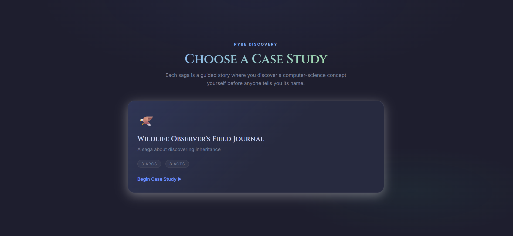
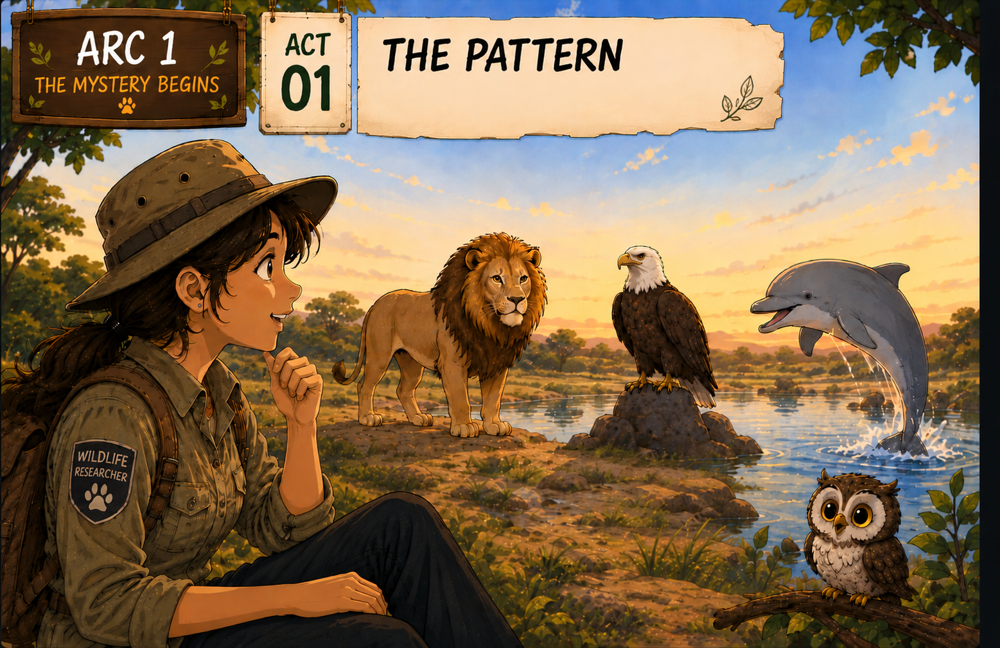

# PyBe — Inheritance Discovery Engine

### Contribution by Pritam Patra

> **Discover the concept before being told its name.**

---

## 🌟 Overview

**PyBe — Inheritance Discovery Engine** is a story-driven learning experience designed to help learners discover **Object-Oriented Inheritance** through observation, exploration, and application.

Instead of beginning with a textbook definition, the learner enters a wildlife case study and takes the role of an observer.

The learner investigates the characters and their characteristics, compares general and specialized entities, identifies patterns, and gradually connects those observations to the programming concept of **Inheritance**.

Only after the learner has explored the relationship is the formal programming concept introduced.

The experience then moves from the story into Python, allowing the learner to apply the discovered concept through code.

> **You are given a case so that you keep exploring it and eventually understand it.**

---

# 📸 Application Preview



The application opens with the **Wildlife Observer's Field Journal**, an interactive case study focused on discovering inheritance.

The experience is organized into:

- **3 learning arcs**
- **8 interactive acts**
- Story-based activities
- Observation and discovery
- Transfer scenarios
- Multiple-choice checks
- Concept explanations
- Story-to-code connections
- Python coding activities
- Progress tracking
- Field-journal style notes

---

# 📖 The Story Behind the Learning

The central case study is:

## 🦅 Wildlife Observer's Field Journal

The learner explores a wildlife scenario rather than immediately being given a programming definition.

The story provides a familiar context in which the learner can notice that different animals can share common characteristics while also having their own specialized characteristics and behaviors.

This creates the foundation for understanding the relationship between a **general class** and a **specialized class**.

---

## 📖 Story Experience

The inheritance journey is presented as a wildlife investigation rather than a traditional programming lesson.

The learner begins by observing different animals and identifying patterns in their characteristics and behavior. These observations gradually lead to the idea of general and specialized entities, creating a natural bridge to Object-Oriented Inheritance.



### From Story to Concept

The learner is guided through questions such as:

> **What do you observe?**

> **What characteristics do these animals share?**

> **What makes one animal different from another?**

These observations become the foundation for understanding inheritance before the programming terminology is introduced.

The story therefore acts as the first step in the learning process:

```text
Observe
   ↓
Compare
   ↓
Identify the Pattern
   ↓
Discover Inheritance
   ↓
Apply It in Python