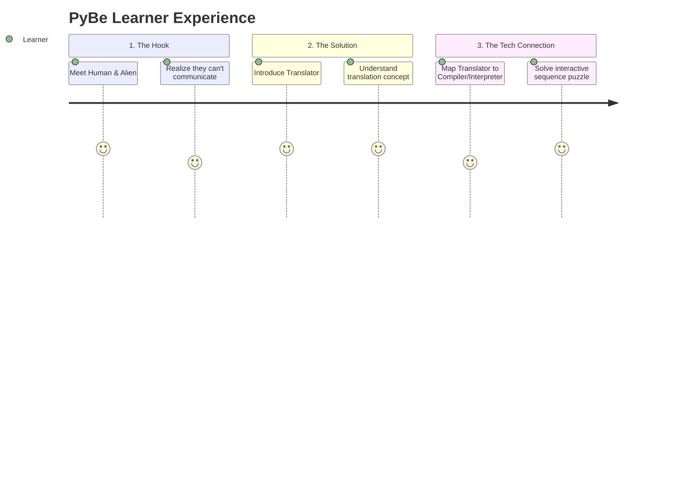

# 🛸 PyBe Product Specification
> **Module:** Translators, Compilers & Interpreters — Human & Alien Case Study

---

## 🎯 1. Product Vision

**The Problem:** Traditional computer science concepts (like compilation vs. interpretation) are often introduced using dry, highly technical jargon. This creates a steep learning curve and alienates beginners.

**The Solution:** PyBe replaces abstract definitions with a rich, interactive story. By using the relatable analogy of a human attempting to communicate with an alien, we make the "why" and "how" of code execution intuitively obvious.

---

## 👥 2. Target Audience

| Audience | Needs | How PyBe Helps |
| :--- | :--- | :--- |
| **CS Beginners** | Easy-to-grasp mental models for abstract concepts. | Uses a story-driven approach before introducing technical terms. |
| **Visual Learners** | Diagrams and interactions over walls of text. | Implements drag-and-drop puzzles and visual learning flows. |
| **Educators** | Engaging materials to supplement standard lectures. | Provides a zero-setup, self-paced interactive module. |

---

## ✨ 3. Core Features & UX

* 📖 **Story-Driven Framework:** A compelling narrative that anchors abstract concepts to a concrete scenario.
* 🧠 **Real-Time Assessment (MCQs):** Immediate feedback checks understanding as the user progresses.
* 🧩 **Tactile Learning (Puzzles):** Drag-and-drop sequence puzzles physically reinforce logical steps (e.g., `Human ➡️ Translator ➡️ Alien`).
* 🔒 **Gated Progression:** Users cannot advance until they demonstrate mastery of the current slide, preventing cognitive overload.
* 🎨 **Immersive Interface:** A distraction-free, responsive SPA featuring custom gradients, glowing text shadows, and buttery micro-animations.

---

## 🗺️ 4. User Journey

---

## 🚀 5. Future Roadmap

- [ ] **Expanded Case Studies:** New modules covering Memory Management, Variables, and Loops.
- [ ] **Audio & Immersion:** Add voice narrations, sound effects, and ambient background audio.
- [ ] **User Accounts & Tracking:** Allow learners to save progress and educators to track classroom metrics.
- [ ] **Accessibility (a11y) Polish:** Full screen-reader support and keyboard-navigable puzzles.

---
*Document Status: Draft v1.0 | PyBe Core Team*
