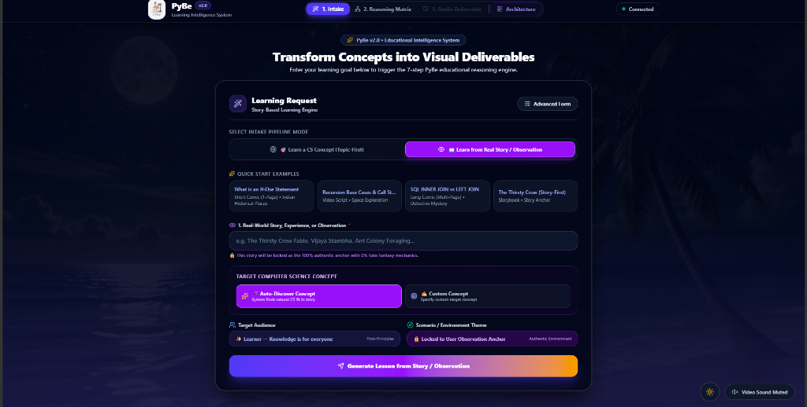
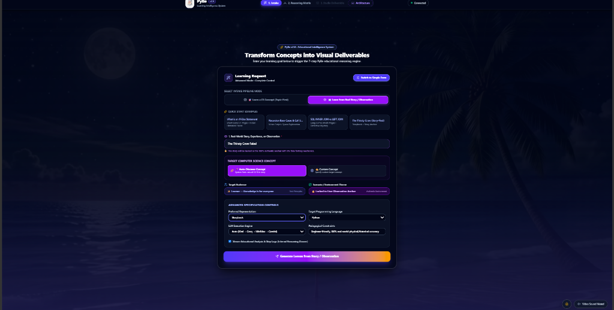
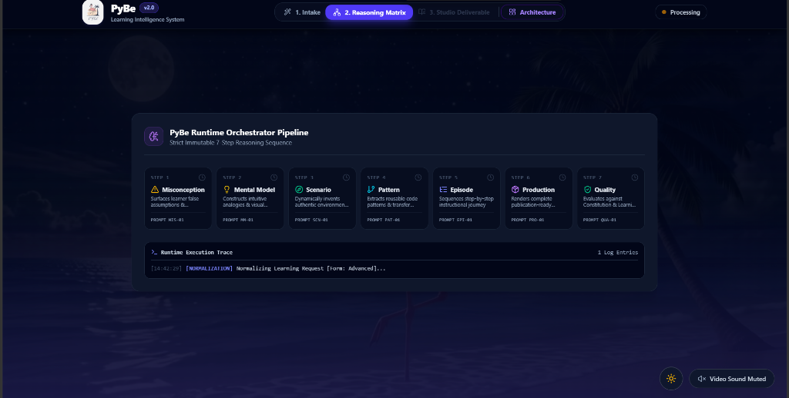
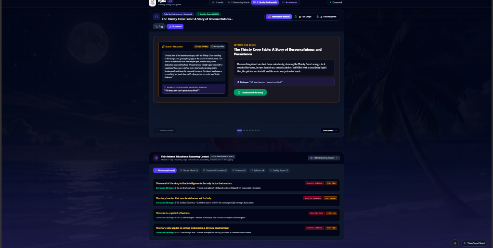

<div align="center">
  
  <h1>PyBe v2.0 — CKLIS Story-to-Code Intelligence Engine</h1>
  <p><em>Transforming Real-World Observations, Historical Anecdotes & Fables into Executable Code & Studio Deliverables</em></p>

  [](docs/SYSTEM_DOCUMENTATION.md)
  [](LATENCY_SUMMARY.md)
  [](#license)
  [](MVP/src/server/llmClient.ts)
  [](MVP/src/types.ts)
  [](MVP/src/App.tsx)
</div>

---

> ⚡ **PERFORMANCE & LATENCY OPTIMIZATION REPORT (v2.0):**  
> Addressed project supervisor feedback regarding high execution latency. **Before, the process was taking 9–10 minutes; now it takes only 2–3 minutes** (with initial live streaming output appearing in **1–2 seconds**).  
> 📄 [**Read Executive Summary**](LATENCY_SUMMARY.md) | 📊 [**Read Full Technical Report**](docs/LATENCY_REDUCTION_REPORT.md)

**PyBe (Pedagogical Story & Concept-to-Code Intelligence Engine)** is an advanced AI intelligence system designed to bridge real-world physical observations, historical anecdotes, and cultural fables directly to computer science principles and programming constructs.

Rather than relying on artificial code analogies or forced metaphors, PyBe operates on a strict **Constitutional Framework (18 Constitutional Laws CL-01 through CL-18)** that guarantees **100% real-world physical and historical fidelity**.

---

## 📸 Application Interface & Studio Showcase

PyBe features a modern dark-mode glassmorphic interface designed for rich interactive learning and 7-step pedagogical auditability.

### 1. Dual-Mode Learning Intake Interface
| **Simple Intake Form** | **Advanced Specification Controls** |
| :---: | :---: |
| [](docs/images/01-pybe-intake-form.png) | [](docs/images/02-pybe-advanced-controls.png) |
| *Experience-First vs Topic-First intake with canonical story presets* | *Multi-key provider rotation, target programming language & pedagogical constraints* |

---

### 2. CKLIS 7-Step Reasoning Matrix & Real-Time Execution Trace
[](docs/images/03-pybe-reasoning-matrix.png)
*Real-time SSE execution trace across the 7 immutable CKLIS reasoning steps: Misconceptions, Mental Model, Scenario Anchor, Pattern Mapping, Episode Sequence, Production, and Quality Audit.*

---

### 3. Interactive Studio Deliverable & Reasoning Auditability Drawer
[](docs/images/04-pybe-studio-deliverable.png)
*Interactive Studio Deliverable Viewer (Split-screen storybook mode) paired with the collapsible **Internal Educational Reasoning Drawer** providing full transparency into pedagogical decisions and misconception corrections.*

---

## 🚀 Quick Start (Launch App in 30 Seconds)

```bash
# 1. Navigate to the MVP directory
cd MVP

# 2. Install dependencies (if not already installed)
npm install

# 3. Launch dev server
npm run dev
```

Open `http://localhost:3000` (or `http://localhost:3001`) in your browser to access the PyBe Studio UI.

---

## 🏛️ System Architecture

PyBe processes learning requests through a **4-Pass Pipeline** powered by the CKLIS engine with **Multi-Provider LLM Support (Groq, Gemini, MiniMax, Kimi)** and an intelligent **Multi-Key Usage & Sliding Window Cooldown Mechanism** ([`llmClient.ts`](MVP/src/server/llmClient.ts)):

```
                                ┌─────────────────────────────────────────┐
                                │             USER INTAKE MODE            │
                                └────────────────────┬────────────────────┘
                                                     │
                      ┌──────────────────────────────┴──────────────────────────────┐
                      ▼                                                             ▼
         🎯 TOPIC-FIRST INTAKE                                        📖 EXPERIENCE-FIRST INTAKE
  (Provide CS Concept → Auto-Discover Story)                  (Provide Observation → Anchor Lock Story)
                      │                                                             │
                      └──────────────────────────────┬──────────────────────────────┘
                                                     │
                                                     ▼
                                     ┌───────────────────────────────┐
                                     │ CKLIS 4-PASS REASONING ENGINE │
                                     └───────────────┬───────────────┘
                                                     │
               ┌─────────────────────────────────────┼─────────────────────────────────────┐
               ▼                                     ▼                                     ▼
     PASS 1: FOUNDATION                    PASS 2: NARRATIVE                     PASS 3: STUDIO
   • Misconceptions (MC-01)               • Pattern Mapping                     • Short Comic (1-Page)
   • Mental Model (MT-01)                 • Episode Sequencing                  • Long Comic (Multi-Page)
   • Scenario Anchor Lock                                                       • Video Script (3D Motion)
                                                                                • Split-Screen Storybook
                                                                                • Audio Podcast
                                                     │
                                                     ▼
                                     ┌───────────────────────────────┐
                                     │ PASS 4: QUALITY ENGINE AUDIT  │
                                     │ • Constitution Score (0-100)  │
                                     │ • Learning Science Score      │
                                     └───────────────────────────────┘
```

---

## 📚 Documentation Index

| Document | Purpose |
| :--- | :--- |
| ⚡ [**Latency Reduction & Performance Report**](docs/LATENCY_REDUCTION_REPORT.md) | Formal report detailing latency bottleneck analysis, SSE streaming, multi-key Groq rotation, and 70-94% performance improvements for Project Director / Supervisor. |
| 🛠️ [**System Architecture & Technical Manual**](docs/SYSTEM_DOCUMENTATION.md) | In-depth engineering manual detailing the 4-pass CKLIS pipeline, LLM client, and story grounding logic. |
| 📖 [**Prompt & Usage Guide**](docs/PROMPT_AND_USAGE_GUIDE.md) | Comprehensive guide to PyBe's dual intake modes, sample prompts, presets, and studio workflow. |
| 🎯 [**Product Vision & Framework**](PRODUCT.md) | The PyBe thesis, 18 Constitutional Laws (CL-01 to CL-18), and pedagogical philosophy. |
| 🚀 [**Developer Quickstart**](QUICKSTART.md) | Setup, environment variables (`.env`), API verification, and benchmark testing. |
| 📝 [**Changelog (v1.0 → v2.0)**](CHANGELOG.md) | Complete version history, performance enhancements, and fix history. |
| 🤖 [**AI Pair Programming Guidelines**](AGENTS.md) | Coding guidelines and rules for AI agents (Gemini, Claude, Cursor). |

---

## 🎨 5 PyBe Studio Deliverable Modes

PyBe transforms educational reasoning into **5 presentation deliverables**:

1. 🎨 **Short Comic (1-Page)**: 4–5 panel single-page comic with 60–80 word AI image generation prompts ending with executable Python code on the final panel.
2. 📚 **Long Comic (Multi-Page)**: Multi-page historical/domain comic blueprint (CP1) followed by panel-by-panel production scripts (CP2).
3. 🎬 **Concept Explainer Video Script**: 8-section Video Production Blueprint (VP1) with scene-by-scene SnapGenAI 3D motion prompts (VP2).
4. 📖 **Split-Screen Storybook**: Visual narrative featuring embedded speech balloons, narrative story prose, code concept bridge, and executable Python snippets.
5. 🎙️ **Audio Podcast**: Dual-host educational podcast script (*Alex & Dr. Sam*) with audio cues and concept breakdowns.

---

## 🔒 Canonical Story Grounding Engine

To prevent LLM hallucination and preserve authentic story canons, PyBe incorporates a **Canonical Story Grounding Engine** ([`knowledgeLoader.ts`](MVP/src/server/knowledgeLoader.ts)):

* 📜 **Vikram and Betaal (*Betal Pachisi*)**: Preserves King Vikramaditya carrying Betaal on his shoulder in silence, Betaal posing a moral riddle, Vikram answering truthfully, and Betaal flying back (`while betaal_captured: betaal.tell_story(); if silence_broken: betaal.fly_back()`).
* 👑 **Akbar and Birbal**: Emperor Akbar poses a difficult court decree; Birbal observes physical/logical invariants to prove the solution.
* 🐦 **The Thirsty Crow**: Physical volume displacement loop (`while water_level < REACHABLE: drop_pebble(); water_level += 0.2`).
* 📜 **Tenali Raman & Panchatantra Fables**: Authentic real-world physical laws and period-accurate historical settings.

---

## ⚖️ License & Attribution

Developed for **IIT Ropar PyBe Project**. All rights reserved.
