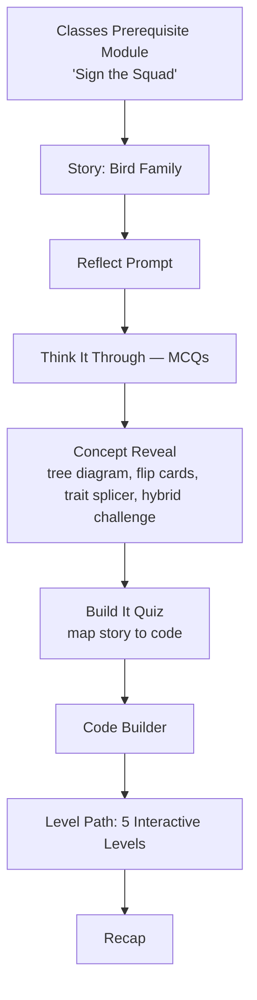

# Product Overview

**pyBe — Inheritance: The Bird Family** is an interactive learning feature within the pyBe platform that teaches Object-Oriented Programming (OOP) **inheritance** through a story about a Bird parent and its five chicks, paired with hands-on code simulation, quizzes, and gamified progression.

Rather than presenting inheritance as an abstract syntax rule to memorize, the product wraps the concept in a narrative the learner can reason about intuitively, then walks them from that story into real Python code, level by level, with feedback and rewards along the way.

The feature is the second half of a two-part learning experience: it builds directly on a prerequisite Classes module ("Sign the Squad") that already teaches `class`, `__init__`, and `self`.

The project is organized as a `client` (the learner-facing lesson app) and a `server` (progress persistence):

```text
pybe-inheritance/
├── client/
└── server/
```

---

# Product Vision

Programming concepts like inheritance are usually taught definition-first: a rule, a syntax pattern, a toy example. Learners can often recite the definition without ever forming an intuitive picture of what's actually happening between a parent and a child class.

The vision behind this product is to teach the *relationship* before the *syntax* — using a story learners already understand (a family of birds, each related to their parent but different in their own way) as the mental model, and only then mapping that story onto real code. Interaction is treated as a requirement, not a bonus: the learner is repeatedly asked to predict, answer, or try something rather than passively read, and progress is made visible throughout so the learning feels like a journey rather than a wall of text.

---

# Problem

- OOP inheritance can feel abstract to beginners when introduced only through syntax (`class Child(Parent):`) and generic examples.
- Static explanations make it difficult to build intuition for *why* a child class behaves the way it does — what it keeps from its parent, what it replaces, and what it adds.
- Learners often understand a definition well enough to answer a quiz question, but struggle to recognize or apply the same pattern when they see it in real code.
- Without visible progress or feedback, self-paced lessons can feel directionless, and learners disengage before finishing.

---

# Target Users

- Beginners learning Object-Oriented Programming for the first time
- Students specifically learning class inheritance in Python
- Learners who benefit more from visual, narrative-driven explanations than from text-only documentation
- Self-paced learners who respond well to structured progress, levels, and rewards rather than an unbroken lesson page

---

# Learning Experience

The learner journey, as implemented, follows this sequence:



Before reaching the Bird Family story, the learner completes a prerequisite Classes lesson that introduces classes, `__init__`, and `self` through a separate storyline. Only after that is the Inheritance experience unlocked.

Within the Inheritance lesson itself, the learner moves through a fixed sequence of stages — story, reflection, a pattern-recognition quiz, an interactive concept explanation, a "map the story to code" quiz, and a guided code build — before entering the level path, where each of the five levels is unlocked and completed in order. The lesson ends with a recap screen.

---

# Story-Based Learning

The lesson opens with the shared premise: every bird in the forest is born a **Bird** first, and every Bird knows how to eat, sleep, and lay eggs — no exceptions.

The Story Cards then introduce the bird characters in this exact order, as implemented in the project's story data:

1. 🦅 **Eagle** — grew up watching her mother glide over the mountains, and simply did what a Bird does: she flew.
2. 🐧 **Penguin** — also had wings, but the sea was his sky, so when it was his turn to "fly," he kept the Bird's other habits but changed the flying part to suit his own life.
3. 🦆 **Duck** — kept every Bird habit too, but found ponds and lakes and added something of its own: the ability to swim, alongside flying when needed.
4. 🐦 **Sparrow** — kept every Bird habit, and picked up a skill of her own that Bird never had: weaving twigs into a nest.
5. 🦉 **Owl** — didn't throw away what Bird already did, resting on a branch like every Bird — then added his own habit on top: staying alert to hunt through the night.

Each bird's story beat is written to foreshadow a distinct way a "child" can relate to its "parent" — keeping a behavior as-is, replacing it, adding something new, or building on top of it — without stating the programming term outright. That mapping is made explicit later, in the Concept Reveal and Level stages, once the learner has the story fresh in mind.

---

# Core Product Features

- **Story Cards** — the Bird Family narrative is delivered as individual, swipeable cards (one per bird) rather than a single block of text.
- **Reflect Prompt** — an open-ended reflection question after the story, with a reveal.
- **Think It Through** — multiple-choice questions that check pattern recognition before any code is shown.
- **Interactive Concept Reveal** — the inheritance concept is explained through an inheritance tree diagram, trait flip cards comparing the birds, a "trait splicer" activity, and a hybrid-bird challenge, rather than static prose.
- **Build It Quiz** — multiple-choice questions that ask the learner to map the story onto code.
- **Guided Code Builder** — a step-by-step build-up of the Bird class in code.
- **Five Interactive Levels** — one level per bird (Eagle, Penguin, Duck, Sparrow, Owl), each with its own runnable code simulator.
- **Level Path / Challenge Map** — a hub between levels showing which levels are complete and which is unlocked next.
- **Continue-After-Level Prompt** — after finishing a level, the learner is explicitly asked whether they want to continue to the next challenge.
- **Points (XP)** — each level awards points on completion.
- **Streak Tracking** — a streak counter tracks continued engagement.
- **Progress Percentages** — story, concept, practice, and quiz progress are each tracked and shown.
- **Achievement Badges** — four badges (Story Explorer, Knowledge Builder, Code Apprentice, Quiz Master) unlock as the learner completes the story, concept, build, and quiz stages, with a popup celebration and a badge case on the Recap screen.
- **Recap Screen** — a closing summary at the end of the lesson.
- **Animations** — Lottie-based animations and hand-drawn inline SVG bird illustrations are used throughout the concept and level screens.
- **Progress Persistence** — learner progress is saved via the `server` so it can be resumed later (see *Progress & Learning Persistence* below).

---

# Gamification

The product layers several gamification mechanics on top of the core lesson to keep learners motivated to finish:

- **Levels** give the lesson a clear sense of structure and forward motion — one level per bird, in a fixed order.
- **Points (XP)** are awarded on completing each level, giving learners a tangible reward for progress.
- **Streaks** reward continued engagement with the lesson over time.
- **Progress indicators** (story / concept / practice / quiz percentages, and completed-level count) make invisible learning progress visible, so learners always know how far they've come and how much is left.
- **The Level Path/Challenge Map** turns the level sequence into something closer to a game map — showing completed levels, the next unlocked level, and giving the learner a clear "next step" to aim for instead of an open-ended lesson.
- **The continue-after-level prompt** turns each level boundary into a small decision point rather than an automatic advance, reinforcing that the learner is choosing to keep going.
- **Achievement badges**, unlocked at major milestones and celebrated with a popup, give learners a sense of accomplishment distinct from raw points, and are displayed together on the Recap screen at the end.

Together, these mechanics are designed to turn a single long lesson into a series of small, rewarding steps.

---

# User Journey

1. **Arrive at the Classes lesson.** A new learner starts with "Sign the Squad," the prerequisite Classes module, before Inheritance is unlocked.
2. **Read the Bird Family story.** The learner swipes through Story Cards introducing the Bird parent and, in order, Eagle, Penguin, Duck, Sparrow, and Owl.
3. **Reflect.** The learner answers an open-ended reflection prompt and sees a reveal.
4. **Think it through.** The learner answers multiple-choice questions that test whether they've picked up on the patterns in the story.
5. **Explore the concept.** The learner interacts with a tree diagram, flip cards, a trait-splicing activity, and a hybrid-bird challenge that make the inheritance relationship concrete.
6. **Map story to code.** The learner answers a second quiz connecting the story to actual code.
7. **Build the code.** The learner is guided step-by-step through constructing the Bird class.
8. **Play through five levels.** Starting from the Level Path, the learner enters, simulates, and completes one level per bird — Eagle, then Penguin, then Duck, then Sparrow, then Owl — earning points and unlocking the next level each time, and choosing to continue after each one.
9. **Track progress along the way.** Throughout, the learner can see their points, streak, and completion percentages, and unlock achievement badges at key milestones.
10. **Recap.** At the end, the learner reaches a recap screen summarizing what they've completed and the badges they've earned.

---

# Product Architecture

The product splits cleanly along product lines rather than pure technical layers, into a `client` and a `server`:

- **`client`** — a React application (built with Vite) that owns the entire learner-facing experience: the Classes lesson, the Inheritance lesson (story, concept, quizzes, code builder, and levels), progress/streak/points display, and the achievement system. Illustrations are hand-drawn inline SVG, and animations are handled with a Lottie-based animation library, so the experience stays lightweight and doesn't depend on external image assets.
- **`server`** — a lightweight Express API backed by MongoDB, whose sole product responsibility is remembering where each learner is. It does not drive the lesson content or logic itself — the `client` owns the full learning experience, and the `server` exists purely to persist and restore progress.

This split means the story, concept interactions, quizzes, and levels can evolve independently in the `client`, while the `server`'s job stays narrow and stable: save progress, return progress.

---

# Progress & Learning Persistence

Learner progress is persisted per learner, per lesson, so that returning to the app resumes rather than restarts:

- Progress for the **Inheritance lesson** and the **Classes lesson** is stored as two separate records on the `server`, since the two lessons track different fields.
- For the Inheritance lesson, the `server` stores: whether the story has been understood, the reflection answer, answers (and correctness) for both the "Think It Through" and "Build It" quizzes, which levels have been completed, overall lesson-completion status, and a completion timestamp.
- For the Classes lesson, the `server` stores its own stage, activity counts, and completion status.
- Each learner is currently identified by a randomly generated ID stored on their device, rather than a login — meaning progress persists on the same device/browser, but isn't yet tied to an account.
- The API is intentionally simple: fetch a learner's current progress, or merge in updated progress fields — giving the `client` full control over exactly when and what to save.

---

# Team Contributions

### Arni Johry — OOP / Classes Introduction
Owned the introductory OOP experience that learners complete before Inheritance — the "Sign the Squad" Classes module — including the interactive explanations of `class`, `__init__`, and `self` that establish the foundation the Inheritance lesson builds on.

### Patan Jamsheer — Overall Layout
Built the overall project layout and structure that the rest of the learning experience is assembled into, and maintains the [repository](https://github.com/patan-jamsheer/pybe-inheritance).

### Simran — Progress, Streak, Levels & Story Cards
Owned the progress-and-motivation layer of the product: progress tracking, streak tracking, and level count, along with converting the original single-story presentation into the individual Story Cards learners swipe through today.

### Gunjan Pandey — Interactive Concepts & Animations
Owned making the concept-learning section interactive rather than static, and brought the concept explanations and bird illustrations to life with animation.

### Sumit Dhakar — Interactive Levels & Challenges
Owned the level-playing experience: giving each level a challenge name, building the flow that asks learners whether they want to continue after finishing a level, and adding and handling the points awarded and progressed as levels are completed.

---

# Product Value

Compared with a purely text-based inheritance lesson, this product's value comes from combining several reinforcing techniques rather than relying on any single one:

- **Visual learning** — a tree diagram, flip cards, and hand-drawn illustrations give learners a picture to reason with, not just prose.
- **Storytelling** — the Bird Family gives every abstract behavior (keep, replace, add, extend) a concrete, memorable anchor before it's ever expressed in code.
- **Interaction** — nearly every stage asks the learner to do something (answer, predict, run, choose) rather than just read, which keeps attention active.
- **Active application** — the level simulators let learners run and see the actual behavior of each inheritance pattern, closing the gap between "I understood the definition" and "I can recognize this in code."
- **Gamification** — points, streaks, levels, and badges give learners a reason to keep going and a way to feel their progress, especially valuable in a self-paced setting where nothing else is enforcing continuation.

---

# Future Product Opportunities

*The following are potential directions, not existing features:*

- Extending the same story-driven, level-based approach to additional OOP concepts beyond inheritance (e.g. polymorphism, encapsulation)
- Additional levels or optional "hard mode" variants of existing inheritance concepts
- Real authentication, so progress is tied to a learner's account instead of a device-local ID
- Richer learner analytics for teachers/evaluators (e.g. where learners commonly struggle)
- Personalized learning paths based on quiz performance or pacing
- Expanded or additional achievement badges beyond the current four

---

# Product Summary

pyBe — Inheritance: The Bird Family turns a typically abstract OOP topic into a guided, narrative-driven experience: a shared Bird Family story, told through Story Cards in a fixed sequence (Eagle → Penguin → Duck → Sparrow → Owl), followed by an interactive concept explanation, two rounds of comprehension checks, a guided code build, and five hands-on levels — one per bird — each reinforced with points, streaks, progress tracking, and achievement badges. Built on top of a prerequisite Classes module, and organized as a clean `client` / `server` split, it aims to take a learner from "I don't yet have an intuition for inheritance" to "I've built and run five different inheritance patterns myself," with visible, motivating progress the entire way through.
