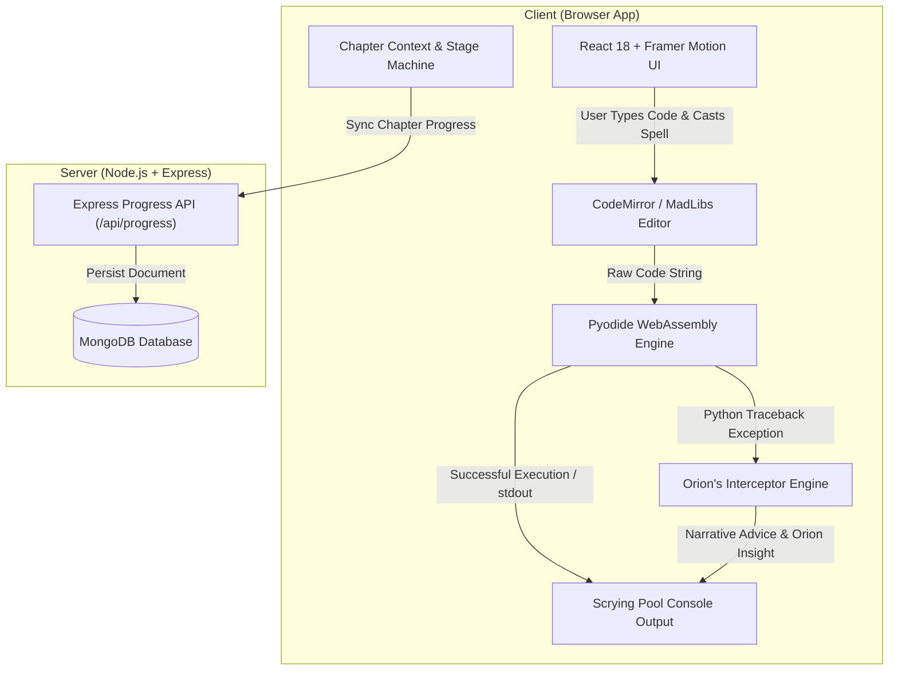

# CREATION 📜✨
### *The Art of the Eternal Mold*

> **An Interactive, Narrative-Driven Platform for Learning Python Object-Oriented Programming (OOP)**


---

## 🌟 Overview

**Creation** is an immersive visual-novel and interactive code sandbox designed to demystify **Python Object-Oriented Programming (OOP)**. 

Instead of reading dry technical syntax, learners step into the robes of an apprentice in the Whispering Woods. Guided by **Master Orion**, the Grand Architect, players experience the exact problem OOP was created to solve: the tedious, repetitive manual creation of individual creatures. Through narrative discovery, players forge the **Scroll of Life**—a master blueprint (*Dhancha*)—and learn how `class`, `def __init__`, `self`, object instantiation, and methods work in harmony.

All Python code executes directly in the user's browser via **Pyodide WebAssembly (WASM)**, paired with **Orion's Interceptor Engine**, an intelligent error-handling pipeline that translates cryptic Python tracebacks into encouraging, wizardly dialogue.

---

## 📑 Table of Contents

- [✨ Key Features](#-key-features)
- [🧩 Educational Pedagogy & Narrative Mapping](#-educational-pedagogy--narrative-mapping)
- [🏗️ System Architecture & Execution Pipeline](#️-system-architecture--execution-pipeline)
- [🛠️ Technology Stack](#️-technology-stack)
- [📁 Project Structure](#-project-structure)
- [⚡ Quick Start & Installation Guide](#-quick-start--installation-guide)
- [🔌 API Documentation](#-api-documentation)
- [🧙‍♂️ Orion's Interceptor Engine (Error Handling)](#️-orions-interceptor-engine-error-handling)
- [🛣️ Roadmap & Story Chapters](#️-roadmap--story-chapters)
- [🤝 Contributing](#-contributing)
- [📜 License](#-license)

---

## ✨ Key Features

- 📖 **Split-Screen Interactive Canvas**: 
  A 40/60 split layout combining an animated RPG Storybook Stage (top-left environment art & dynamic dialogue box) with a dark-parchment Code Editor & Scrying Pool Console on the right.
- 🐍 **In-Browser Serverless Python Execution**:
  Executes real Python 3 code in WebAssembly using Pyodide v0.26.1—zero backend sandbox or execution servers required.
- 🧙‍♂️ **Orion's Misfire Interceptor Engine**:
  Parses Pyodide runtime tracebacks (`IndentationError`, `TypeError`, `NameError`, `AttributeError`, case sensitivity) and converts them into friendly, in-character narrative hints from Master Orion.
- 🎮 **Gamified Chapter Progression**:
  - **Stage 1: The Tedious Workbench** – Manually fill dictionary attributes to feel the friction of repetition.
  - **Stage 2: Exhaustion Cutscene** – Narrative turning point highlighting inefficiency.
  - **Stage 3: The Blueprint Epiphany** – Introduction of the *Dhancha* (master blueprint / rubber stamp concept).
  - **Stage 4: MadLibs Scroll (Fill-in-the-Blank)** – Interactive step-by-step rune binding for `class`, `def __init__`, and `self`.
  - **Stage 5: Blueprint Forged Ledger** – Reviewing and validating the master class structure.
  - **Stage 6: Summoning Ritual (Instantiation)** – Invoking `Fox("Ember", "Fire")` to mint live, animated guardians.
  
- 💾 **Full-Stack Persistence & Graceful Offline Fallback**:
  Stores user chapter progress and custom code scrolls via a Node.js/Express API with MongoDB, with an automatic standalone fallback if offline.

---

## 🧩 Educational Pedagogy & Narrative Mapping

| Story Element | Python OOP Concept | Educational Insight |
|---|---|---|
| **Hand-Molded Clay** | Manual Dictionaries / Objects | Illustrates how defining objects one-by-one causes code duplication and hoarse voices. |
| **The Scroll of Life** | `class` | The master blueprint (*Dhancha*) that defines the structure and rules for all creatures of that type. |
| **The Awakening Spell** | `def __init__(self, ...)` | The constructor method that automatically triggers when a new instance is born to initialize attributes. |
| **The Shimmering Tether** | `self` | The instance binder that ties attributes (`name`, `color`) to *this specific creature* rather than the abstract class. |
| **Summoning Ritual** | `fox1 = Fox("Rusty", "Red")` | Instantiation—creating unique, concrete objects from a single class definition. |


---

## 🏗️ System Architecture & Execution Pipeline



---

## 🛠️ Technology Stack

### **Frontend (`/client`)**
- **Framework**: [React 18](https://react.dev/) + [Vite 5](https://vitejs.dev/)
- **Styling**: [Tailwind CSS v4](https://tailwindcss.com/) + PostCSS + Autoprefixer
- **Animations**: [Framer Motion](https://www.framer.com/motion/)
- **Code Editor**: [@uiw/react-codemirror](https://uiwjs.github.io/react-codemirror/) + [@codemirror/lang-python](https://github.com/codemirror/lang-python)
- **Python WASM Runtime**: [Pyodide v0.26.1](https://pyodide.org/)

### **Backend (`/server`)**
- **Runtime**: [Node.js](https://nodejs.org/) (ES Modules)
- **Framework**: [Express.js](https://expressjs.com/)
- **Database**: [MongoDB](https://www.mongodb.com/) via [Mongoose](https://mongoosejs.com/)
- **Utilities**: `dotenv`, `cors`, `nodemon`

---

## 📁 Project Structure

```
Creation/
├── client/                          # React + Vite Frontend Application
│   ├── src/
│   │   ├── assets/                  # Environment art & character assets
│   │   ├── components/              # Interactive UI & stage components
│   │   │   ├── BlueprintSuccessLedger.jsx  # Blueprint confirmation ledger
│   │   │   ├── ConfettiEffect.jsx          # Victory particle effects
│   │   │   ├── ConsoleOutput.jsx           # Terminal / scrying pool output
│   │   │   ├── EurekaScreen.jsx            # Class epiphany cutscene
│   │   │   ├── ExhaustionScreen.jsx        # Manual labor exhaustion cutscene
│   │   │   ├── FillInTheBlankEditor.jsx    # Guided code construction
│   │   │   ├── ImageStage.jsx              # Environment visual stage
│   │   │   ├── IntroScreen.jsx             # Welcome & story introduction
│   │   │   ├── MagicalBackground.jsx       # Dynamic ambient wallpaper & particles
│   │   │   ├── MagicalEditor.jsx           # Full CodeMirror Python editor
│   │   │   ├── SelfTooltipModal.jsx        # Interactive 'self' concept tooltip
│   │   │   ├── StoryCanvas.jsx             # Orion dialogue box & avatar
│   │   │   ├── SummoningLedger.jsx         # Object instantiation stage
│   │   │   └── TypewriterText.jsx          # Animated RPG dialogue renderer
│   │   ├── context/
│   │   │   └── ChapterContext.jsx          # Chapter state, user progress & API sync
│   │   ├── utils/
│   │   │   └── pyodideEngine.js            # Pyodide WASM loader & execution wrapper
│   │   ├── App.jsx                         # Main app routing & stage orchestrator
│   │   ├── MagicalLedger.jsx               # Stage 1 manual fox molding ledger
│   │   ├── MagicalScrollMadLibs.jsx        # MadLibs interactive scroll editor
│   │   ├── RightPanelManager.jsx           # Stage switcher & right panel state machine
│   │   ├── interceptorEngine.js            # Orion Misfire Error Interceptor
│   │   ├── main.jsx                        # React entry point
│   │   └── index.css                       # Design tokens & font configurations
│   ├── index.html                          # Main HTML document
│   ├── vite.config.js                      # Vite configuration
│   └── package.json                        # Client dependencies & scripts
│
├── server/                          # Express + Node.js Backend API
│   ├── models/
│   │   └── UserProgress.js                 # Mongoose schema for user state & saved scrolls
│   ├── routes/
│   │   └── progressRoutes.js               # GET/PUT progress REST endpoints
│   ├── .env                                # Environment config (PORT, MONGO_URI)
│   ├── index.js                            # Express server & Mongo connection listener
│   └── package.json                        # Server dependencies & scripts
│
└── Documents/                       # Technical & Design Specifications
    ├── Storyline.md                    # Detailed chapter story arc & narrative goals
    ├── Implementation.md               # Architecture, execution pipeline & interceptor logic
    └── Presentation.md                 # UI design layout & visual stage specs
```

---

## ⚡ Quick Start & Installation Guide

### **Prerequisites**
- **Node.js**: v18.0.0 or higher
- **npm**: v9.0.0 or higher
- **MongoDB** *(Optional)*: Local MongoDB instance or MongoDB Atlas URI (if omitted, server runs in standalone mode).

---

### **1. Clone the Repository**
```bash
git clone https://github.com/vicharanashala/pybe.git
change directory to pybe -> summership-26-prs -> sheetal
```

---

### **2. Setup & Start the Server (Backend)**

```bash
cd server
npm install
```

Configure `.env` file inside `/server`:
```env
PORT=5000
MONGO_URI=mongodb://localhost:27017/creation_db
```

Start the backend development server:
```bash
npm run dev
```
*The server will start listening at `http://localhost:5000`.*

---

### **3. Setup & Start the Client (Frontend)**

Open a new terminal tab/window:
```bash
cd client
npm install
```

Start the Vite development server:
```bash
npm run dev
```
*Open your browser and navigate to `http://localhost:5173`.*

---

## 🔌 API Documentation

Base URL: `http://localhost:5000/api`

### **1. Server Health Check**
- **Endpoint**: `GET /health`
- **Response**:
```json
{
  "status": "ok",
  "app": "Creation Backend"
}
```

### **2. Get User Progress**
- **Endpoint**: `GET /api/progress/:userId`
- **Response**:
```json
{
  "success": true,
  "data": {
    "user_id": "apprentice_1",
    "current_chapter": 1,
    "saved_scrolls": ["class Fox:\n    def __init__(self, name):\n        self.name = name"],
    "createdAt": "2026-08-08T10:00:00.000Z",
    "updatedAt": "2026-08-08T10:05:00.000Z"
  }
}
```

### **3. Save / Update User Progress**
- **Endpoint**: `PUT /api/progress/:userId`
- **Headers**: `Content-Type: application/json`
- **Body Payload**:
```json
{
  "current_chapter": 2,
  "saved_scrolls": [
    "class Fox:\n    def __init__(self, name, color):\n        self.name = name\n        self.color = color\n        self.energy = 100"
  ]
}
```
- **Response**:
```json
{
  "success": true,
  "data": {
    "user_id": "apprentice_1",
    "current_chapter": 2,
    "saved_scrolls": [...]
  }
}
```

---

## 🧙‍♂️ Orion's Interceptor Engine (Error Handling)

Beginners are frequently discouraged by raw Python stack traces. **Orion's Interceptor Engine** (`client/src/interceptorEngine.js`) catches WebAssembly exceptions and transforms them into natural, encouraging feedback:

```javascript
// Sample Interceptor Logic
if (traceback.includes("IndentationError")) {
  orionMessage = "🧙‍♂️ Orion's Insight: 'Your spell runes are misaligned! In Python, indentation defines the structure of your class blueprints. Indent lines inside class or def blocks.'";
} else if (traceback.includes("TypeError") && traceback.includes("takes 0 positional arguments but 1 was given")) {
  orionMessage = "🧙‍♂️ Orion's Insight: 'Wait! When you shout an action, how does the forest know WHO should perform it? Put the self tether inside the parentheses of your spell!'";
} else if (userCode.includes("Self.")) {
  orionMessage = "🧙‍♂️ Orion's Insight: 'Magic is very particular about capitalization. The tether is woven with lowercase threads. Use self, not Self!'";
}
```

---

## 🛣️ Roadmap & Story Chapters

- [x] **Chapter 1: The Tedious Workbench** *(Manual Dictionaries & Data Duplication)*
- [x] **Chapter 2: The Glowing Parchment** *(Defining `class Fox:`)*
- [x] **Chapter 3: The Spell of Awakening** *(Implementing `def __init__` Constructor)*
- [x] **Chapter 4: The Magical Tether** *(Understanding `self` Parameter & Attribute Binding)*
- [x] **Chapter 5: Release into the Wild** *(Instantiation `bandit = Fox()` & Executing `bandit.pounce()` Methods)*
- [ ] **Chapter 6: The Forest Guardians** *(Inheritance & Method Overriding – `class MagicalFox(Fox)`)*
- [ ] **Chapter 7: The Enchanted Vault** *(Encapsulation & Private Attributes `__energy`)*

---

## 🤝 Contributing

Contributions, issues, and feature requests are welcome!
1. Fork the Project
2. Create your Feature Branch (`git checkout -b feature/AmazingFeature`)
3. Commit your Changes (`git commit -m 'Add some AmazingFeature'`)
4. Push to the Branch (`git push origin feature/AmazingFeature`)
5. Open a Pull Request

---

## 📜 License

Distributed under the MIT License. See `LICENSE` for more information.

---

<p center>
Made with ✨ magic, 🐍 Python, and ⚛️ React by Sheetal.
</p>
